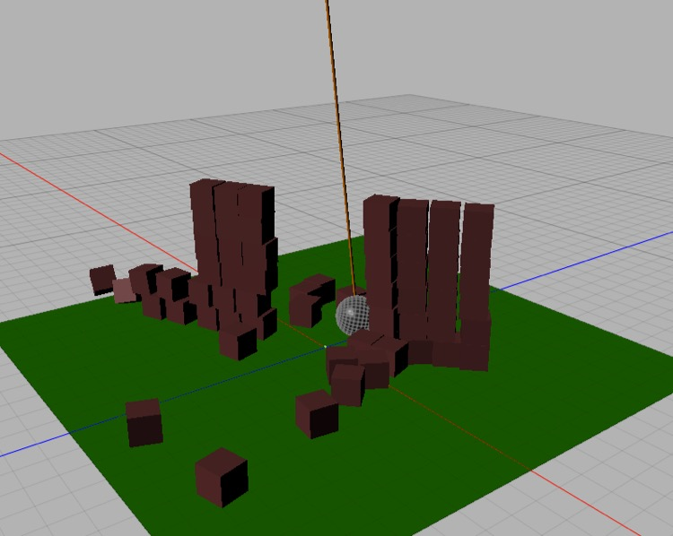
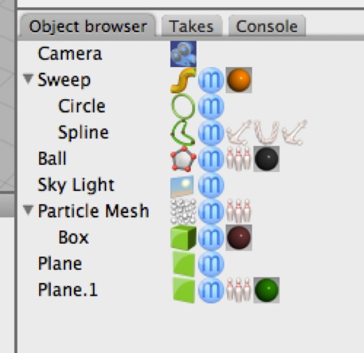

## Building Blocks

### Dynamics Tags

*The “rope” is a spline with a rope tag and two anchor tags (one simply anchors the top point, while the other attaches the bottom point to the ball). The blocks are a collapsed particle mesh system with a dynamic rigidbody tag. The ground plane has a static rigidbody tag. The ball has a dynamic rididbody tag.*

Objects which have Dynamics tags assigned to them will take part in dynamic Simulations. Objects which don’t, won’t. Because dynamic simulations can be memory and processor intensive, it’s a good idea not to apply Dynamics tags to things that won’t be moving or struck by other objects.

Once an object has a Dynamics tag assigned, running a dynamic simulation will affect its behavior.

### Rigid Body

Assigning a rigid body tag to an object makes it behave like a solid inflexible object.

There are three types of rigid body which serve very different roles:

**Dynamic**. This is the default. The object will be affected by forces, collide with things, and so forth.

**Static**. The object is fixed in space, but other objects can collide with it. Large, immovable objects should be made static rigidbodies.

**Kinematic**. The object is being animated conventionally, but you want it to affect the Dynamics behavior of other objects. You might set an animated character to be kinematic, but the clothing on the character to be a soft body. Similarly, a sailing ship might be conventionally animated, but its sails and flags could be soft bodies, its rigging could be ropes, and stuff on its deck could be dynamic rigidbodies.

### Rope

Rope tags are used to give splines rope-like behavior.

Generally, you’ll want to use anchor tags to give ropes interesting behavior.

Note that you should set a spline to Bezier Curve, Linear, or NURBS (rather than the default Bezier Spline) setting because dynamic simulations won’t move control handles around, leading to odd results.

### Soft Body

Soft body tags make surfaces behave like cloth, and (with volume preservation) make closed meshes behave like jelly or fluid-filled objects (like balloons).

The soft body tag is limited to objects with 10,000 points or fewer. If you assign a soft body tag to an object with too many tags it won’t do anything.

### Anchor

Anchor tags do two different things.

**Fixing the position of vertices**. If you simply select one or more vertices of a mesh or spline, add an anchor tag to it and Set anchors, those vertices will be fixed in position relative to the parent’s coordinate system (or global space).

**Attaching other objects**. If you select one or more vertices and then drag an object to the Attach to Object socket, then instead of the vertices being fixed in position, the attached object will be attached to those vertices.

### Particles

Normally, you cannot assign a Rigidbody tag (for example) to a particle system and assigning it to a particle produces ugly results (Dynamics gets applied to the single particle, and its motion is replicated for every particle).

If you collapse a particle system (double-click on it in the Object Browser or **Objects \> Make Editable**) you turn it into a static collection of instances, and now you can assign a Rigidbody tag to the entire collection, and it behaves as you’d expect.

### Effectors

Particle Effectors can influence dynamic simulations, which makes them extremely useful for creating special effects, such as vortices and explosions.

