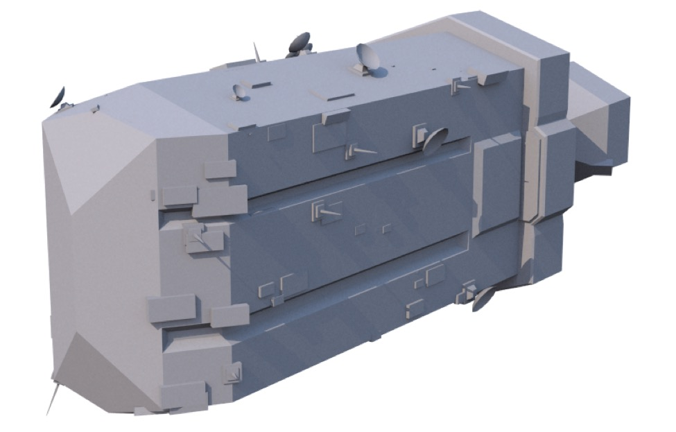

# Particles

*A simple starship model decorated with random detail using a Particle Mesh.*

Sometimes when you’re creating a scene you want lots and lots of “stuff” but you don’t want to handle every single bit of that stuff by hand. Some common examples would be blades of grass, trees in a forest, hairs on a head, people in a crowd, stones in a desert, sparks coming from a welder, puffs in a column of smoke. One of the common approaches to filling this need is the “particle system”.

A particle system comprises the following things:

One or more base **Particle **objects. These are just mesh objects — any kind will work. Each object you use as a particle may have a **Particle tag**.

A **Particle** **Emitter**.

Optionally, one or more **Particle Effectors** — objects that influence particle motion.

A Particle Emitter generates **instances** of the Particle objects it contains over time (when, where, and how many are determined by its properties). Particle Effectors cause the particles to move in different ways (e.g. they can simulate wind, gravity, or turbulence).

