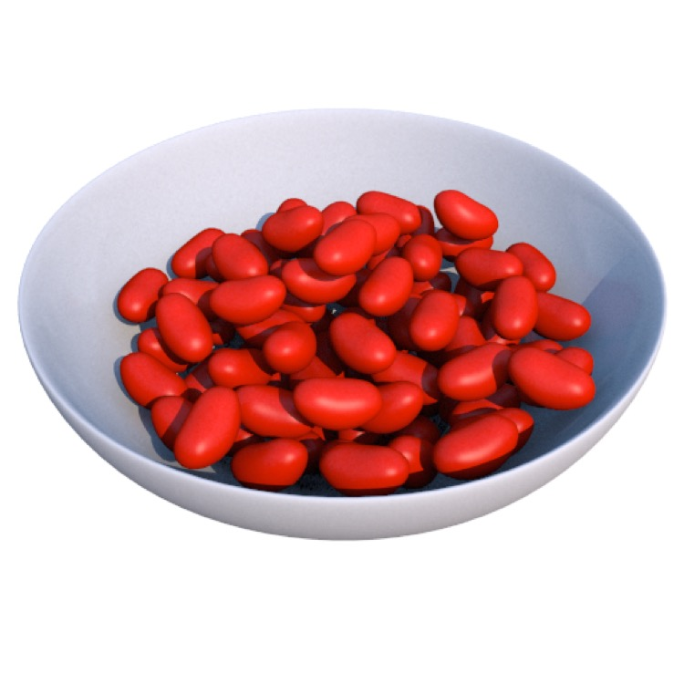
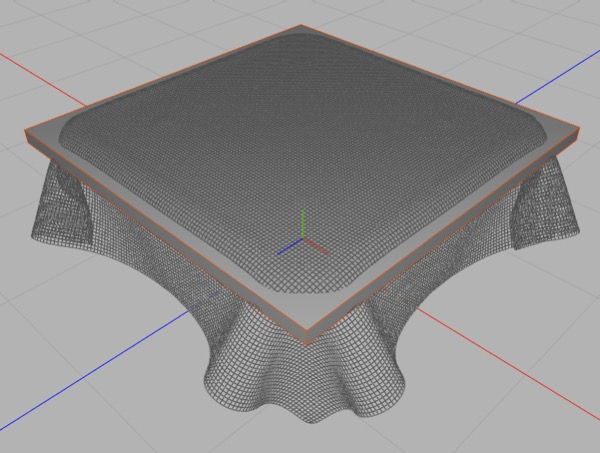
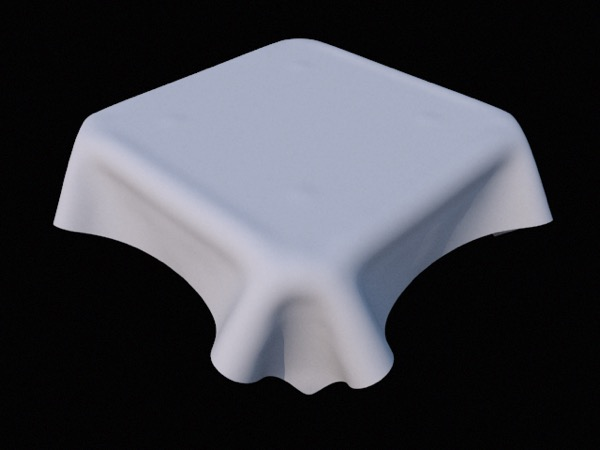

## Using Dynamics to Model

*Imagine if you were going to model this bowl of jelly beans by hand. Placing each jelly bean would be a difficult enough. With a simple dynamic simulation you can fill a bowl with jelly beans, or any other object, in a few seconds.*

Dynamics is useful for making natural-looking arrangements of objects that are hard to do by hand (just think how hard it is to do something like lay a model of a screw on a flat surface), and in particular for working with large numbers of objects (and particles).

### Tutorial: Filling a Bowl with Jelly Beans

You’ve already seen the principles of this tutorial. In essence we model a bowl, and make it a static, concave Rigid Body. We’ll also need to dial up the precision of the Dynamics system to avoid having jelly beans do weird things.

Now we use a Particle Mesh to create a supply of jelly beans. We collapse the Particle Mesh and add a Rigid Body tag to it.

We press Play and watch our jelly beans fill up the bowl. We may need to make our animation longer to give the system time to settle down, and we can add some friction and damping to make the system calm down more quickly.

Now we have a bowl randomly filled with nonintersecting jelly beans — something that would have been horribly tedious, if not impossible, to do properly by hand.

### Tutorial: Using a Soft Body to Drape Cloth

Getting cloth to drape nicely using Soft Body simulations requires a bit of fiddling and cheating (as with everything in 3D!) but it’s much easier than doing it by hand, and can quickly produce quite satisfying results.

*This screenshot shows a Soft Body cloth draped over a box. I’ve left the box visible to show that the simulation is hardly perfect, but it’s easy to see how you can finesse the size of the mesh used as the collider to produce a good result for a slightly smaller table.*

