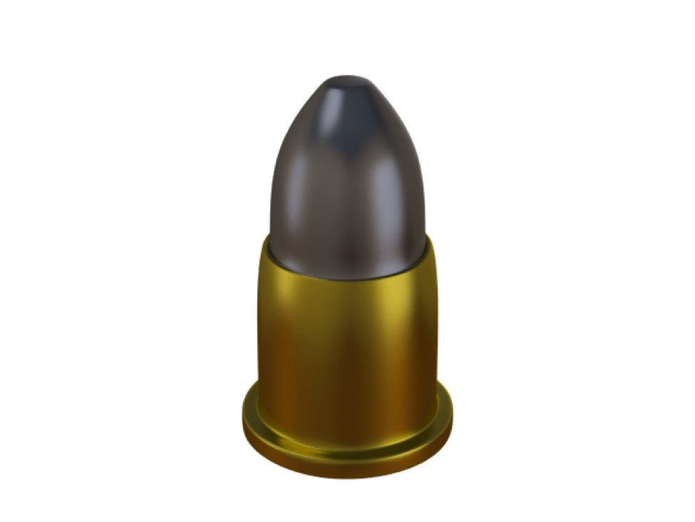

# Dynamics

**Note**: this chapter was previously called "Physics".

The 3D “world” in which cg artists work is a mathematical construct. A polygon is a purely mathematical construct with no thickness, or weight. Typically, if one wants to create a 3D “still life”, to place a 3D “apple” in a 3D “bowl” one would need to think about how the apple would rest in a bowl in the real world and then attempt to position it accordingly in the virtual world. It’s hard to do even something this simple well, and one can easily make a mistake — the apple could end up floating slightly in the air, or intersect with the bowl, or simply rest in an implausible off-balance position.

Just as ray tracing attempts to simulate the image you’d get if the virtual objects in a scene were lit with the virtual lights and photographed with the virtual camera, the term dynamics in the context of 3D graphics refers to the attempt to simulate mechanical interactions in the virtual world.

Dynamic simulations are useful both as a convenience (want to place an 3D apple in a 3D bowl? drop it!) and to automatically create effects that would be extraordinarily difficult to do by hand (e.g. accurately model huge numbers of interactions, such as explosions or fluid dynamic effects).

### Bullet Physics Library

The Bullet Physics Library is an Open Source physics implementation that has become very popular both with 3D graphics software developers and game developers.

(The word “physics” is often used quite carelessly, since ray tracing is all about optics, which is a branch of physics. But I guess it sounds better than “mechanics”. I will try to use the term "Dynamics" instead.)

You can find out more about the library at [bulletphysics.org](http://bulletphysics.org).

