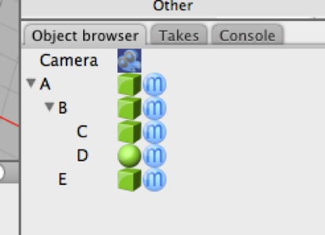

## The Object Browser

A **scene graph** is a schematic representation of the content of a 3D scene. In Cheetah 3D the “scene graph” is called the Object Browser.

**The Object Browser works a lot like folders on your computer**. If you move a folder somewhere you’re also moving its contents. If you delete a folder, you’re deleting its contents.

**Note**: in Cheetah 3D we now have a Search feature built into our toolbar (by default). You can filter the contents of the Object browser and Material panels by typing something into the search field in the toolbar. Even objects hidden deep inside hierarchies will instantly be displayed — but once you delete the search terms they’ll disappear again. Search operates purely on name matching.

