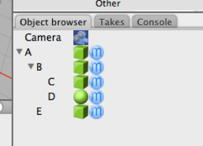

## Parents

In this simple scene, A is the parent of B and E. B is the parent of C and D. A has no parent — it might be referred to as being a “root” object.

Everything in a Cheetah 3D scene is represented in the scene graph as an icon in the Object Browser as part of a hierarchy. Any object may have one or more (or “contain”) children, and some objects may have (or “be inside”) a parent.

A parent object “carries its children along with it” when transformed (unless those children have outside **constraints**). So if you moved, rotated, or scaled A, you’d also be doing the same thing to B, C, D, and E. Similarly, if you moved, rotated, or scaled B you’d be doing the same thing to C and D.

