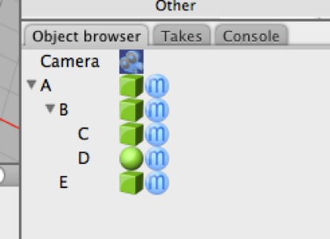

## Children

In this simple scene, A has two children: B and E. B has two children: C and D. C, D, and E have no children.

Everything in a Cheetah 3D scene is represented in the scene graph as an icon in the Object Browser as part of a hierarchy. Any object may have one or more (or “contain”) children, and some objects may have (or “be inside”) a parent.

A child object “lives in its parent’s coordinate system”, which means that if the parent is moved, rotated, or scaled, so is the child. Similarly, a child’s positional information (position, rotation, and so forth) is relative to its parent. E.g. if A is at 1,0,0 and B is at 0,1,0, then B is in fact at 1,1,0 in “global” space (we’re assuming A’s scale is 1,1,1 and A’s rotation is 0,0,0).

You can see this if you create a hierarchy, move a parent, and then pull the child out of the hierarchy (you’ll see the child’s position change).

Moving objects “into” one another to establish relative positions is a very useful trick. E.g. suppose you want to quickly move some newly created object A close to some other object B that’s off somewhere else so you can work on them together. You simply drag A into B and zero out its position and there you are. You can move A back out again and it will still be there. This trick is even more useful for matching orientations.

