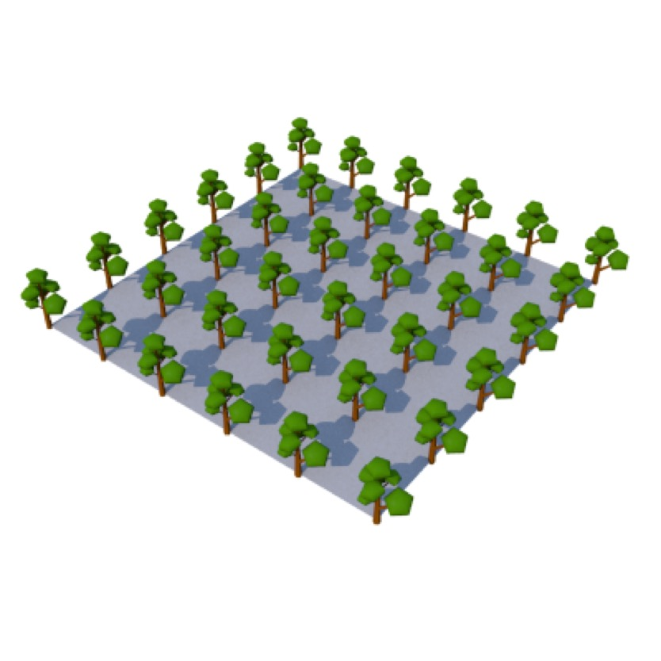
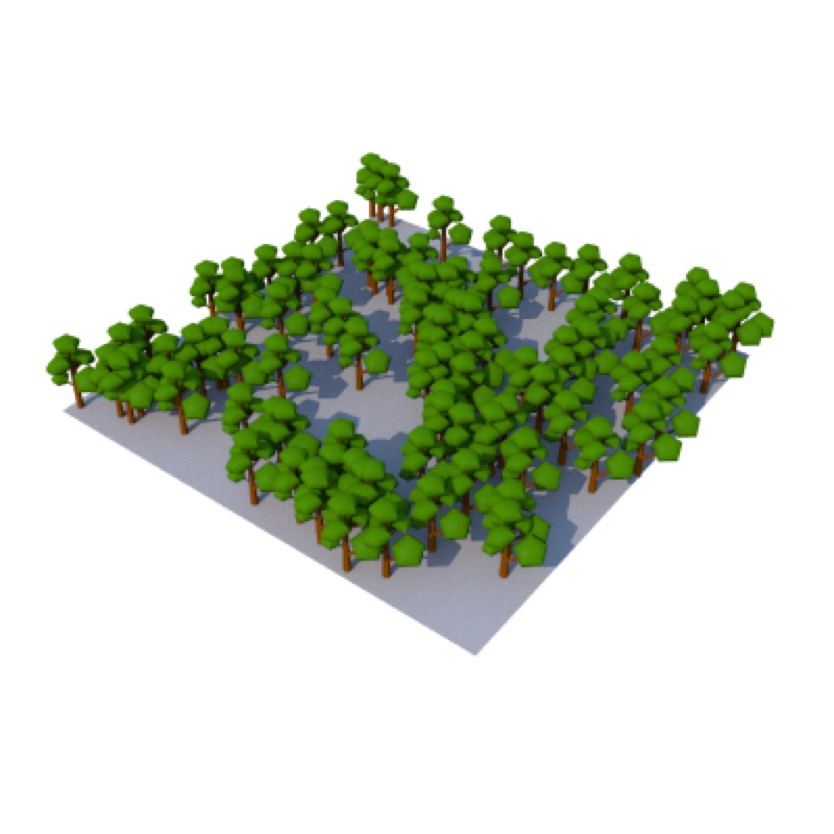
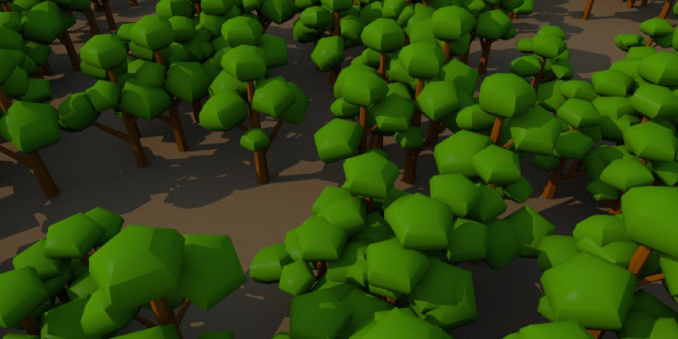
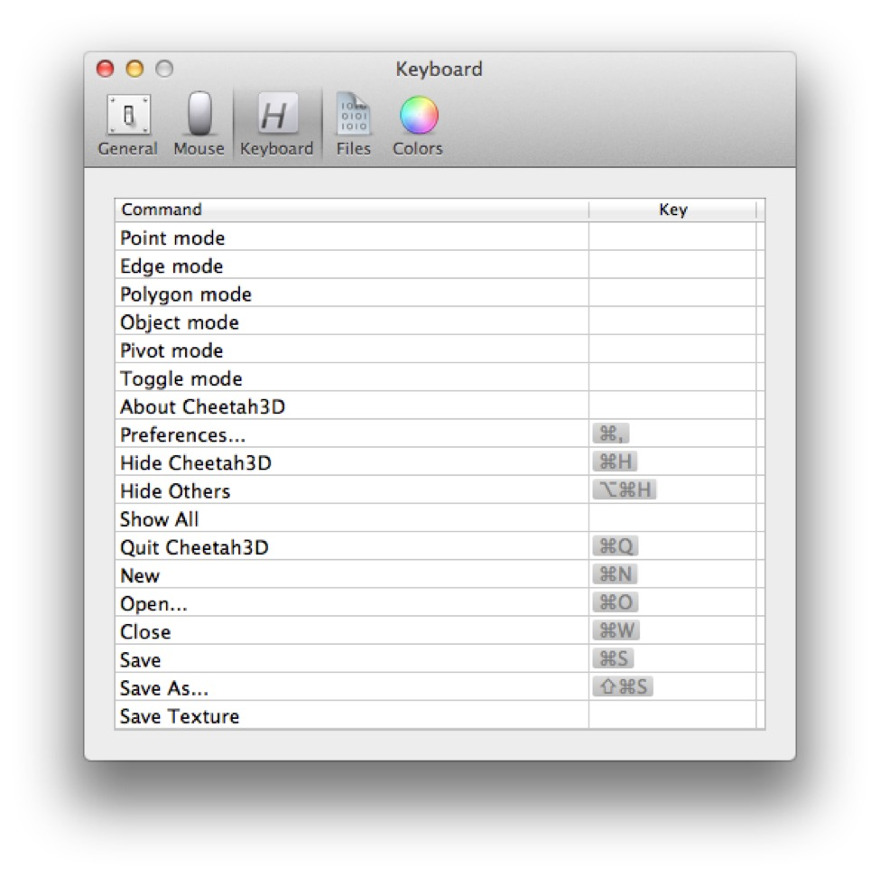
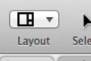
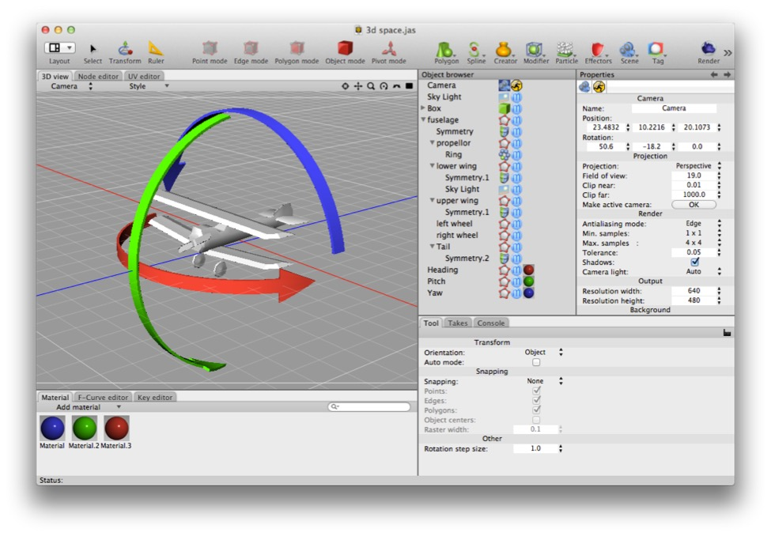

## Managing Complexity

### Using Instances

The most obvious use for particles is things like sparks and explosions, but perhaps the best use for particles in Cheetah 3D right now is producing multiple **instances** of objects to create detailed scenes that don’t require huge amounts of **memory**.

The key to this trick is the **Particle Mesh**.

A Particle Mesh produces instances of its children on a specified mesh using one of a number of different rules:

_**Top**: a Particle Mesh distributing tree (particles) one per **point** in a 5x5 plane. **Bottom**: 100 instances of the tree distributed randomly over the **surface** of the plane._

- **Points** — one instance is placed on each point on the mesh

- **Edges** — one instance is placed on the middle of each edge of the mesh

- **Polygons** — one instance is placed in the middle of each polygon of the mesh

- **Surface** — a set number of instances are randomly placed on the surface of the mesh

- **Volume** — a set number of instances are placed within the interior of the mesh (this rule is a little dodgy).

Note that this mesh may consist only of vertices (i.e. have no visible polygons). Using such a mesh provides a very precise way of placing instances of a given object using a Particle Mesh.

#### Instant forest — just add particles!

Particle Meshes also have the advantage of allowing very flexible complex scenes. E.g. you can create an arbitrarily shaped surface and distribute trees over it to create a forest. You can later change the density of the trees, or the variation in height, and so on.

### Folders

Folders allow you to group objects together and move them as one. This is a simple but very useful tool for organizing complex scenes.

Of course you can use any object as a “folder” too.

### Smart Folders

Smart Folders allow you to use a one scene inside another scene. Smart Folders are useful but can behave a bit strangely — e.g. if you delete or modify some piece of a scene imported through a smart folder, the change will appear to occur, but when you reopen the file it will revert to its original form. Smart folder objects are “read only” (kind of).

### Takes

Takes allow you to split up animations into manageable components. The most common use of takes is to separate a character’s actions. (Takes work very well with Unity.)

### Custom Hotkeys

The simplest thing you can do to make Cheetah 3D more streamlined is set up your own hotkeys. Because Cheetah 3D isn’t a text-oriented program, you can set unmodified keystrokes (e.g. “F”) to trigger functions (and even run scripts), which allows you to work with one hand on the mouse, and another on the keyboard.

To edit Cheetah 3D’s hotkeys, simply open up its Preference window and click on the Keyboard icon. You may find it helpful to click on the Command heading to sort the commands into alphabetical order.

**Custom View Layouts**

Another powerful customization feature is the ability to completely customize the Cheetah 3D’s document window. (The one thing Cheetah 3D doesn’t do is allow you to use more than one window to view a document, which is a little unfortunate for those of us with multiple monitors.)

All you need to know is that you can resize panels by dragging on the boundaries between adjacent panels, and you can repurpose a panel by right-clicking on its name (this includes adding and removing tabs, and changing the purpose of a tab).

You can save your layout by selecting Save Layout from the layout menu in the toolbar. **Warning**: you can’t choose which layout you’re saving, so by choosing Save Layout you are changing the layout you’re currently using.

*You’ll notice from my screenshots that my window layout is probably not like yours (similar, but not the same). By right-clicking on the names of the panels you can add tabs to them and change the role the pane plays. Rather than use the different view layouts, I have modified my modeling view to serve all roles.*

### Snapping

You can set the Transform tool to snap to Component, Surface, or Raster. 

- **Snap to component** means that if you free move objects (including vertices) then they will snap to points, the centers of edges, and the centers of polygons.

- **Snap to surface** means that objects will snap to existing polygons in the scene (not just their centers, but anywhere on them).

- **Snap to raster** (it should really be called “grid” to be more intuitive) means that objects will snap to whole multiples of the “Raster width” (or “grid spacing”) setting (by default this is 0.1). If you free move an object it will snap all three coordinates to multiples of the raster width. If you move an object along a single axis it will snap that coordinate to multiples of the raster width.

