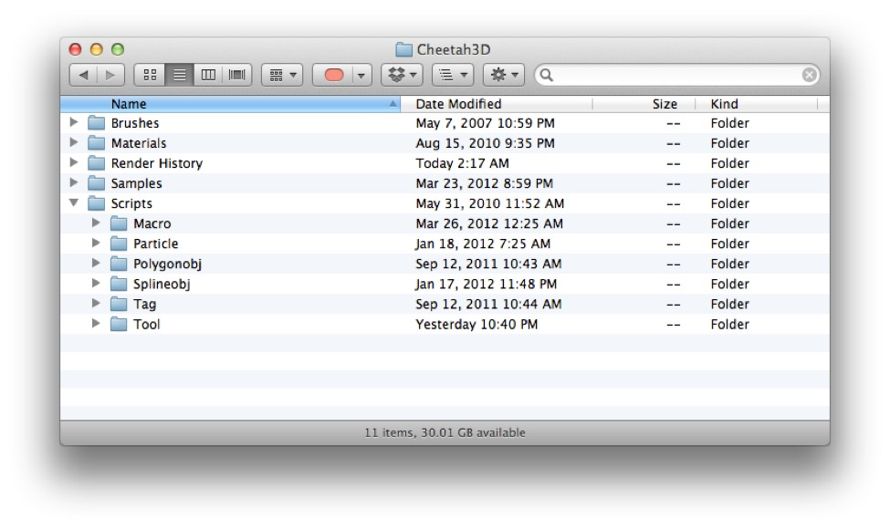
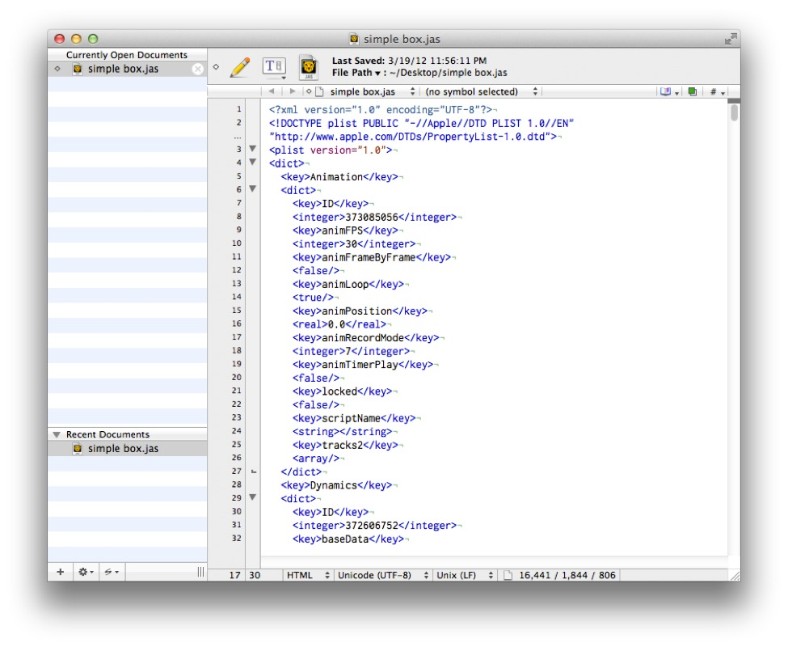

## Cheetah 3D Under the Hood

### Cheetah 3D’s Application Support Folder

You can open Cheetah 3D’s Application Support folder by selecting **Go \> Go to folder…** in Finder and entering this path: **~/Library/Application Support/Cheetah3D/**

Inside this folder you will find four folders:

#### Brushes

Images you put in this folder will be available for use as brushes in Cheetah 3D’s texture painting tool.

#### Materials

This is where the materials available from the Material menu are found. If you want to add more materials (or remove materials you don’t like) here’s where to look.

#### Render History

This is where all the renders you’ve ever done with Cheetah 3D (using this particular user account) and not deleted can be found. Each render job has its own folder. Each folder will almost always include an image (in PNG format), a thumbnail (in JPEG format), some metadata (in an info.plist XML file). Animations will include multiple images and a movie wrapper named movie.mov. If you rendered with preferences set to cache HDR or EPIX then those will be here too.

As I write this, I have over 4000 folders in my Render History.

#### Scripts

The Scripts folder has a number of subfolders for different kinds of scripts:

- **Macros** are simple automations. They do something immediately and automatically with no further user input.

- **Particles** are scripted Particle Systems.

- **Polygonobj** are scripted mesh primitives.

- **Splineobj** are scripted spline primitives.

- **Tag** are scripted tags. (They allow you to add custom properties to objects which can then be used by other scripts.)

- **Tools** bring up a UI panel which you can be used configure the tool or perform tasks.

### .jas Files

*A simple .jas file open in BBEdit 10.*

If you open up a .jas file with a text editor (such as Text Edit — if you want a good, free text editor I highly recommend **TextWrangler** from **barebones.com**) you’ll see that it’s an XML file. It follows that you can perform major changes to .jas files — if you’re careful — using any of the huge variety of tools for manipulating XML. E.g. using XSL it should be possible to write simple transformations that document the contents of .jas files, convert them to other file formats, or perform systematic changes.

