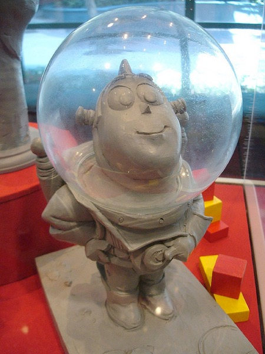

## Workflow

*A photo of an early maquette of Buzz Lightyear (on display at Disney California Adventure in Los Angeles). The workflow for sculpting (in the real world) is horrible — make a mistake and you start over (especially if you’re working in marble) but it’s clearly an incredibly powerful creative tool. *

_**Note**: I found this image on karlb’s photo stream on Flickr. The maquette and images of it presumably belong to Disney (of which Pixar is now a subsidiary), and the photo to karlb, so I hope this is fair use! I apologize and will remove the image if anyone complains._

In a perfect world, an artist sketches out a character concept, quite possibly modeling the character in clay to figure out exactly how that character will look in 3D. Once the character design is perfect, it is turned into a set of reference images that are used by a modeler to create a perfect mesh, which is then textured by a texture artist, rigged by a rigger, animated by an animator, framed and test-rendered (by the same or other animators and/or the director), lit by lighting specialists, and then final rendering is overseen by specialists, and passed to a compositing and finishing team for post-processing.

This perfect world doesn’t exist. In practice, roles are muddled, tasks get performed out-of-order, mistakes get made, people change their minds, and inspiration strikes at the wrong time. Not only that, but the finished product is almost always better because this process isn’t perfect. 

In his [long, hilarious, and insightful reviews of the Star Wars prequels](http://redlettermedia.com), Mike Stoklasa (narrating as “Mr. Plinkett”) argues that one of the major reasons the original Star Wars movies were great and that the prequels are awful is that making a big special effects movie in 1976 was *really difficult*, and the difficulty led to improvisation and inspiration that improved the final result. The prequels, by contrast, were filmed on green screen sets, George Lucas never had to get out of his armchair or do without a cappuccino, and the result was garbage.

Workflow problems can make your life horrible, and they can also end up leading to serendipitous inspiration, but that doesn’t mean you shouldn’t try to avoid them, and that’s what this section is about.

### Points of No Return

There are a number of operations in 3D graphics which tend to be points of no return, in other words points where if a mistake was made beforehand then there’s no good way to fix it later.

#### Converting Objects to Editable Meshes

A simple, trivial example is when you double-click on an object to convert it into an editable mesh. That object might be an assemblage of complex parameters (e.g. a primitive with certain settings, a bunch of modifiers with certain settings, and so forth). Once you double-click the object all that stuff is “collapsed” into a single editable mesh, and you can’t go back and tweak the parameters.

This particular example is pretty easy to **recognize** and **avoid**. You can save a copy of the file (or it might be automatically backed up by **Time Machine** or a third-party alternative) or duplicate the object itself and make the copy invisible *just in case*.

But there are much, much worse cases that are far harder to avoid, and minimizing their impact can require careful planning. As a general rule, a lot of these issues involve the interaction of modeling, UV-mapping, and animation.

#### Collapsing Symmetry

As “points of no return” go, collapsing a symmetry modifier is not a big deal. It’s easy enough to delete half of the mesh and put a symmetry modifier back into it.

The main reasons for collapsing symmetry modifiers are rigging (you can’t rig a mesh with a symmetry modifier because the mirrored geometry can’t be rigged) and UV-mapping (where you want the textures to be asymmetrical even if the geometry is symmetric. 

The workflow issue that arises here is not the collapsing of the symmetry modifier, but the actions taken afterwards, since this work will be lost if you need to tweak the mesh using a symmetry modifier later.

#### Rigging & Animation

“Skinning a mesh” (i.e. attaching a Skeleton tag to a mesh, dragging a bunch of joints into the Skeleton tag, and then binding the mesh to those joints) is a point of no return. You cannot edit a mesh one it’s skinned without having horrible things happen to it.

In a perfect world, no-one would skin meshes that aren’t perfect. But in the real world, the usual way one finds problems in a mesh is by skinning it and discovering that it does weird things when you deform it *just so*.

Fortunately, the default binding method that Cheetah 3D uses is excellent, and it’s usually good enough to quickly test a mesh for obvious problems. What you should do is create your joint hierarchy, and then create a test animation that goes through the most extreme poses you expect character (or whatever it is) to go through. Then when you first skin your mesh you should play this animation while examining it carefully from all angles for problems — if you find any then you should remove the Skeleton tag and fix the problems immediately.

Another thing that this test animation will be useful for is manually painting vertex weights should this be required.  You can scrub your test animation to a point where a deformation occurs and then paint vertex weights with the mesh in it’s problem pose until the problem is fixed.

In any event, the one thing you stand to lose at this point is the binding. You can recover your mesh, and you can recover your joint hierarchy. But if you need to edit your mesh you need to throw away the binding between the two.

#### Morphing

As with skinning, morphing is a “point of no return”. The Morph tag stores vertex positions, and if you mess with the vertices in your mesh you’re going to screw up the Morph tag.

#### Combining Meshes with Different Materials

One of the biggest headaches in Cheetah 3D is merging meshes which have multiple materials. (And if you do a lot of texture baking it’s particularly problematic because you can only bake single meshes.)

Right now there’s no good workaround for this except possibly to write a script. Even making sure that all the meshes you’re working with have the same materials assigned to them in the same order does not guarantee success.

#### UV Mapping Across Multiple Meshes

Another common problem is trying to work on a UV map for a material shared between multiple meshes. The easiest workaround is to merge the meshes, do the UV mapping, and then split the meshes again.

This can clearly be a problem if more than one material is assigned to one or more of the meshes involved. (See the previous issue.)

#### Baking

Baking often involves multiple points of no return. To begin with you may need to write out or overwrite a UV map. Next, you might want to bake multiple meshes into one texture but have them split back into individual meshes for animation purposes (e.g. a spinning propellor or an opening door). Merging meshes loses pivot points, etc., which you’ll need to figure out how to restore or preserve.

**Helpful Hint**: if you want to preserve an object’s pivot you can create a folder, make it a child of that object, and zero out its position and orientation, then pull out of its parent. Now you can do horrible things to the mesh and, when the time comes you can drag it into that folder you created and use **Tools \> Coord System** and then **Burn Transform** to restore its original pivot.

Usually you can write/overwrite UV Map 2, so it’s not a big deal since UV Map 2 is seldom used for anything else, but to run really lean you might want to avoid having two UV maps (they take up memory, etc.) or you may be using an engine that doesn’t support multiple UV maps at all.

You might end up with a workflow like this:

Create your mesh with its UV maps. Save it.

Duplicate the file, add a Bake Material tag to the mesh, do other baking related setup (e.g. merging meshes). Save a copy of this. Use the Bake Material tag to create UV2, bake to UV2. Save this as a new file. Save the baked image.

Duplicate the second file (before UV2 was written to) and use its Bake Material tag to overwrite UV1 (which should end up exactly like UV2 in the third file). Remove the existing materials, and create a new material that uses the baked image in its diffuse channel. Save this for use in your game engine (it only uses one set of UVs).

### Playing Well With Others

#### Importing Stuff

In general, importing stuff into Cheetah 3D is a lossless process! The one exception to this is certain FBX files may have data in them that Cheetah does not support. For example, some Maya/3Ds Max deformers are supported in FBX that Cheetah 3D simply can’t understand and will ignore on import (or worse).

#### Exporting Stuff

Cheetah 3D exports to several widely used 3D file formats, including FBX (“Motionbuilder”), dae (“Collada”), and obj (Alias|Wavefront). FBX is the richest format, supporting animation data, Collada is potentially a very rich format but support for it is rudimentary, while obj faithfully preserves geometry and material assignments, but little else. Every other file format (e.g. 3Ds and STL) also loses geometric information.

#### Working with an external image editor

Cheetah 3D generally plays well with external image editors. It usually detects when an image has been changed and updates itself automatically (worst case, you can always load the image again).

Cheetah 3D also supports PSD files directly, so you don’t need to flatten and export them.

#### Working with other 3D modelers

The best way to get data in and out of Cheetah 3D (aside from its own files) is via FBX. If you only want to import or export geometry, OBJ works well too.

#### Working with Unity 3D

Working with Unity 3D is almost completely seamless. Simply move Cheetah 3D .jas files directly into Unity projects and they will come right through. 

Ideally, images used in materials in a scene should be in the same folder as the .jas file or in a subfolder. (Sometimes you may need to hook up materials with textures in Unity.)

In Unity, you can double-click on models imported from Cheetah 3D and they’ll open right up in Cheetah 3D. Any changes you make will immediately be reflected in your Unity project. Note that changing the names of meshes or the object hierarchy can cause mesh components to become disassociated from their sources.

You may need to explicitly enable the export of UV2 to FBX if you’re using UV2.

