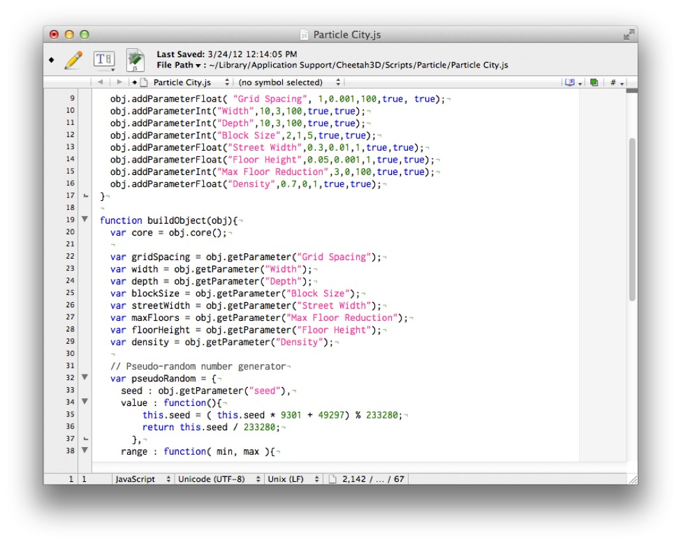
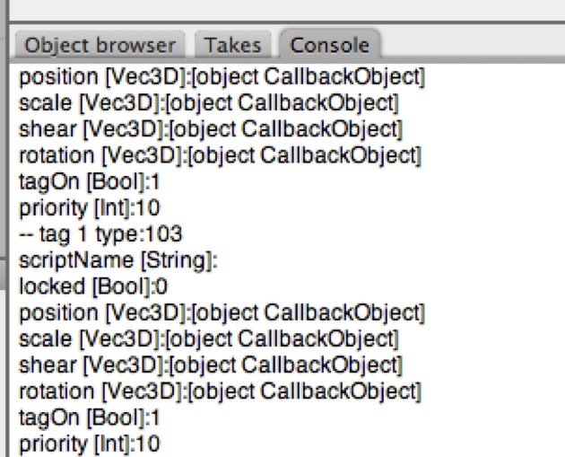
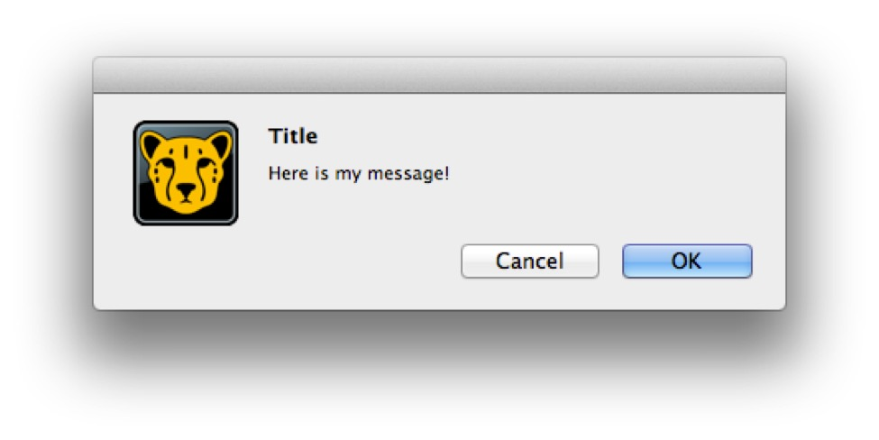

## Scripts

### Some Very Useful Scripts

For the last couple of years I’ve tried to maintain a “master list” of useful scripts for Cheetah 3D (I’ve even contributed a couple myself). This list is posted on the forums here: **http://www.cheetah3D.com/forum/showthread.php?p=42637** but I’ve included the current list as of writing below.

#### Basic Interface Enhancements

- [Expand Selection](http://www.cheetah3d.de/forum/showthread.php?t=4108) conditionally expand a selection

- [Toggle Visibility / Make Solo](http://www.cheetah3d.com/forum/showthread.php?t=7106) make everything except the selection disappear or go wireframe

- [OBJ Importer](http://www.cheetah3d.de/forum/showthread.php?t=4085) improved OBJ import

- [Object Chunker](http://www.cheetah3d.de/forum/showthread.php?t=4991) break large meshes into smaller meshes to meet polygon budget (e.g. for Unity which won’t accept meshes with more than 65535 triangles).

- [set changer](http://www.tres-graficos.jp/blog/files/category.php?k=Script)

#### Modeling

- [Bent Arrow](http://www.cheetah3d.de/forum/showthread.php?t=5130)

- [Billboard](http://www.cheetah3d.de/forum/showthread.php?t=1686)

- [Center Bounds](http://www.cheetah3d.de/forum/showthread.php?t=3537) set center of object to the center of its bounding box

- [Curls](http://www.cheetah3d.com/forum/showthread.php?t=8033)

- [Dissolve](http://www.cheetah3d.de/forum/showthread.php?t=3792)

- [Edge N Splitter](http://www.cheetah3d.com/forum/showthread.php?t=8024) a more versatile ring cutting tool

- [Edge Utilities](http://www.cheetah3d.de/forum/showthread.php?t=2574) macros for working with creases and seams

- [Center of Gravity](http://www.cheetah3d.de/forum/showthread.php?t=4810) set center of object to the center of "gravity" of a selected set of faces.

- [Point Array](http://www.cheetah3d.de/forum/showthread.php?t=970)

- [Flatten Polygon](http://www.cheetah3d.de/forum/showthread.php?t=1405) make selected polygons properly coplanar

- [Hair](http://www.cheetah3d.de/forum/showthread.php?t=1294) algorithmic generation of hair geometry with UVs

- [Loft](http://www.cheetah3d.de/forum/showpost.php?p=8076&postcount=1)

- [Mandlebulb](http://www.cheetah3d.de/forum/showthread.php?t=5865) julia set modeler

- [Mirror Copy](http://www.cheetah3d.de/forum/showthread.php?t=1448) (also useful for animation) mirror geometry and poses

- [Particle Connector](http://www.cheetah3d.com/forum/showthread.php?t=8025)

- [Path Array](http://www.cheetah3d.de/forum/showthread.php?t=5292)

- [Pivot Setter](http://www.cheetah3d.com/forum/showthread.php?p=67193&posted=1) (and a derived script for setting the pivot to a selected point)

- [Polygon Reduction](http://www.tres-graficos.jp/blog/files/category.php?k=Script)

- [Surface Utilities](http://www.cheetah3d.com/forum/showthread.php?p=57851) powerful tools for changing smoothing settings and fixing normals.

- [Taper Sweep](http://www.cheetah3d.de/forum/showthread.php?t=4029)

- [Toggle Shading](http://www.cheetah3d.com/forum/showthread.php?t=6381)

- [Toggle Visibility](http://www.cheetah3d.com/forum/showthread.php?t=6373)

- [Polygon Splitter](http://www.cheetah3d.com/forum/showthread.php?t=6776)

- [Extruded Text Maker](http://www.cheetah3d.com/forum/showthread.php?t=6801) — has more options than standard text spline

- [Elliptical Splines](http://www.cheetah3d.com/forum/showthread.php?t=6607)

- [Rounded Rectangle Spline](http://www.cheetah3d.com/forum/showthread.php?t=6698)

- [Pathed Helix](http://www.cheetah3d.com/forum/showthread.php?t=1298&highlight=helix)

#### Animation

- [Guided Spline](http://www.cheetah3d.de/forum/showthread.php?t=3880)

- [morph](http://www.tres-graficos.jp/blog/files/category.php?k=Script)

- [Moving Textures](http://www.cheetah3d.de/forum/showthread.php?t=1210)

- Particles while you wait for 5.4

- [Point Array](http://www.cheetah3d.de/forum/showthread.php?t=970)

- [Pose Utilities](http://www.cheetah3d.de/forum/showthread.php?t=5358) mirror and flip poses quickly and efficiently

- [Sequential OBJs](http://www.cheetah3d.de/forum/showthread.php?t=2110)

- [Automatic Lip Sync from WAV File](http://www.cheetah3d.com/forum/showthread.php?t=6557)

#### Texturing and UV-Mapping

- [Polygon UV Editor](http://cheetah3d.de/forum/showpost.php?p=2689&postcount=12)

- [Text Tool](http://www.cheetah3d.com/forum/showthread.php?t=8019)

- [UV Stepper](http://www.cheetah3d.de/forum/showthread.php?t=2280)

#### Rendering

- [LuxCheetah](http://www.cheetah3d.de/forum/showthread.php?t=4374) exports C3D scenes to the free physically-based renderer [LuxRender](http://luxrender.net/)

#### Particles

- [Iterative Relative Particles](http://www.cheetah3d.com/forum/showthread.php?t=6905) for Groboto-style procedural objects

- [Particle City](http://www.cheetah3d.de/forum/showthread.php?p=43391#post43391) custom particle system for procedurally generating "cities"

### Using Scripts

The first thing you need to know about scripts is where to “install” them. This is especially tricky as of Lion because Apple has hidden user Library folders.

The simplest option is to use **Go \> Go To Folder** in Finder to go to this folder: 

**~/Library/Application Support/Cheetah3D/**

#### Which subfolder does a script go in?

For some reason Cheetah 3d requires scripts to be put in specific sub-folders despite the fact that (a) human beings cannot easily tell what kind of script a given script file is and (b) Cheetah 3d probably can. Go figure. If it's not obvious from the script's documentation or internal comments what kind of script it is, here's how you can *probably* tell by looking through it:

- If the script contains **function** **main** function, it's a **Macro** script.

- If the script contains **function buildObject** and calls **addParticle**, it's a **Particle** script.

- If the script contains **function buildObject** and calls **spline… (e.g. spline.move() or spline.curve()), it's a Spline script.

- If the script contains function buildObject, but no calls to spline, addParticle it's a Polygonobj script.

- If the script only contains function buildUI (and maybe some declarations) it's a Tag script.

- Finally, if the script contains function buildUI, *at least one other function*, but no buildObject function, it's a Tool script.

This is not completely foolproof. It's possible to create a Particle script that never calls addParticle, for example, but it would be kind of weird. In most cases, where a script is supposed to do should be documented.

#### When must you relaunch Cheetah 3D?

If you’re working on a script you do not need to relaunch Cheetah 3D for it to see changes to the script (but you may need to select the script anew from the Tool menu). Cheetah 3D will only find *additional* scripts when launched, so if you want Cheetah 3D to recognize a newly added script you will need to quit and relaunch it.

Be careful when coding scripts. It is quite possible for a script to seize up Cheetah 3D and require a force quit. (Command-option escape to force quit, in case you didn’t know. You can also click and hold on an application’s icon in the dock.)

#### Assigning Hotkeys to Scripts

Once you’ve loaded a script, you can assign a hotkey to it (just as you would anything else). This is extremely useful for some of the more frequently needed scripts. E.g. when doing character animation, you might want to hotkey Pose Utilities.

### Writing Scripts

To create a new script simply fire up your favorite text editor and create a new JavaScript (.js) document in the appropriate folder. 

The best way to do it is probably to open up your Cheetah 3D folder inside Application Support — ~/Library/Application Support/Cheetah3D/ — and duplicate a script of the type you want to write, name it what you want, and then launch/relaunch Cheetah 3D. (TextEdit in plain text mode works fine, but it’s very basic — if you don’t have a serious programmer’s text editor, I recommend TextWrangler from barebones.com — it’s free and very powerful.)

To write Cheetah 3D scripts requires that you know some JavaScript. Teaching JavaScript is beyond the scope of this book, but there are many good resources for learning JavaScript (many would recommend Douglas Crockford’s *JavaScript: The Good Parts* and his videos at [http://yuiblog.com/crockford](http://yuiblog.com/crockford)). If you’ve done any programming you can probably follow along without knowing much about JavaScript specifically.

#### Basics

The simplest kind of script in Cheetah 3D is a Macro script. A Macro script looks like this:

function main(doc){

// do stuff here

}

A comment in JavaScript is anything between /\* and \*/ or anything following // until the end of that line. So “// do stuff here” is a comment.

When someone selects a macro script from the Tools \> Script \> Macro Script menu Cheetah 3D loads the script and calls its main function, passing it the variable doc, which contains a representation of your Cheetah 3D document.

If we look through the online help for documentation on the Document object (which is what doc is going to be) we can see it has some useful looking properties and methods. A nice simple method is render(). Let’s try that.

function main(doc){

doc.render();

}

If you try running this script it will do exactly what you expect. Well, *kind* of. Unlike clicking the Render icon in the toolbar you get no visual feedback until the render is complete.

Still, it’s not like this is a terribly useful script. Let’s try something a little more advanced.

function main(doc){

doc.addObject( BOX );

}

This, again, does what you’d expect. The documentation also stipulates that addObject returns an object — the thing you added. Let’s do something with it.

function main(doc){

var box = doc.addObject( BOX );

box.setParameter( "position", new Vec3D( 0, 0.5, 0 ) );

}

This macro creates a new box and then moves it up 0.5 units. (Ever frustrated by how the default box is centered on the origin rather than sitting neatly on the XZ plane? This script is your answer!)

### Debugging Scripts — The Console

If you right-click on the header of any panel in a Cheetah 3D window you’ll discover that one of the options is for a console panel. I recommend adding a console panel somewhere to one of your layouts if you want to do any scripting.

My default layout has a console tab tucked in with the object browser — ready whenever I need it.

If you want your script to say something to you (“Hey, I got this far without crashing”) then Cheetah 3D provides a print() function.

function main(doc){

print( "hello world");

}

Hmm, maybe I should have started with this!

You can also generate alerts using the OS.messageBox() function.

function main(doc){

OS.messageBox("Title","Here is my message!");

}

### Feeling Your Way Around

Cheetah 3D’s documentation is sometimes lacking, especially with respect to scripting, but it does offer some introspection tools to allow you to figure things out for yourself. One of the sample Macro scripts — Material Info.js — gives you a rough idea of how to do this, and forum scripting expert tg\_jp has improved on it with this more general version:

function main(doc) {

var obj = doc.selectedObject();

print('---- Object Info ---');

if ( obj ) {

print('-- object type:'+obj.type());

var info = obj.parameterInfo();

for(var j=0;j<info.length;j++) {

print(info[j][0] +" [" + info[j][1] + "]:"+obj.getParameter(info[j][0]));

}

var tcount = obj.tagCount();

for (var i = 0;i < tcount;++i) {

var tag = obj.tagAtIndex(i);

info = tag.parameterInfo();

print('-- tag '+i+' type:'+tag.type());

for(var j=0;j<info.length;j++){

print(info[j][0] + " [" + info[j][1] + "]:"+tag.getParameter(info[j][0]));

}

if (tag.type() == 102) { // material tag.

var material = doc.materialAtIndex(tag.linkedToMaterial());

print('-- linked Material --');

info = material.parameterInfo();

for(var j=0;j<info.length;j++){

print(info[j][0] + " [" + info[j][1] + "]:"+material.getParameter(info[j][0]));

}

}

}

}

}

This script, when saved as a Macro Script, will document all the properties of any selected object. 

If you wrap the core functionality of this script in a utility function, I’ll call it describe(), then you get something like this:

function describe( obj ){

if ( obj ) {

print('-- object type:'+obj.type());

var info = obj.parameterInfo();

for(var j=0;j<info.length;j++) {

print(info[j][0] +" [" + info[j][1] + "]:"+obj.getParameter(info[j][0]));

}

var tcount = obj.tagCount();

for (var i = 0;i < tcount;++i) {

var tag = obj.tagAtIndex(i);

info = tag.parameterInfo();

print('-- tag '+i+' type:'+tag.type());

for(var j=0;j<info.length;j++){

print(info[j][0] + " [" + info[j][1] + "]:"+tag.getParameter(info[j][0]));

}

if (tag.type() == 102) { // material tag.

var material = doc.materialAtIndex(tag.linkedToMaterial());

print('-- linked Material --');

info = material.parameterInfo();

for(var j=0;j<info.length;j++){

print(info[j][0] + " [" + info[j][1] + "]:"+material.getParameter(info[j][0]));

}

}

}

}

}

Now if I’m trying to figure out what properties a given object has, I can simply describe() it and its properties will be listed in the console.

This function has saved my bacon many times — e.g. when trying to script a Particle System the Random Seed property isn’t documented — how do you get at it? Using getParameter(“Random Seed”) doesn’t work. If you open the .jas file you’ll discover it’s called “particlesSeed” in the XML. But “particlesSeed” doesn’t work either (nor does “Particle Seed”). Finally, selecting a particle system and using this script reveals a property called “seed” of type “Int”. Eureka!

---- Object Info ---

-- object type:81

scriptName [String]:Scripts/Particle/Particle City.js

locked [Bool]:0

...

rotorder [Int]:6

name [String]:Procedural City

order [Int]:1

seed [Int]:12345

displayType [Int]:3

...

editorActive [Bool]:1

renderActive [Bool]:1

editorShading [Int]:0

### Some Useful Techniques

Well, you’re pretty much on your own now. The best way to create new scripts is to look at the example scripts provided with Cheetah 3D, as well as those on the forums, and use them as a starting point. Before I send you off to swim with the sharks, here are a few useful techniques I’ve picked up.

#### Iterating Across the Scene Graph

This simple tool illustrates probably the single most useful pattern for writing macros and tool scripts.

First of all, it shows how to build a tool user interface.

The set\_smooth function is called by the user interface button (the name of the function the button will call is passed as a parameter when creating the button).

The set\_smooth function uses the target utility function to figure out if it’s going to act on the scene root or the selection (based on UI settings).

It then defines a simple function fn that does what it wants to do for a given object and calls the iterate\_on\_objects utility function to apply this simple function to the object returned by the target function and — if the user has opted for recursing children — everything below it in the scene graph (i.e. the Object Browser).

// build the tool UI

function buildUI(tool){

tool.addParameterBool("Selection Only", true, false, true, false, false);

tool.addParameterBool("Recurse Children", true, false, true, false, false);

tool.addParameterSeparator("Smoothing");

tool.addParameterFloat("Angle",15.0,0.0,90.0,true,true);

tool.addParameterButton("Set Smooth Angle","OK","set_smooth");

}

function set_smooth(tool){

var angle = tool.getParameter("Angle");

var fn = function( obj ){

if( obj.type() == POLYGONOBJ ){

obj.setParameter("normalAngle", angle);

}

}

iterate_on_objects( tool, target(tool), fn );

tool.document().redrawAll();

}

function target(tool){

var doc = tool.document();

if( tool.getParameter("Selection Only") ){

return doc.selectedObject();

} else {

return doc.root();

}

}

// applies a function to an object and then, if user has selected recurse,

// recursively iterates across that object's children

function iterate_on_objects( tool, obj, fn ){

fn( obj );

if( tool.getParameter("Recurse Children") ){

for( var i=0; i<obj.childCount(); i++ ){

iterate_on_objects( tool, obj.childAtIndex(i), fn );

}

}

}

#### Iterating across the parts of an editable mesh

Using the same framework from the previous example, here’s a tool for flipping normals. You can flip every normal in your entire scene with a single button press using this handy script!

But the flip\_normals function shows how to iterate across components of an editable mesh (a.k.a. POLYGONOBJ). Also note how it uses some tricks to force Cheetah 3D to recalculate normals and then forces the scene to be redrawn when it’s done.

// build the tool UI

function buildUI(tool){

tool.addParameterBool("Selection Only", true, false, true, false, false);

tool.addParameterBool("Recurse Children", true, false, true, false, false);

tool.addParameterSeparator("Normals");

tool.addParameterButton("Flip Normals","OK","flip_normals");

} 

function flip_normals(tool){

var fn = function( obj ){

if( obj.type() == POLYGONOBJ ){

var c = obj.core();

for( var i=0; i<c.polygonCount(); i++ ){

c.flipWinding( i );

}

// Force recalculation of normals

obj.setParameter("normalAngle", obj.getParameter("normalAngle"));

}

}

iterate_on_objects( tool, target(tool), fn );

tool.document().redrawAll();

}

function target(tool){

var doc = tool.document();

if( tool.getParameter("Selection Only") ){

return doc.selectedObject();

} else {

return doc.root();

}

}

// applies a function to an object and then, if user has selected recurse,

// recursively iterates across that object's children

function iterate_on_objects( tool, obj, fn ){

fn( obj );

if( tool.getParameter("Recurse Children") ){

for( var i=0; i<obj.childCount(); i++ ){

iterate_on_objects( tool, obj.childAtIndex(i), fn );

}

}

}

#### Pseudo-Random Numbers

One of the useful features of Cheetah 3D’s Particle System objects is that they are driven by a pseudo-random number generator for which you *explicitly* provide a seed value (which defaults to 12345). This means that a particle system will *deterministically* produce results based on that seed value. The effects *seem* random, but they’re completely predictable and reproducible. This means that if you’ve tweaked your particle settings to produce a pleasing result it won’t suddenly do something different when you render it (or the next time you load the file).

But what if you’re writing your own Particle System? Cheetah 3D doesn’t provide access to the pseudo-random number generator it uses internally. Here’s the current version of my Particle City script, a Particle System specifically designed to lay out buildings on a street grid. Note the Pseudo-random number generator! Also note how I obtain the seed value that Cheetah 3D automatically provides as part of any Particle System interface (so I don’t even need to create my own).

If you want to create procedural meshes (e.g. like the Relief object) you can make sure they will produce deterministic results based on a seed value using this pseudo-random number generator, or another like it.

//

// Particle City

// ©2010-12 Tonio Loewald

//

function buildUI(obj){

obj.setParameter("name","Procedural City");

obj.addParameterFloat( "Grid Spacing", 1,0.001,100,true, true);

obj.addParameterInt("Width",10,3,100,true,true);

obj.addParameterInt("Depth",10,3,100,true,true);

obj.addParameterInt("Block Size",2,1,5,true,true);

obj.addParameterFloat("Street Width",0.3,0.01,1,true,true);

obj.addParameterFloat("Floor Height",0.05,0.001,1,true,true);

obj.addParameterInt("Max Floor Reduction",3,0,100,true,true);

obj.addParameterFloat("Density",0.7,0,1,true,true);

}

function buildObject(obj){

var core = obj.core();

var gridSpacing = obj.getParameter("Grid Spacing");

var width = obj.getParameter("Width");

var depth = obj.getParameter("Depth");

var blockSize = obj.getParameter("Block Size");

var streetWidth = obj.getParameter("Street Width");

var maxFloors = obj.getParameter("Max Floor Reduction");

var floorHeight = obj.getParameter("Floor Height");

var density = obj.getParameter("Density");

// Pseudo-random number generator

var pseudoRandom = {

seed : obj.getParameter("seed"),

value : function(){

this.seed = ( this.seed * 9301 + 49297) % 233280;

return this.seed / 233280;

},

range : function( min, max ){

return Math.floor( this.value() * (max - min + 1) + min );

}

}

var w = (width - 1) * gridSpacing + Math.floor( width / blockSize ) * streetWidth;

var d = (depth - 1) * gridSpacing + Math.floor( depth / blockSize ) * streetWidth;

for( var x = 0; x < width; x++ ){

for( var z = 0; z < depth; z++ ){

if( pseudoRandom.value() < density ){

var bx = x * gridSpacing - w * 0.5 + Math.floor( x / blockSize ) * streetWidth;

var bz = z * gridSpacing - d * 0.5 + Math.floor( z / blockSize ) * streetWidth;

var  p = core.addParticle();

// drop each building by a number of floors

var h = pseudoRandom.range( 0, maxFloors ) * floorHeight;

p.setPosition( new Vec3D(bx, -h, bz) );

// rotate each building by a multiple of 90°

var r = pseudoRandom.range( 0, 3 ) * 90;

p.setRotation( new Vec3D( 0, r, 0 ) );

}

}

}

}

