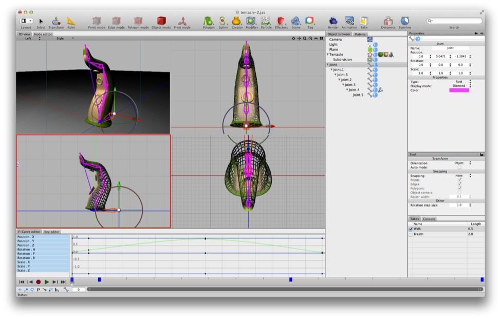

# Mastering Cheetah 3D’s Interface

*“When I use a word,” Humpty Dumpty said, in rather a scornful tone, “it means just what I choose it to mean — neither more nor less.”*

*“The question is,” said Alice, “whether you can make words mean so many different things.”*

*“The question is,” said Humpty Dumpty, “which is to be master — that's all.”*

*Alice was too much puzzled to say anything; so after a minute Humpty Dumpty began again. “They've a temper, some of them — particularly verbs: they’re the proudest — adjectives you can do anything with, but not verbs — however, I can manage the whole lot of them! Impenetrability! That's what I say!”*

**From *Through the Looking Glass*, by Lewis Carroll**

