## Glossary

Or, miscellaneous, possibly useful information in no particular order that may be useful if you search for an unfamiliar term.

Note that most of the terms discussed here have excellent and detailed definitions online in places like Wikipedia. Many are also discussed "inline" in relevant chapters. If you want more information on any of this stuff, Google is your friend. (Or Bing. Nothing against Bing.) I am not going to try to replace online reference sources by providing detailed formal definitions of these terms, and instead will focus on communicating the core concepts and why they’re important in as beginner-friendly a manner as possible.

### Copyright, Intellectual Property

I am not a lawyer.

Copyright and intellectual property essentially come down to two questions: What can I use? What can I show publicly / give away / sell? 

The answer to the first question — **what can one use?** (legally) — is, pretty much, anything you like as long as it’s for your own personal use. To give you a concrete example — movie directors frequently create rough cuts of work in progress using music copied from their collections, shots copied from other movies, and so on. This is *professional work* done by movie industry insiders, and it’s just fine — as long as they don’t distribute or sell the rough cut.

The second question — what can one display, give away, or sell? — is the important one, and comes down to whether you own or have the rights to make specific use of something. And it doesn’t really matter whether you’re showing something publicly (e.g. uploading it to YouTube), giving it away, delivering it as work-for-hire, or selling it — the penalties and pitfalls of making the wrong call are pretty much the same.

Read your license agreements carefully! If in doubt, get legal advice.

### Forward Kinematics, Inverse Kinematics

Forward kinematics (also referred to as hierarchical animation) is the 3D animation system you get by having children contained inside their parent’s coordinate system. Thus when you move an object, the motion is carried “forward” to its children.

Inverse kinematics evolved from the difficulty 3D animators had in animating characters and other complex “rigs” using forward kinematics. 

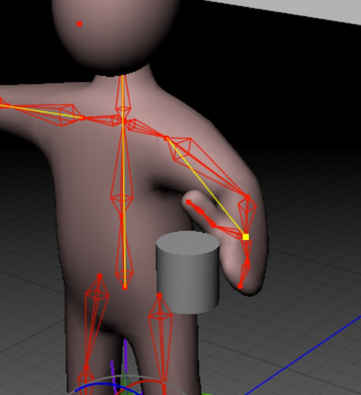

*A simple animation task such as moving a character’s hand to a cup can be enormously difficult using forward kinematics. Inverse kinematics addresses this problem by allowing the animator to pick the desired result and calculate the pose necessary to achieve it.*

Consider a simple arm made using a hierarchy of bones — the upper back bone contains the collar bone contains the upper arm contains the lower arm contains the hand. Typically an animator wants to do something like “move the hand to pick up the cup”, but to do this requires moving the upper arm, which has unpredictable effects on the lower arm and hand, then the lower arm, which affects the hand, and so on. Getting the cup to the hand involves many iterations and is an iffy proposition at best. You might end up with the hand on the cup but the arm in a very unnatural pose.

Inverse kinematics (or IK) approaches this class of problem by allowing the animator to choose the desired result — the hand is poised to pick up the cup — and then solving the highly complicated problem of how the hierarchy above the hand must be moved to obtain the result based on _constraints_. To produce reasonable results, an IK system relies on constraints which restrict the movement of joints to reasonable values (e.g. we cannot bend our elbows in any direction). 

Modern IK systems, including Cheetah 3D, make good use of the initial state of a skeletal hierarchy and produce quite good behavior without painstakingly setting constraints, but often produce better results with constraints.

### Interpolation

Interpolation simply means trying to figure out the value of a variable at some point between known values of the variable. E.g. animation involves interpolating the position of an object between keyframes produced by the animator. The animator tells the program that the object will be at point A at time X and point B at time Y, the program determines where the object will be between X and Y by interpolating (between A and B).

Interpolation is used everywhere in 3D graphics. Animation is all about interpolation and so is rendering (the way lighting is calculated involves interpolating between normals).

By default, when animating Cheetah 3D will smoothly interpolate your state changes. This is often, but not always, what you want. To fine-tune interpolation in Cheetah 3D you should use the f-curve display.

### F-Curve

F-Curves are adjustable representations of how Cheetah 3D is interpolating values in an animation. In determining how an object gets from A to B (where A and B might be positions or anything else — e.g. rotations, scales, or even colors) any number of interpolation methods may be used. Linear interpolation is the most obvious algorithm (the state changes at the same rate as time) but animators almost never want linear interpolation.

The most common interpolation method used in animation is called easing. Ease-in means you start moving slowly and then accelerate, while ease-out means you start slow down as you approach your goal.

In *Disney Animation: The Illusion of Life* the authors suggest that the best way to interpolate a motion involves “point-to-point” (spend most of your time at the start and destination, and very little time in between — effectively ease-in and ease-out), anticipation, and overshoot. You can achieve all of these effects quite simply using the f-curve editor.

### Keyframe

In 3D animation, a key frame is a point on the time line at which at least one animated parameter is “keyed” (i.e. has a set “key” value).

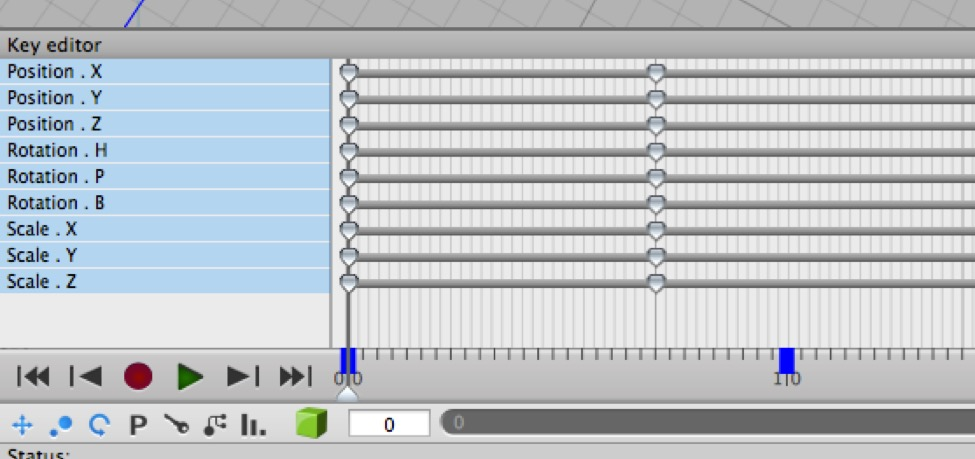

*This shows two keyframes (with position, rotation, and scale keys) on the timeline. This is taken from the bottom-left of the default Animation layout with the animation timeline controls visible.*

Cheetah 3D will show you where there are keys for the currently selected object on the timeline. (Annoyingly it won’t show you keys for child or parent objects.)

In traditional animation, a *key *frame was a drawing created by a lead animator. Because lead animators were the principal bottleneck in animated film production (in *Disney Animation: The Illusion of Life*, the authors contended that there were only ten artists good enough to work as lead animators for Disney features *in the world*), the idea was to minimize the work they had to do, so they drew key frames and less precious artists (“in-betweeners”) drew the intervening frames (or “tweens”).

### Instrumenting Rigs

*Filip C [posted a simple "blockman" rig demonstrating](http://www.cheetah3d.com/forum/showthread.php?t=8534) how you can create quite sophisticated rigs in Cheetah 3D (using splines, which don't render or create polygon meshes on their own) as instrumentation. If you search the forums you will find quite a lot of rigs, some very sophisticated.*

Rigged characters can be very complicated objects, and most serious animators will “instrument” their rigs to make them easier to work with. Many 3D programs provide some kind of support for instrumenting rigs (e.g. they allow you to build virtual controls that float near the character and allow you to quickly select IK targets, or control settings or poses).

### Morphing, Morph Target

Morphing simply means “changing form”. Cheetah 3D supports “morph target” animation which allows you to move the points of a mesh around and store different states of its vertices as morph targets which can then be interpolated.

Morph target animation is a common technique for animating the faces of characters (e.g. you might edit a character’s head into various facial expressions and vowel forms, making each into a morph target, and then you can animate the figure simply by blending the different forms at different points in time).

Today, morph target animation is falling out of favor and fully boned facial rigs with skin/bone/muscle deformers are being used instead.

### Non-destructive Creator/Modifier Chain

Cheetah 3D, like many other powerful 3D programs, allows you to progressively modify a mesh using one or more non-destructive modifiers. Because more than one modifier can be applied (and these modifiers are applied in fixed order) this is often referred to as a chain. The term “non-destructive” refers to the original mesh not being affected by the modifiers.

### Creator

In Cheetah 3D a Creator is an object that generates a mesh by applying rules to one or more children. Creators differ from Modifiers in that some operate on more than one input object (modifiers always apply to a single object, their parent) and they can operate on objects other than meshes.

### Modifier

In Cheetah 3D a Modifier is an object that modifies its parent mesh. If a parent mesh has more than one modifier, the modifiers are applied in order (top to bottom). Modifiers differ from creators in that they operate on their parent (rather than their children) and thus can only affect on object, and they only operate on meshes. (It’s theoretically possible to write a Modifier plugin that can operate on non-meshes.)

### Node-Based, Shader, Material

In Cheetah 3D a material is something you can apply to a mesh (or part of a mesh) to change its surface appearance.

E.g. a material might be “rusted steel” and if assigned to a box would make it look like it was made of rusted steel.

In Cheetah 3D, and in 3D software generally, a shader is an algorithm for rendering surfaces which, along with textures and data, determines the appearance of surfaces it is applied to.

E.g. a shader might be called “car paint” and if used in a material will make objects assigned that material look like they’re covered in car paint, but exactly what color or pattern of car paint would be determined by information fed into the car paint shader.

“Node-based” simply means that the object is defined graphically using a flowchart comprised of nodes and lines joining them. Cheetah 3D has a node-based material system.

(In other programs, the words “material” and “shader” may be used slightly differently, but these definitions are pretty typical.)

### Normal Map, Bump Map

Normal Maps and Bump Maps represent two complementary approaches to representing three-dimensional surface detail on two-dimensional surfaces by manipulating the rendering algorithm.

In essence, a bump map treats greyscale data as a “height field” where the whiter a pixel is the more the renderer treats it as being “pushed out” from the surface. The way this is done is by changing the **surface normal** which in turn changes the outputs of all the lighting calculations (including reflection and refraction).

A normal map simplifies this process by encoding a precalculated normal as an r,g,b value. Normal maps are thus colored and not greyscale, and *may* include much more precise information about the angle of the implied surface, but no information about its height. Normal maps are preferred for game engines because they save calculation steps.

There is a third approach: sub-polygon **displacement**, which takes a bump map and uses it to deform the underlying geometry. This produces wonderful results. Cheetah 3D provides some support for displacement, which is discussed elsewhere.

### Procedural Texture

A procedural texture is an algorithm — usually a chaotic function — that generates imagery based purely on spatial coordinates.

### Convex Polygon

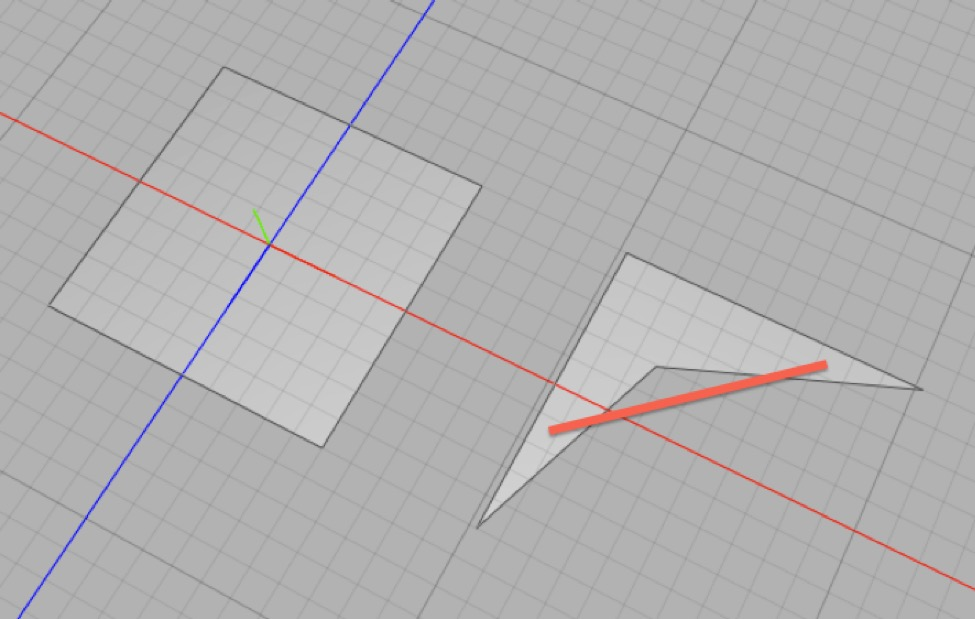

*A convex polygon (left) and a concave polygon (right). The red line shows how you can draw a line between two points in the concave polygon that passes outside it.*

A convex shape in mathematics is defined as one where if you join any two points in that object with a line, the line will be entirely contained within the shape. In general, you don’t want non-convex polygons in your meshes if you can help it, especially if you plan to export those meshes to another program.

**Aside**: You’ve probably heard of a “convex lens” (such as a typical magnifying glass lens). In simple terms, convex has protrusions, while concave has dents. You don’t need to know this, but “convex” is completely general in mathematics, and applies to things that have any number of dimensions, and things embedded in spaces that are non-Euclidean and so on (where “line” is a concept derived from a “distance” or “norm” function).

(Why? One reason is that the way different 3D programs triangulate meshes varies, and you cannot predict whether a non-convex mesh that looks OK in Cheetah 3D will still look OK when a different triangulation of the mesh occurs.)

### Quad

A quad is a four-sided polygon. Ideally, meshes should be composed entirely of quads and those quads should be convex and, ideally, “squarish”. (Why? Quads subdivide nicely, which means anything built of quads can be subdivided and deformed with generally good results. Texture-mapping that relies on UVs tends to work best — i.e. distort textures least — with squarish quads.)

Cheetah 3D has tools for selecting any polygons in a mesh that aren’t quads, which is very helpful for cleaning up meshes. These tools are **Selection \> Select Triangles**, **Selection \> Select Quads**, and **Selection \> Select nGons \> 4**.

### Triangulation, Tessellation

*A cube (left) and a triangulated cube (right).*

Triangulation (sometimes tessellation) is referred to the process of converting a mesh composed of arbitrary n-gons (an n-gon is a polygon with n sides, n being 3 or more) into a mesh entirely composed of triangles.

Note that the word tessellation sounds fancier but is actually less accurate.

### Spline

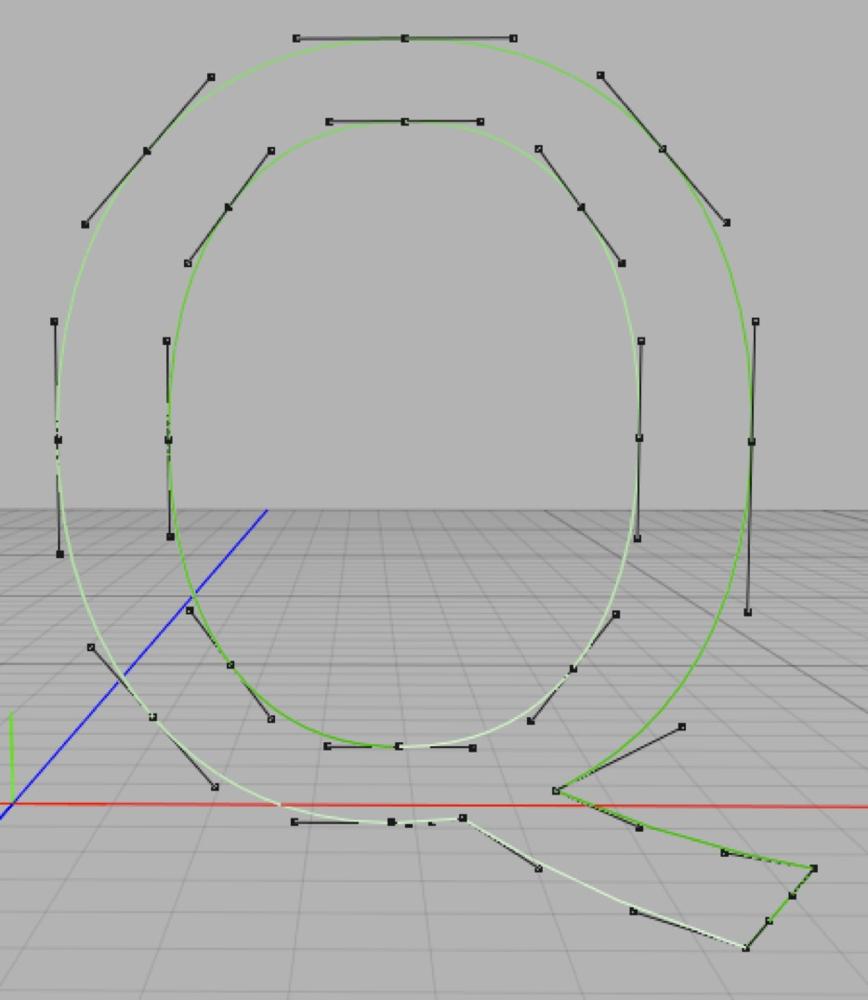

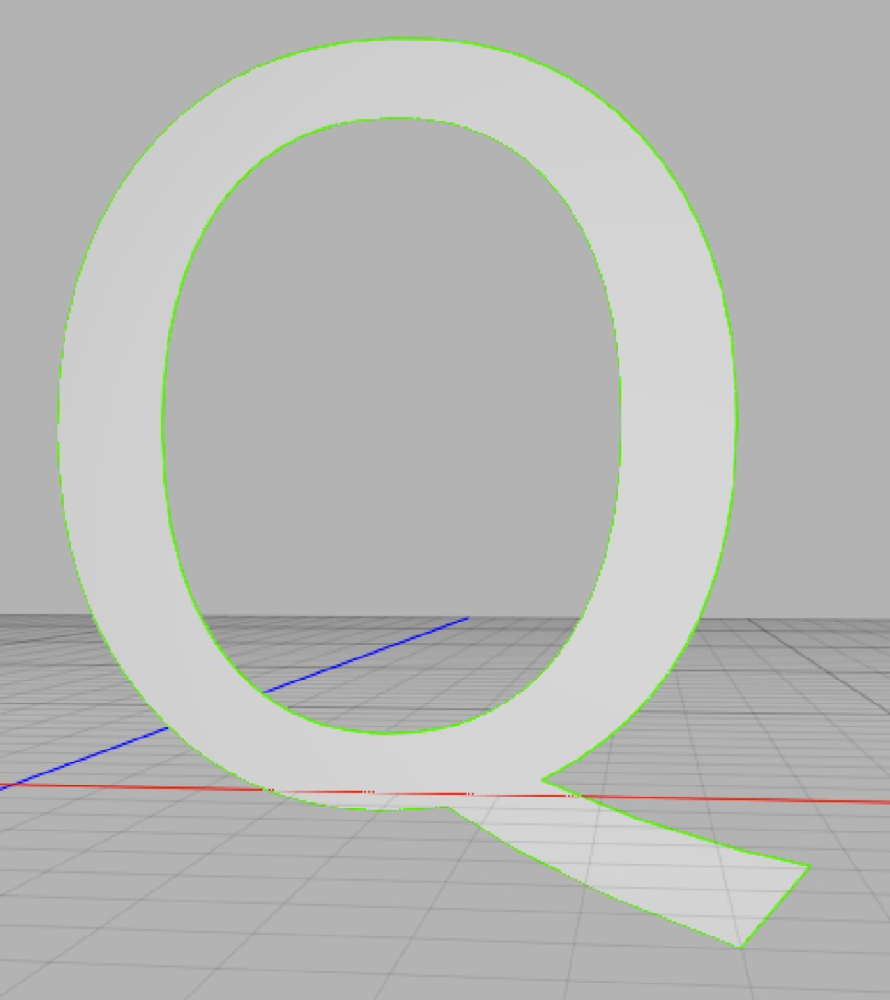

_**Top**: this spline object (which happens to be a letter Q) is formed out of two separate splines. The inner spline is interpreted as a “hole” in the outer spline. **Bottom**: the same spline object dragged into a Polyplane creator showing how Cheetah 3D interprets the spline object._

A spline is a bezier curve. A single spline object can create multiple separate spline curves.

### Displacement Map

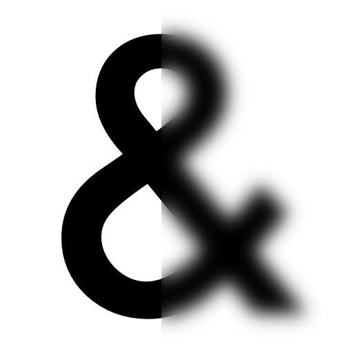

_Displacement Map_

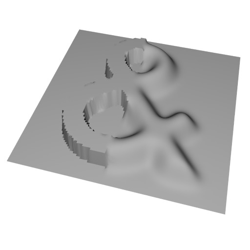

_100x100 Plane with displacement map applied (using Displacement modifier with -0.1 offset)_

The general idea of displacement is that you define a “base mesh” and then subdivide it (linear subdivision) and displace the polygons from their original positions based on a displacement map (which is treated as a bump map or height field).

Cheetah 3D supports displacement in two ways. There’s the **Relief object**, which is essentially a plane with a displacement modifier and a fractal displacement map built in, and there’s the **Displacement modifier** which applies displacement using a supplied displacement map and the parent mesh’s UV map.

### Mesh Weight, Mesh Topology, Retopologize

Mesh weight simply refers to how computationally expensive a mesh is to work with. At first approximation, mesh weight is determined by the number of points and triangles in the mesh. A mesh can sometimes have many more UV points than geometric points, and this will add to its “weight”.

Mesh topology refers to the “niceness” of the mesh’s geometry. It’s hard to explain good mesh topology — it’s something you get an eye for with experience.

To “retopologize” a mesh is to take a mesh that has the right shape but “bad topology” and rebuild it with a nicer topology (usually reducing the complexity and weight of the mesh in the process). 3D scanning and sculpting frequently produce “heavy” meshes with bad topology that need to be retopologized.

### Box Modeling** This is the process of building 3D models by directly creating and modifying mesh elements, often used in concert with subdivision surfaces.

### Solid Modeling** Some 3D modeling programs treat virtual 3D objects as solid volumes rather than collections of points and polygons. This is very useful for engineering work. Cheetah 3D is not a solid modeler, but it can export to STL (a file format commonly used for 3D printing).

### NURBS

Non-Uniform Rational B-Splines are the 3D cousin of bezier curves, and allow artists and engineers to precisely model curved surfaces. Cheetah 3D allows you to work with splines to achieve many NURBS-like effects, but not true NURBS. You can, of course, import meshes created with NURBS modelers into Cheetah 3D.

You may find my **Normal Utilities** script useful for cleaning up the smoothing of imported NURBS meshes.

### Sweep

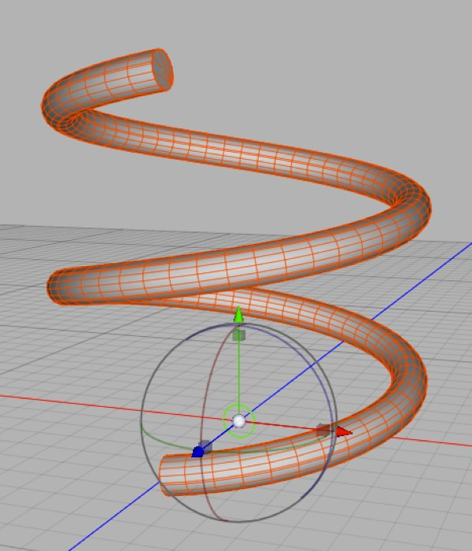

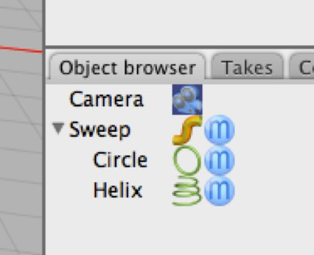

*An object produced by sweeping a circle **profile** along a helix **path**.*

A sweep is a solid formed by moving a 2D *profile* through space along a path. Cheetah 3D’s Sweep creator operates on two spline objects, treating the first child as the profile and the second as the path.

### Lathe

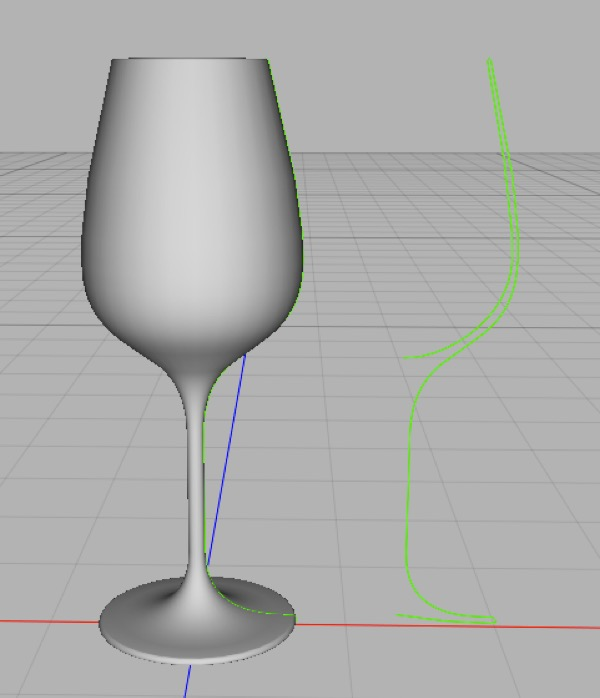

*The wineglass on the left was created by lathing the profile on the right.*

A lathe is a solid formed by revolving a 2D profile around an axis. Cheetah 3D’s Lathe creator operates on a spline child object.

### Extrusion

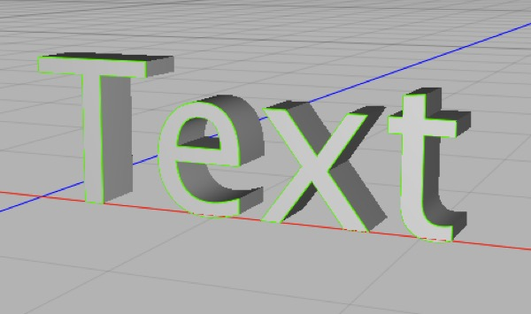

*If you create a text object and drop it into an Extrude creator, this is what you get.*

An extrusion is a solid formed by pushing a 2D profile through a line (usually perpendicular to the plane of the 2D profile). Cheetah 3D’s Extrusion creator operates on a spline child object.

