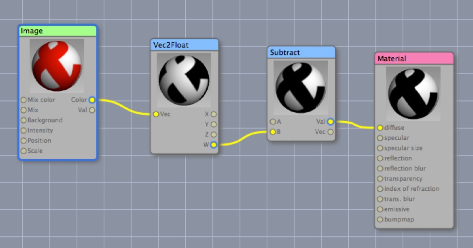
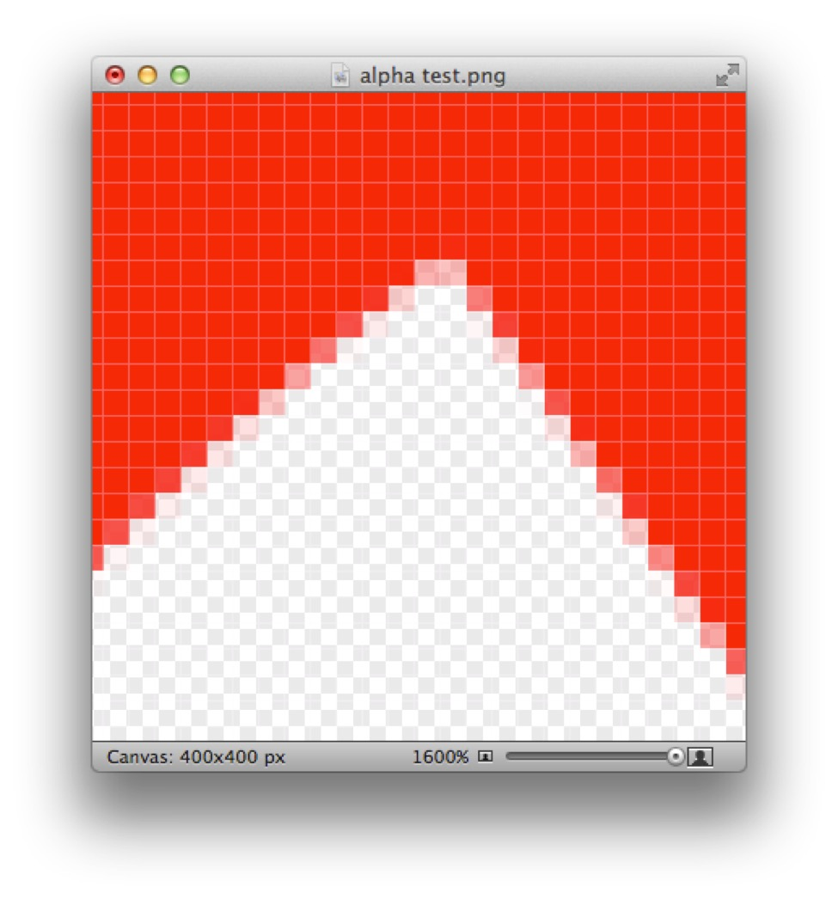

## Alpha Channels in Depth

Alpha channels turn out to be a surprisingly complicated topic. To begin with, alpha channels can vary _interpretation_ (is it a _transparency_ map or an _opacity_ map?) and _depth_ (in other words, the precision with which transparency can be represented). Typically, alpha channels are 8-bits deep, allowing 256 levels of transparency ranging from completely transparent to completely opaque. Another example you may be familiar with is GIF files, which allow a specific color to be treated as "transparent" — in effect, a 1-bit alpha channel.

### Use Alpha?

The Cheetah 3D Material Shader has a checkbox labelled “Use Alpha” which simply uses the alpha channel of the image being used for the material’s diffuse channel as its transparency channel.

If you simply want to use an image’s alpha channel for some arbitrary purpose in the Node Editor you can feed its color output into a Vec2Float node and pull out the W component and then subtract it from 1 to invert it (for some reason if you pull out the alpha channel this way it comes out flipped).

### Opacity or Transparency?

One common problem with alpha channels is which way up they go. Some programs treat “black” as being opaque, while others treat it as transparent. This generally isn’t a problem for you since the conventions are baked into the file formats and you usually don’t need to worry about them, but it’s worth knowing for those rare instances where you need to work with alpha channels directly.

The important thing to remember in Cheetah 3D is that Cheetah 3D considers 1.0 to equate to transparent, and 0.0 to equate to opaque (regardless of the input file format's convention).

### Premultiplied?

The final complication with alpha channels is how they interact with color values. The “obvious and correct” way to handle this would be for the color values to produce red, while the alpha channel determines transparency, but in many cases this is not how alpha channeled images are stored.

If you consider the image on the right, the edge pixels are mixtures of red and white (the background color) where the more transparent the pixel, the more white got mixed in. In many cases, alpha-channeled images will be stored as if the image had been overlaid on a flat background (usually black or white) — this probably dates back to the time when compositing an image on a background was considered to be computationally intensive. 

Such an image is said to be “premultiplied”. If you want to composite a premultiplied image then you need to know what the background color that the image has been premultiplied onto was so as to be able to compensate for it when calculating the actual color of the edge pixel.

Photoshop actually has special tools for removing premultiplication from the edges of alpha-channeled images (“Remove Black Matte” and “Remove White Matte”).

