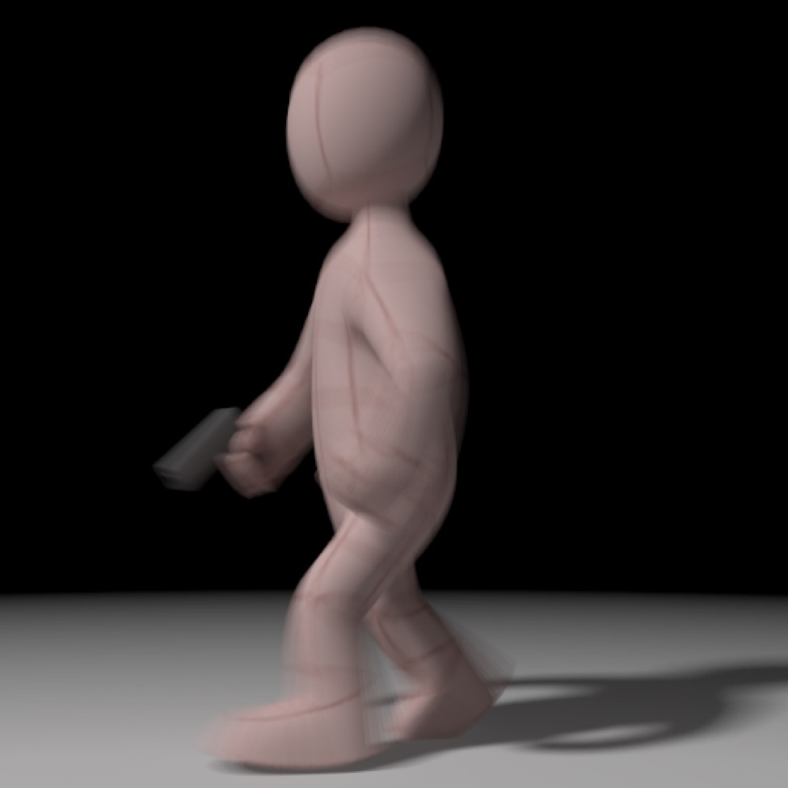

## Faking Motion Blur

The best way to fake motion blur right now is to use a high-end motion graphics program (such as **Motion** or **After Effects**) to _interpolate_ the frames of a high-fps animation for you. The image above was created by rendering an animation at 120fps, then importing it into **Motion 5** and then turning on **View \> Render Options \> Motion Blur** and setting the **Project Properties** Motion Blur samples and shutter angle to values that produced the desired result (16 samples and 720° in this case).

**Note**: if you want to think of this in terms of photography, by default Cheetah 3d renders with a shutter speed of 0s (or 1/∞ – which is impossible, of course), but we're used to seeing images produced with an actual non-zero shutter speed during which some things will tend to move and thus become slightly smeared. By rendering at 120fps and then sampling 16 frames we are, in effect, simulating a shutter speed of 16/120 or roughly 1/8s. (The shutter angle determines how the frames are sampled.)

I believe similar results can be achieved using Adobe **After Effects**, but I haven’t got a recent version of After Effects to play with. (Motion is available from the App Store for $50.)

### Motion Blur Tool

A few years ago I wrote a free tool for doing something similar to what I’ve just described. It uses the same approach I’ve outlined above, but doesn’t have as high quality a rendering path as Motion does, so I’d only use it if you don’t have a better solution.

You can obtain a copy of my Motion Blur Tool [here](http://loewald.com/motionblur).

