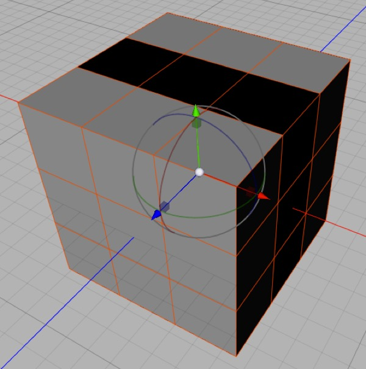

## 3D Math

### Axes, X Axis, Y Axis, Z Axis

In a cartesian coordinate system, the axes are the lines where one coordinate varies and the other coordinates are zero (e.g. in 3D the x axis is the line on which x varies and y, and z are zero).

The axes all meet at the origin of the coordinate system (i.e. 0,0,0 in 3D space).

### Quaternion

You won’t see quaternions mentioned anywhere in Cheetah 3D, but they’re important anyway. Quaternions are an imaginary number system used to represent orientations in 3D space in way that allows smooth interpolation between any two orientations (in particular, it eliminates gimbal lock).

**Aside**: You probably have encountered or will encounter imaginary numbers in high school. This is arithmetic with the addition of i as the square root of -1. Quaternions are based on the supposition that -1 has three different square roots, i, j, and k, and that ijk = -1. Just as imaginary numbers turned out to be incredibly useful, so did quaternions.

### Frustrum

A frustrum is a square pyramid with its point chopped off. 

A frustrum also happens to be the _exact shape of the volume of space rendered by a 3D camera_ — the sides of the frustrum determined by the field of view and the top and bottom by the near and far clipping distance of the camera.

### Space, Coordinates

In the context of 3D graphics, space usually refers to a coordinate space. 

The word coordinates and space are sometimes used interchangeably. Usually the word space will be qualified by the space being referred to.

It’s easy to get lost in the quagmire of shifting coordinate systems (i.e. spaces). You’re trying to render a picture in “image space” by firing rays from a virtual camera in “global space”. Objects that are part of hierarchies live in their own “local space”, and when a ray hits a triangle you need to figure out where it hit in “texture space”.

If the coordinates are x, y, and z then you’re dealing with some kind of 3D space, such as local or global 3D space. If the coordinates are u and v, or u, v, and w then you’re dealing with texture space.

### (Rendered) Image Space

This is the coordinate system of an image being rendered (i.e. in the camera’s viewport). Some rendering effects, such as ambient occlusion, radiosity, and sub-surface scattering involve precalculating lighting effects in image space.

### Texture Space, UV Space, UV Coordinates

This is the coordinate system of materials, which can itself be determined in many different ways. Texture space coordinates are generally referred to as “uv coordinates”, although there can be a third dimension to them (many procedural materials are defined in three or even more dimensions).

In Cheetah 3D an object will always have one and may have two sets of UV coordinates (referred to as UV1 and UV2). Non-editable meshes will have a fixed set of UV coordinates while editable meshes can have their UV coordinates set arbitrarily (e.g. manually or by “unwrapping”).

For 2D texture space, a texture is considered a rectangle with position determined by coordinates u and v ranging from 0 to 1. By default, image-based textures “wrap” so any value of u and v simply ignores the part before the decimal point (10.75 and -0.25 are the same effective coordinate).

For 3D texture space, a texture is considered an infinite volume. 3D textures are procedural and do not need to wrap.

### Local Space, Local Coordinates

*Here you can see the cube’s local coordinate system reflected by the position and orientation of the transform widget. (Note that the tool’s orientation is set to “Object”.)*

Every object has its own “local” coordinate system (which is reflected by the orientation of the transform widget when the transform tool’s orientation property is set to “object” (the default settings).

The vertices of an object (and consequently its faces) “live” in this local coordinate system as do any “child” objects (i.e. other objects contained by the object in the Object Browser).

Working in local coordinates is often very useful. E.g. to bring one object close to another simply make it a child of that object and zero out its position coordinates. (Similarly you can often align two objects by doing the same thing with rotation coordinates.) Having repositioned or aligned objects, they can be returned to their proper positions in the scene hierarchy and their coordinates will be recalculated automatically.

### Global Space, Global Coordinates

The “root” of a scene is its global coordinate system. The coordinates and orientation of objects with no “parent” are expressed in global coordinates. Often camera objects will “live” in global space, and it’s similarly a good idea for some lights (e.g. Sky Lights) to be in global space to avoid unnecessary confusion.

### Normal

In mathematics, normal means “perpendicular”. In 3D this means that the “normal” to a surface is a unit vector pointing straight up from it. If you think about this for a second you’ll realize that a polygon can be seen from both sides so which is the normal? Cheetah 3D uses right-handed normals (make a “thumbs up” gesture with your right hand — if your fingers describe the winding order of a polygon, i.e. anticlockwise, your thumb is pointing in the direction of the normal).

In real time 3D renderers (including Cheetah 3D’s editor view if you turn on **Backface Culling**) normals are only visible from the side the normal points to.

In Cheetah 3D back faces of polygons are rendered as dark. This makes it pretty easy to see flipped polygons most of the time, but it can be tricky if you have lights in the scene.

Here’s the same mesh after I added a skylight to the scene. Now it’s impossible to tell that some of the polygons are flipped.

Turning on **Backface Culling** is very helpful for revealing flipped polygons (and also seeing how your model will look in a 3D game engine, where back faces are usually invisible). Once Backface Culling is switched on, the errant polygons disappear. Sadly, while this is effective, you now can’t easily select the problem polygons!

Another, possibly better, solution is to add a “modeling light” to your scene. This is an ambient light that is dim and a slightly unusual hue (e.g. cyan). In its mode tag uncheck **Visible in Renderer** (so it only appears in the editor view). This makes it possible to see detail even in completely unlit portions of your scene, and makes the back faces visible even in shadow. (It would work better if backfaces were rendered as black, but they seem to pick up some ambient light in the editor view.)

Some 3D programs (unfortunately Cheetah 3D is not one of them) will allow you to display the normals of each polygon as a colored line (here the normals are green). You can achieve this effect in Cheetah 3D using a simple straight spline and a Particle Mesh in Polygon mode (which is how I created this screen shot). This makes spotting flipped polygons much easier. (This image should also give you a good idea of what a normal is.)