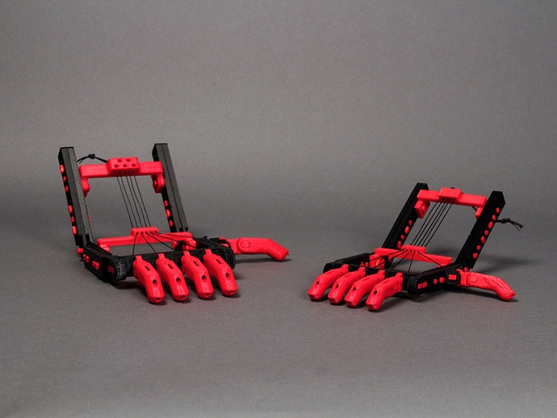

## Why Learn 3D Graphics?

Thirty years ago, 3D Graphics was something only a tiny number of people knew or cared about. Some people had probably noticed the wireframe graphics in Star Wars, or perhaps the 3D animated sequences in TRON. Twenty years ago, any serious 3D graphics work required hardware and software costing as much as a new car. By 1993, Jurassic Park featured multiple completely virtual creatures. Today, 3D graphics are everywhere: on television, movies, cereal boxes, advertising — and on your computer, game console, phone, and maybe even your watch.

Today, iff you’re a designer or illustrator, even if you see yourself as primarily working in 2D media, you probably need to learn 3D just to do package mockups. But wait, there’s more…

### 3D Printing is the next industrial revolution

*Three-dimensional printing from digital designs will transform manufacturing and allow more people to start making things.* **The Economist**

If you’re using a unibody Mac, _the computer you’re using was 3D printed_ using a CNC milling machine — in essence, a high-end 3D printer.

Just as 2D graphics allow you to print anything you imagine on a 2D surface, 3D graphics will soon let you print anything you can imagine in 3D. Already, many successful projects have been launched on Kickstarter and similar sites based on creating a 3D printed prototype product, allowing the creators to show the product in use, and then creating a business manufacturing and selling it. Only a few years ago, the costs of creating such prototypes would have been out of the reach of most small businesses.

For less than a hundred dollars you can convert a 3D model into a physical object using an online bureau service. For a few thousand a 3D model can be converted into moulds for manufacturing. For a few hundred dollars you can buy a device that can carve your 3D models out of wood, or “print” them in any number of materials. All these prices will likely be obsolete by the time you read this.

_Prosthetic hands used to be so expensive that children would have to wait until they stopped growing to be fitted for them. 3d printers allow parents to inexpensively customize and print prosthetic hands as their child grows. [http://www.thingiverse.com/thing:92937](http://www.thingiverse.com/thing:92937)_ 

Progress in 3D printing has been rapid. The second generation Form 2 3D printer is about the same price (adjusted for inflation) as the inkjet printer I bought in 1990, and about half the price of a first generation LaserWriter.

If you can imagine it, you can model it, and if you can model it, you can make it real — either as an image, a character in a game, or a physical object you can hold or assemble into something bigger.

