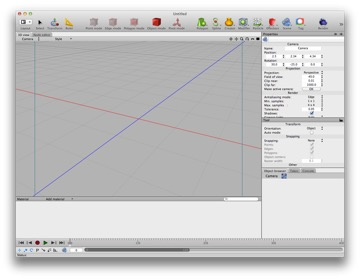
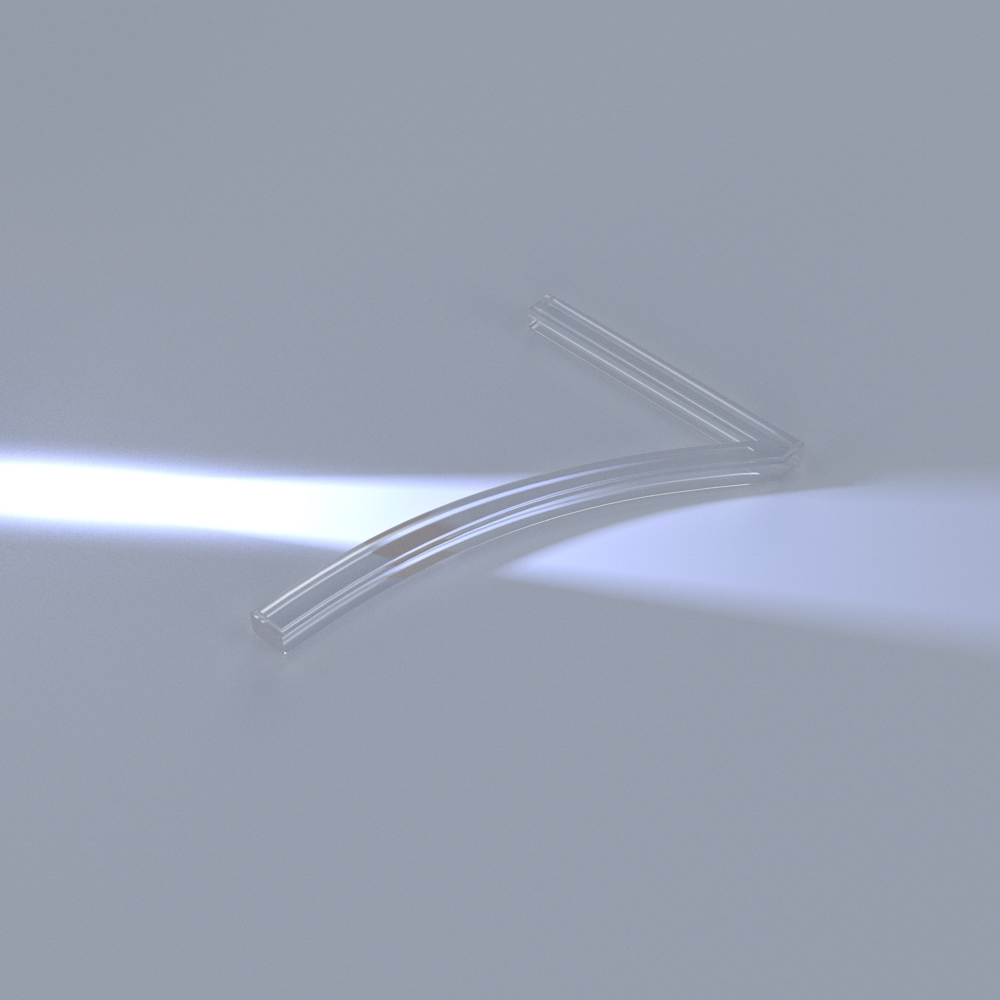

## 3D in a nutshell

We are wired to think in 3D.

When you look at the world you immediately have a feel for how far away things are, you recognize familiar objects and recognizes or extrapolate their three dimensional form. It’s not just eyesight — blind people can make their way around cluttered rooms, and we can all reach into our pockets, or for a light switch, or open a door without looking.

Research has shown we don’t need stereoscopic vision to "see in 3D". Although the brain does make use of stereo vision to gauge depth, it also uses other cues including overlap, focus distance, and depth of field.

3D graphics is all based on a *mathematical representation* of an *imaginary world*.

Remember wondering what use all that trigonometry and cartesian geometry was going to be in “real life”? Well, it turns out that one very good answer is 3D graphics, and 3D graphics turns out to be useful for everything from creating commercial art to designing spaceships.

It’s possible you haven’t studied trigonometry or cartesian geometry. Maybe you’re in Middle School! If so, you’re very lucky because learning 3D graphics is a great way to learn this stuff without falling asleep!

But don’t panic. You don’t need to understand the math.

Or to put it another way, you kind of do need to *understand* the math, you just don’t need to do the calculations.

*“A new life awaits you in the offworld colonies. A chance to begin again in a golden land of opportunity and adventure.” (I can only go so long without making a Bladerunner reference.)*

