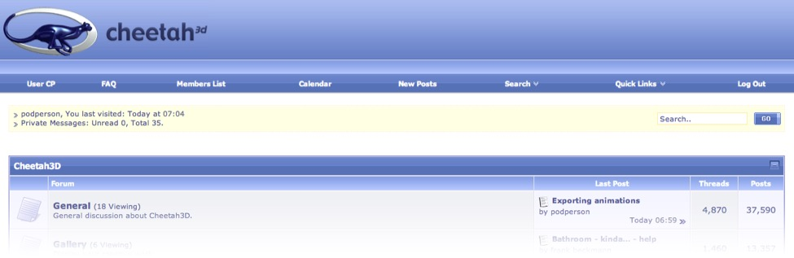

# Introduction

## Is this book for you?

This book is intended for anyone who wants to learn how to create 3D graphics, including students, teachers, artists, videographers, game developers, or anyone else with an interest in 3D. It is not, however, a general treatise on 3D graphics, but assumes you use or want to use Cheetah 3D (hence the title).

### Prerequisites

While there’s nothing stopping you from simply reading this book for entertainment — aside from its utter lack of entertainment value — to make good use of this book you’ll need an Intel Mac running Mac OS X 10.6 (“Snow Leopard”) or later, a copy of Cheetah 3D 7 (and — ideally — a license). You can download and use Cheetah 3D for free, but certain important features (notably saving files) will be disabled until you buy a license. You can buy Cheetah 3D direct from the developer.

I have tried not to assume specialized prior knowledge. (You do need to know how to use a Mac, and the basics of using an image editor such as Photoshop.) If you find that I have failed dismally, please let me know and I will try to improve future versions.

You _can_ use this book with an *earlier* version of Cheetah 3D — especially any version 5.x or 6.x (possibly even running on a [PowerPC](voodoo://PowerPC)-based Mac) — but some features will be missing and the user interface will have changed somewhat.

### Cheetah 3D’s Best Feature: The Community

The best feature of Cheetah 3D is its active and helpful online community. Simply go to [the Cheetah 3D forums]((http://cheetah3d.com/forum/)) and you’re there! Most questions seem to be answered within hours, if not minutes.

### Classroom Use

This book has not been written specifically for the classroom, but if there is any way in which it could be improved for teaching purposes, please let me know!

