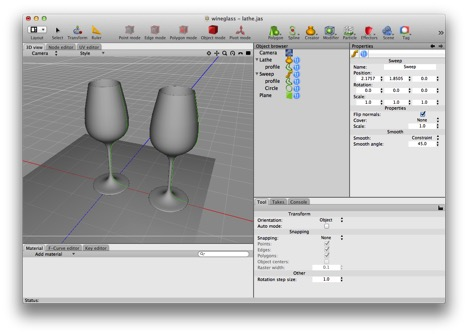
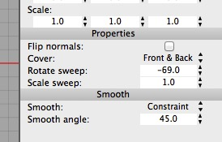
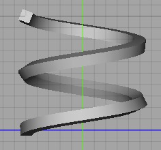
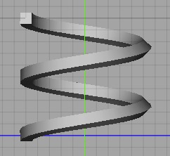

## Creators

A creator produces a mesh non-destructively from one or more input child objects. Creators are essentially like Modifiers except they can operate on more than one object and they work on their children rather than their parents (which is necessary in order for the hierarchy to communicate to them what their inputs are). There are two important types of creator:

### Sweeps

Yet another way to create a wineglass — demonstrating that a lathe is just a special case of a sweep. In this case you can see a wineglass created by lathing a profile, and a nearly identical wineglass created by sweeping the same profile around a tiny, tiny circle (and flipping the normals).

The sweep, lathe, and extrude creators are all variations of the sweep operation. A sweep operation derives a solid from two curves by “pushing” one curve (the “profile” through space along the other curve (the “control curve”).

In Cheetah 3D v6 the Sweep creator has two new properties: Rotate sweep and Scale sweep. Rotate sweep lets you fine tune the rotation of the profile as it is “pushed” along the control curve. Scale has the obvious effect.

On the top is what you get when you sweep a small square along a helix, note how the square ends up rotated a bit at the end. On the bottom, with Cheetah 3D v6 you can adjust the rotation to correct for this (I set the Sweep rotation property to -69°).

An Extrude creator sweeps a profile along a straight line. An Extrude creator operates on one spline which acts as the profile (the Extrude implicitly generates the control line). The Extrude creator can do a few things that a Sweep can’t, in particular adding bevels and controlling the end-caps.

A Lathe creator sweeps a profile along a circular arc. A Lathe creator operates on one spline which acts as the profile (the Lathe implicitly generates the control arc).

Some programs allow a sweep to have more than one profile or control curve, interpolating the curves in the obvious way. Consider, for example, an aircraft wing — near the fuselage the wing’s profile is a tear drop, it then quickly becomes a classic airfoil which then turns back to a tear drop at the trailing edge. The control curves also need to reflect the fact that the wing tapers in length.

### Booleans

The Boolean creator performs boolean operations on two meshes. (You can determine which boolean operation is performed by selecting the Operation from its Property panel.) By “boolean” we essentially mean unions, differences, and intersections. A union merges two objects. A difference subtracts the second child from the first child. An intersection finds the overlap between two objects.

Cheetah 3D’s booleans are very forgiving in that they will try to do something sensible, even if one or both inputs isn’t a proper solid. Exactly what they will do is unpredictable.

On the other hand, Cheetah 3D’s booleans have two significant problems. 

Booleans tend to produce bad output if vertices in one object are coplanar with faces in the other (you can sometimes work around this by changing the input geometries in ways that don’t affect the output, or nudging something slightly).

Worse, booleans always produce triangulated meshes, which means the topology of a boolean creator’s output will be a complete mess. This means that if you must use a boolean, try to use it after doing everything else you need to do.

### Toggling Creators

Like Modifiers, Creators can be toggled on/off via the creator object’s Mode tag. (Toggling the setting on a creator’s input objects has no effect.)

