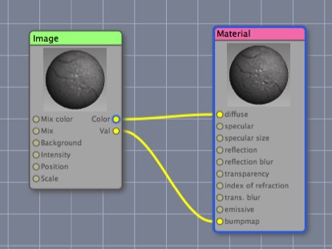

## Materials Overview

There are five critical components to producing an image with a 3D package, and modeling and animation are only two of them. The others are materials, lights, and rendering. In simple terms, modeling is geometry and material is color, but the two often overlap — e.g. “bump” and “normal” maps allow you to make a flat surface look like it has three dimensional detail, and “baking normal maps” allows you to convert geometric detail into textural detail.

### “Material” vs. “Texture“

It’s easy to confuse the terms “material” and “texture” (and there’s also “shader”) and different artists will use the terms in different ways, or even interchangeably. In this book I will try to consistently use these words to mean exact and distinct things:

**Shader** — the component of a material that interacts with the rendering engine to determine the color of a specific point during rendering. 

In essence, the renderer casts a ray into a scene and hits a specific point on a triangle, it finds out which material is assigned to that triangle, and then asks that material’s shader “what color is that point on that triangle” and the shader does some calculations and answers the question.

**Material** — a Cheetah 3D entity that can be assigned to a mesh (or part of an editable mesh) to help determine its appearance.

A material comprises a shader and any number of nodes (including zero) that feed data into that shader. By default, a shader will do its job by using a number of dynamic inputs (provided by the renderer) such as information about lighting, the viewing angle, and so forth, and a bunch of fixed inputs. The nodes in a material allow you to change those fixed inputs in many different ways.

**Texture** — a component of a material that when given a 2D or 3D “texture coordinate” returns a color value. 

A texture answers the question “what color is the point u,v (or u,v,w) in your coordinate space?”

### Basic Materials

The simplest material would consist of just a single node — its shader, and the simplest shader is Solid Color, so the simplest material is a material comprising a Solid Color node. It will not surprise you to discover that this material will make anything you assign it to appear in that color. The Solid Color shader doesn’t even “care” about lighting, so complex objects just become flat splodges of color.

(Why would you want to use the Solid Color shader? We will see!)

_A simple, and fairly typical, material (which is using the quick and dirty (but often effective) method of treating a single image as both diffuse and bumpmap)._

A more useful example of a material comprises a single Image texture node and a Material shader node. Typically the color output channel of the image node feeds into the diffuse input channel of the material node. If you want to make the surface look like it has three dimensional detail, you can often simply send the val (greyscale) output channel of the image into the bump map input channel of the material.

From here, you can probably figure out that you could use a different image for the bump map by adding a second image node and piping its color into the bump channel of the shader. Similarly you could use a different image and pipe its color into the transparency channel.

_Here I’ve built a chain-link material by using two variations of the same bitmap, one for transparency (white is transparent) and an inverted, somewhat blurred version for bump (white sticks out)._

Also note that whether you use the Val or Color output channel of the lower Image node — the one driving bumpmap — makes no effective difference (since a bumpmap makes no use of color information and the Color output of the lower image node will be converted into a greyscale value anyway). It could make a difference for the upper node — the one driving transparency — since color information tints light passing through an object.

If you’re using Cheetah 3D for game development, you can probably stop here. This is all you need to know to “texture” stuff for games and handle UV-mapping. Cheetah 3D can create much more sophisticated materials than this, but there’s no easy way to convert them into game engine shaders (this is where some of the high end 3D packages excel — they are able to replicate game engine shaders in their editing environments).

Image-based materials like this are very common, and have the advantage that Cheetah 3D will do a good job of previewing them in the editor view. While the image in question is a “test pattern” it’s amazing how convincing a simple photo-based texture can be (or how stylish a nicely painted texture can be).

An Image texture node answers the question “what color is the point at u,v” by picking the color at position u,v in the image (treating the top-left as 0,0 and the bottom-right as 1,1). By default it “wraps around” its mapping, so 1.3 is the same as 0.3 and -0.7 — but you can switch that off if desired.

### Reflection

To make a reflective material, simply set the reflection color of the material shader to a color other than black. If the reflection color is white the material will reflect all incoming light perfectly.

#### A Whole Bunch of Nothing: Reflection Maps

If you make a chrome ball in Cheetah 3D and render it then you get a whole bunch of nothing. Why? A Cheetah 3D world starts out empty (except for a camera). When you create a chrome ball, there’s nothing for that ball to reflect, so it appears black.

The simplest way to make reflective things look reflective is to put stuff in the scene for them to reflect or to add a reflection map to the camera (or both). Adding a reflection map is quite easy — add an HDRI tag to the camera (select the Camera and then select HDRI from the Tag toolbar item) and load an image into it. (Why “HDRI” — it stands for “High Dynamic Range Image” because HDRIs are usually used for image-based lighting, which is what the tag is chiefly for; but it also functions as a reflection map.) You may wish to uncheck “Background” in the HDRI tag’s properties to avoid having the image appear in the background of your renders.

Note that making the reflection color of a material anything other than black immediately makes that material more expensive (in computational terms) to render, but what really makes a material expensive is blurred reflections with lots of samples.



_Here are three balls with a medium gray material. From left to right: reflection is dark grey, reflection is off-white, reflection is light grey and reflection blur is 0.4._

### Hint: Make Shiny Objects Look Fabulous

_To make shiny objects that look fabulous, make their material slightly reflective (i.e. set the reflection to a dark color), and make the reflection blur value non-zero. (It may help to use HDRI lighting if you’re in a hurry.) To improve the quality of the final render, increase the “reflection samples” (but it will slow down rendering). That’s all there is to it._

### Transparency and Refraction

As with reflection, to make a material transparent, simply set its transparency color to something other than black. If you want it to blur light as it passes through (like “frosted glass”) then set the trans. blur value to non-zero. And, again, to improve render quality, increase the number of samples.

**Transparency and Shadows**. By default, lights will not shine through transparent materials. To make lights behave in the expected way (kind of) set their Shadow type to “Raytrace + Transparency”.

When I say “kind of”, the problem is that transparent objects are usually refractive to some extent, and the way Cheetah 3D handles shadows for transparent objects doesn’t (cough) reflect this. Simulating the way transparent objects transmit light is discussed under Caustics.

_Two versions of the chainlink material. The one on the left has a refractive index of 1.5 (the default) — note how the “ground” appears to be bent, and there’s something weird going on at the right edge of the “fence”. On the right I’ve set the refractive index to 1.0. This is actually a pretty subtle example of unwanted refraction — real world examples will often be much worse. _

Just take a look at this example from the forums:

Again, the problem is the refractive index not being set to 1.0.

**Transparency and Unwanted Refraction**. First of all, note that materials have a refractive index (“index of refraction”) of 1.5 by default (most glass is around this value). If you’re trying to make a material that is supposed to have holes in it, you’ll want to set the refractive index to 1.0 or it won’t work.

