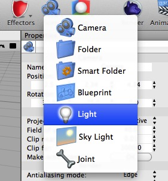
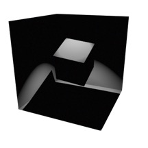
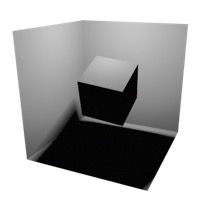
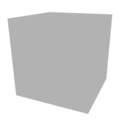
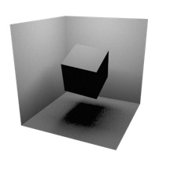
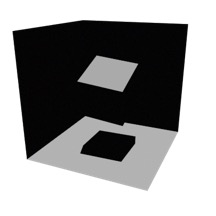
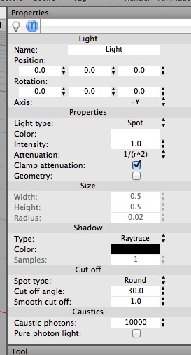
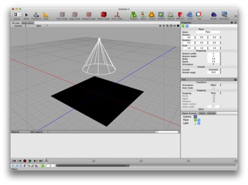
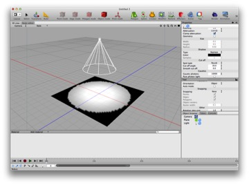

## Lights and Lighting

Lighting is another critical component of 3D graphics. Just as lighting can make the difference between a great photograph and a lousy snapshot, the same is true for rendering.

The Camera Light. By default, Cheetah 3D will light a scene with a “camera light” (this is a light that shines straight out from the camera). Like a flash (actually even worse than a flash) the camera light makes bad pictures. As soon as you add some form of lighting to a scene, the camera light will be switched off.

Cheetah 3D offers several different ways to light a scene. These are:

### The Light Object

These are “lights” in the “ray tracing sense” — things that emit light of a specific color in a very well-defined (not necessarily realistic) way.

To light a scene with light objects simply add one or more light objects to your scene by selecting Light from the Scene toolbar item. By default a light will be a Point source (its “Light type” will be “point”). 

The following **types** of light are supported:

#### Spot light

(Angle changed to 40° and Smooth cut off changed to 10°)

A light from a point but restricted to a cone, kind of like a spotlight. Obviously Spot lights are good for simulating spotlights, flashlights, and headlights.

#### Point light

(Samples set to 5)

A light that shines in all directions. If you’re modeling a solar system, the sun might be treated as a Point light in the middle. Point lights can be given a radius and shadow samples beyond 1 to create soft shadows (much like an area light).

#### Ambient light

Light emitted from all directions. An ambient light is a “cheap” way of faking the kind of all-round light you get from, say, the sky on a sunny day. Ambient light should be subtle — the stronger it is, the flatter your image will look (and the less realistic: there is no ambient light in the Real World).

#### Area light

(Samples set to 5.)

A light emitted from a rectangular or elliptical surface (but only if you increase its Shadow samples to more than 1 — otherwise it just acts like a spot light). Area lights are useful for producing soft light, as you’d get from a window, and also for simulating diffuse light sources such as fluorescent tubes.

#### Directional light

A light shining in a fixed direction from infinitely far away. If you’re modeling a typical scene, the sun might be treated as a distant light source.

### Other Light Properties

Lights have a lot of properties! It’s important to understand them if you want to produce good-looking images.

The **color** and **intensity** of a light should be straightforward. Intensity is important because if you use realistic Attenuation (a.k.a. “falloff”) then lights lose their power fast (the “inverse square law”). E.g. a white light of intensity 4 will have an effective brightness of 1 at a distance of 2 units. This is why a dim light bulb is still blindingly bright to look at directly.

**Attenuation** is how quickly the light’s brightness drops off. In general, you want to use 1/r^2 (inverse square law) brightness for anything other than distant lights (and distant lights have no attenuation).

**Shadow settings** are interesting. Type depends on whether you have transparent objects you want to treat as having “holes” in them (in which case pick Raytrace+Transparency) or you either have no transparent materials or you want to use caustics to handle light passing through transparent objects (in which case leave it as Raytrace).

**Cut off** only affects spot lights and simply determines whether the spot light has a sharp or gradual cutoff around the edge.

**Caustics** are settings that drive caustic simulations. These are discussed under Caustics.

### Hint: Improving Editor Light Previews

If you want Cheetah 3D’s editor view to be more helpful for lighting, you might want to add more detail to your objects, especially ground planes. On the top, a spot light shining on a default plane. On the bottom, the same plane with 50 sections vertical and horizontal.

