## Image-Based Lighting

Image-based lighting (often abbreviated to IBL) is a powerful tool for creating very realistic lighting with remarkably little work. The basic idea is pretty simple — assume you’re rendering an object in some specific spot. You capture all the light coming towards that spot (from all directions) and then use that to render the object.

_**Note**: this has changed significantly in Cheetah 3D 7._

### Setting up image-based lighting in *Cheetah 3D 7*

Add an **HDRI Light** to the scene. You may want to customize its properties (e.g. **uncheck the Background option** if you don’t want the HDRI rendered in the background, load your own HDRI image, and/or set shadows to support transparency):

If you’re using the new Falcon renderer, you are done. If you’re using the old Cheetah renderer, you may (optionally) want to **enable the relevant renderer settings** (notably radiosity):

You’re ready to render!

### Setting up image-based lighting in a scene in *Cheetah 3D 6* and earlier:

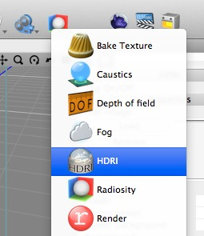

**Add an HDRI tag to the camera you're rendering the scene with**. (The HDRI tag actually serves several purposes — it allows image-based lighting, reflection-mapping, and panoramic backgrounds.)

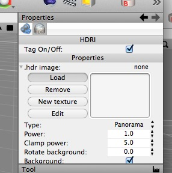

Next you'll need to **load a suitable image** into the HDR image slot. (I've provided a panorama-type HDR image on the support site — http://loewald.com/c3dbook/00_Tutorials/faux%20hdri%20setup.hdr.zip .) 

Note that images for image-based lighting fall into three main types — panoramas, probes, and cubemaps. The pros and cons (and how to tell the difference) are discussed below.

Any suitable image — not necessarily HDR — can work, although HDR images work much better.) Unless you want the image rendered as the background, you'll want to uncheck the background setting. If you're using a non-HDR image or the render is too dim for some other reason you may want to boost the Power to more than 1.0. (A power setting of 4 works well with the linked HDR file).

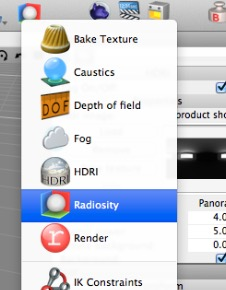

Now **add a Radiosity tag to the same camera**. You need both a radiosity tag and an HDRI tag for image-based lighting. Without radiosity, an HDRI tag only creates reflection and background, without an HDRI tag a radiosity tag simply enhances other light sources in a scene.

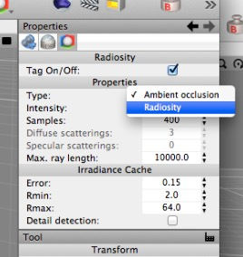

By default, radiosity tags are set to Ambient Occlusion. Ambient occlusion is a far less sophisticated algorithm than radiosity (ambient occlusion simply attempts to make "nooks and crannies" darker). You'll want to **set your Radiosity tag to radiosity mode**, and you almost always want to check the detail detection setting.

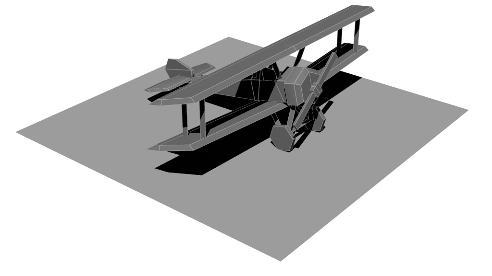

_Single directional light (no radiosity)_

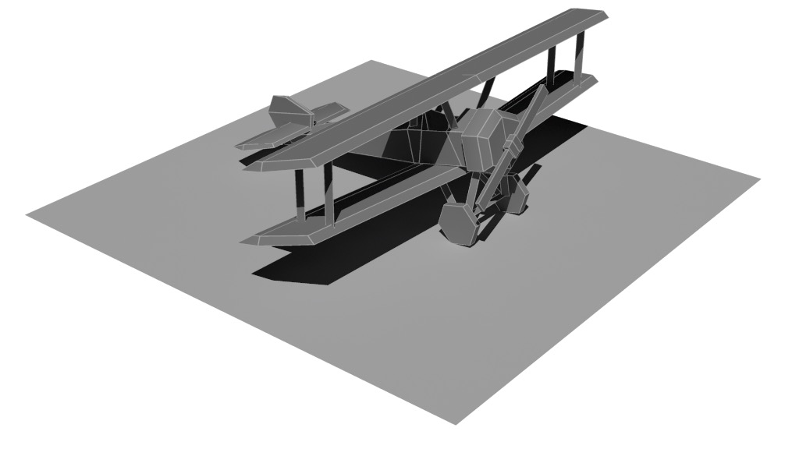

_Single directional light (with radiosity)_

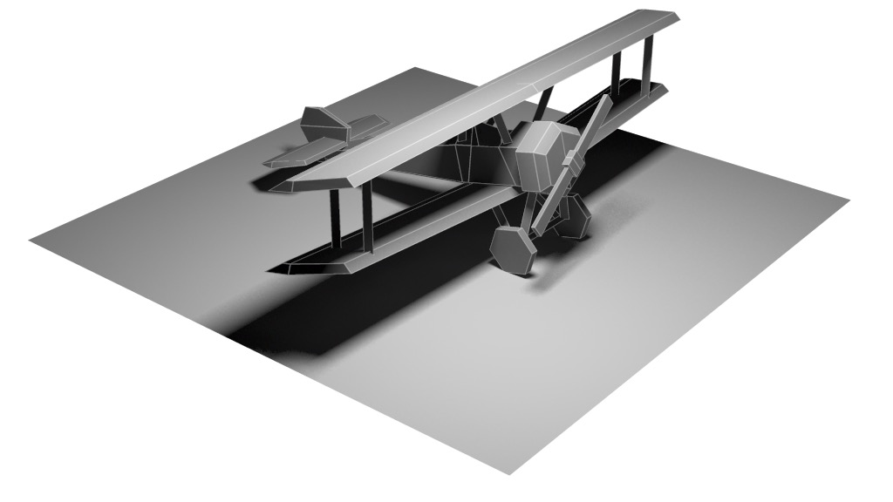

_Single Area light (with radiosity)_

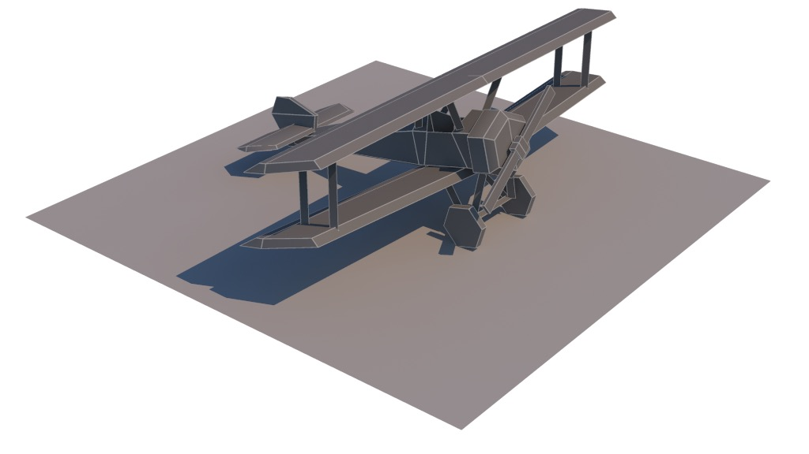

_Sky ight (with radiosity)_

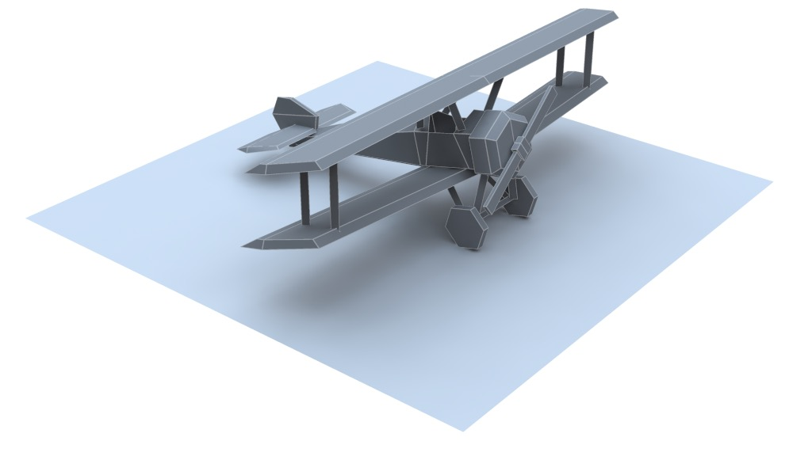

_Image-based lighting (with radiosity)_

**Image-based lighting produces far richer-looking results than simple lighting setups**, but only very good\* HDRs provide good shadow definition. A common solution to the problem of shadow definition is to use a combination of IBL and in-scene lighting (e.g. spot and distant lights) to bring out convincing shadows. In the above render, the shadows look fine for an indoor scene or a cloudy day, but for a daylit scene you'd want to use extra trickery to bring out more defined shadows.

> **Note**: \* by “good HDRI” I don’t mean high resolution so much as high dynamic range. The reason lights cast well-defined shadows is that they’re _enormously_ brighter than anything around them. How much brighter? The illuminated face of the moon is visible against a bright sky, and yet **the sun is 400,000 times brighter than the moon**. Thats 2^18, which means if you represented a pixel of the moon as having a brightness of 255 (i.e. 2^8 - 1, the maximum brightness in 24-bit color) you’d need to represent a pixel of the sun as 2^26. This is only possible with floating-point color depth, and most HDRI images aren’t even making good using of 16-bit per channel (integer) color.

### Aside: limitations of image-based lighting

Sampling “all the light” coming towards a point is, of course, easier said than done. The simplest option is to use a “light probe”. (This technique was pioneered by ILM and Pixar for Terminator 2 — the liquid metal robot.) You take a mirrored ball, place it at the position you’re going to be rendering the object at, and then photograph it (perhaps several times to capture a “high dynamic range” image, and quite possibly shooting a reverse shot so you’ll have material to “paint out” the camera). The resulting circular image samples light in (theoretically) 360°, albeit increasingly inaccurately as you get to the edges (which are sampling light coming from the far side of the ball).

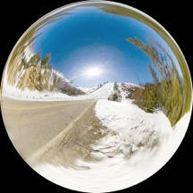

_A royalty-free image probe offered by PolySquared. (Royalty free is not the same as free — it means if you buy the image you can use it without making further payments.)_

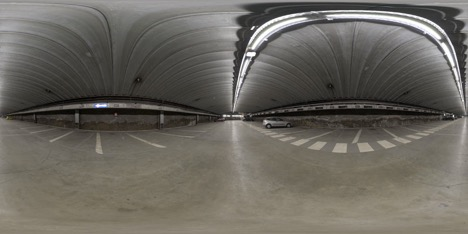

_A garage panorama from openfootage.net, released under the Creative Commons license. It’s provided (for free) at 10k x 4k resolution._

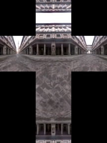

_An HDRI cubemap (or skybox) provided as an example here http://gl.ict.usc.edu/HDRShop/tutorial/tutorial4.html_

A more accurate way of capturing “all the light” is to create an all-round photographic panorama. This is quite easy to render, but much more difficult to capture in the real world (typically, a real panorama of this kind includes images of the tripod the camera was mounted on, and so on).

Both methods suffer from the limited dynamic range of the capturing apparatus. In particular the sun, for example, is a whole lot brighter than a piece of white paper illuminated by the sun, which in turn is a whole lot brighter than a piece of coal illuminated by the sun, which in turn is a whole lot brighter than a piece of coal in a shadow. It’s almost impossible to correctly capture this range of brightness, and especially the brightest components (which tend to blow out imaging apparatus no matter what you do), which means that the shadows in scenes rendered with image-based lighting tend to be softer than they ought to be.

