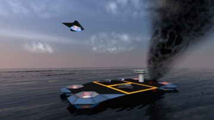
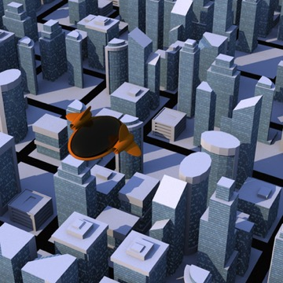
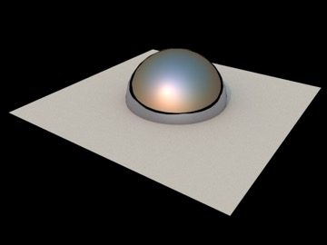

## The Sky Light Object

_What do these two scenes have in common? Each is lit by a single Sky Light._

A quick and simple way of producing quite nice results is simply to add a Sky Light object to a scene and (if you have reflective surfaces) to toggle on its Geometry property. The Sky Light roughly simulates light from the sun and sky based on latitude, longitude, date, and time. It doesn’t render clouds or anything that sophisticated, although the turbidity setting produces a kind of haze effect.

_The Sky Light’s geometry assumes everything below the horizontal plane is pitch black, which is a bit of a shortcoming since the one thing the ground won’t be is pitch black._

A more significant shortcoming of the sky light object is that it doesn’t let you set the color of the ground plane, which means you need to be careful to place your scene slightly above the origin and put in some low level objects (fences or whatever) to prevent black lines from appearing in ground-level reflections.

