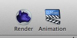
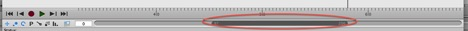
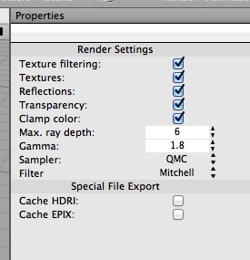

## Rendering

There are two toolbar items for rendering in Cheetah 3D. The Render item renders the current frame, while the Animation item renders the current animation “workspace” (i.e. a subset of the current take defined by the gray bar below the timeline in the animation control panel:



_This grey bar allows you to determine which part of the current animation “take” you’re working on, and also what will be rendered when you click the Animation toolbar item._

Cheetah 3D’s renderer is a **ray tracer**. There are no other options (no “scanline” or “opengl” rendering options, for example). If you want to preview an animation in real time you can simply press the Play button in the animation control panel. For complex scenes, "real time" playback may become slow and jerky.

You can set the renderer’s global settings (on a per-document basis) by selecting Render \> Renderer Preferences which makes Render Settings appear in the Properties panel. Most of these settings are things you’ll never want to change, but Max. ray depth determines how many levels of recursion the renderer will permit when rendering reflections and transparency. 

In complex scenes with lots of transparent and reflective objects you may need to increase this (if you start seeing black where you expect reflections or transparency, it may be that your Max. Ray Depth is too low).

