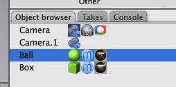
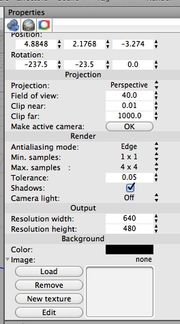

## Camera Objects

The camera currently being used to render (and whose view is shown in the 3D camera view) is the one with the dark background.

The camera object has radically different properties in Cheetah 3D 7 than it did in Cheetah 3D 6, and it also changes based on which renderer you’re using:

_Camera in Cheetah 3D 7 using **Cheetah** renderer_ The changes here reflect a lot of camera “tags” being integrated into the camera itself.

_Camera in Cheetah 3D 7 using **Falcon** renderer_ The Falcon camera is a much simpler beast than the Cheetah camera, in large part because a lot of the hacky features of the Cheetah renderer “just work” via the new unbiased rendering model.

_Camera in Cheetah 3D 6

The most important **camera properties** are:

**Projection** property — you can set the camera to render orthographic projections or panoramas.

_You can see that the camera’s field of view is represented as a subtle outline in the camera view, a frustrum (truncated pyramid) in other views, and shown numerically in the camera’s properties._

_Here the field of view has been increased, which is exactly like **zooming** with a camera lens (except that Cheetah 3D has perfect optics, whereas real lenses have distortion, falloff, field curvature, chromatic aberration, and so forth)._

_Finally, here we’ve moved the camera towards the biplane along its own z-axis (by using the transform tool in Object mode)_

**Field of view** — which is in degrees (a narrow field of view equates to a telephoto lens, while a wide field of view equates to a wide angle lens; many renders will look better if you narrow the field of view slightly from the default (try 10-30°).

**Antialiasing Mode** — this is the criterion Cheetah 3D uses in order to decide whether to render subpixels. The default rule is Edge —meaning it will render subpixels if an edge runs through a pixel in the rendered image. The other rule is Color — meaning it will render subpixels if the pixel differs significantly from an adjacent pixel in color. Use the Color option if you’re trying to render detailed material textures (e.g. product mockups).

**Min Samples and Max Samples** — these control the level of sub-pixel rendering. The default is to at minimum 1x1 (i.e. every pixel) and at most 4x4 (i.e. drill down into a grid of 4x4 subpixels). The higher the maximum, the sharper details will be rendered. The lower the minimum, the more crudely areas without much detail will be rendered. The default settings are usually fine, but increase the minimum if the renderer is missing details and switching Antialiasing Mode doesn’t help. Increase the maximum only if you need more detail.

**Shadows** — on by default. Usually this is fine.

**Camera Light** — auto by default. Usually this is fine.

**Output Resolution** — change these to get bigger or smaller rendered images.

**Background Color** — you may want to set this to a completely transparent color if you want a nice clean render ready for compositing, e.g. if you’re rendering an icon.

Aside from that, cameras are objects like any other — they can be moved around, keyframed, and so forth. You can’t scale a camera though!

If you have more than one Camera object in a scene you can determine which one is active (i.e. determines the view in the 3D Camera view and is used for rendering) by double-clicking it. Cameras also have a Make active camera button in their Properties panel.

I won’t cover the more advanced settings here — there are sectiohs devoted to radiosity, depth of field, and so forth. That’s it. If you’ve gotten through this section, you should at least know your way around Cheetah 3D.

