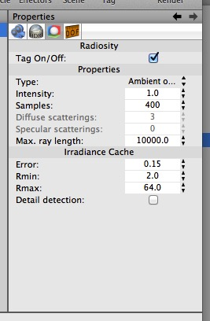
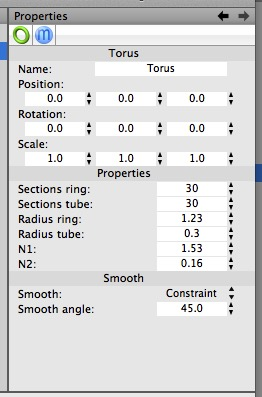
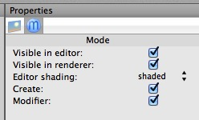
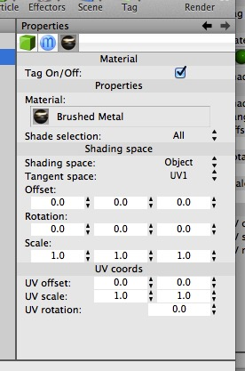

## The Properties Panel

Each object has its own Properties panel.

When you select an object (either in the 3D view or the browser) the Properties panel will display that object’s properties. 

The top of the panel is a row of tags, which each contain their own properties. You can add tags to objects to give them even more properties. 

One object that’s very prone to collecting tags is the camera object (shown here with an HDRI tag, a Radiosity tag, and a Depth of Field tag — a perfectly plausible setup).

Most mesh objects will end up with three or more tags — their own property tag (which will vary based on the kind of object they are), a Mode tag (which controls their visibility and whether or not their creator or modifier chains are active), and one or more Material tags (which assign the material to the mesh, or sometimes just parts of an editable mesh, and can also affect how the material is mapped onto that mesh — this topic is covered in more depth in the section on Materials).

### Common Tags

A typical object starts with two tags, its base tag (representing its own properties) and its Mode tag. Here we see a torus’s properties. Click on the tag icons to display the corresponding properties.

#### The Mode Tag

Most objects will have a Mode tag (cameras do not). 

The mode tag lets you hide the object (from either or both of the edit view and renderer), and also control how the object is displayed (note that you can set this globally for the entire view, but this allows you to change how individual objects are displayed) and finally to turn creator and modifier effects on/off for the object. (This can work a bit strangely — e.g. if you have a mesh with two modifiers, you can turn the modifiers off individually using their Mode tags, or you can turn both modifiers on or off by toggling settings in the mesh’s Mode tag — this can sometimes lead to a modifier not working when you expect it to.)

The Create toggle of a Mode tag only affects creator objects. It appears to do nothing for other objects, even if they are used by creators.

#### The Material Tag

The Material tag assigns a material to a mesh (it may assign the material to all, or just a subset, of an editable mesh’s polygons). The settings within the Material tag affect the way the material is mapped onto the object.

If more than one material is assigned to a mesh (or polygon) then the rightmost material takes precedence.

#### The HDRI and Radiosity Tags

These tags are often seen together attached to a Camera. (They can only be assigned to cameras.) An HDRI tag on its own, with a suitable image loaded, can be used to provide a reflection map for your scene (i.e. something for objects to reflect other than geometry in the scene itself). 

By default an image loaded into an HDRI tag will also be rendered as your scene’s background, but the results are seldom good (unless the image has improbably high resolution) and I recommend toggling that option off. The best way to render something in front of a photographic backdrop is to use the combination of an HDR for lighting and a background image loaded into the Camera.

Together with a Radiosity tag (generally set to Radiosity rather than Ambient Occlusion) an HDRI will provide image-based lighting, which is a great way to quickly light a scene with good results.

In general, image-based lighting will produce good looking renders with little effort and relatively short rendering times, but shadows will not be very soft (because HDRs generally don’t do a great job of replicating intense light sources).

