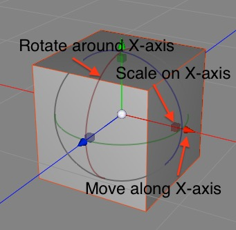
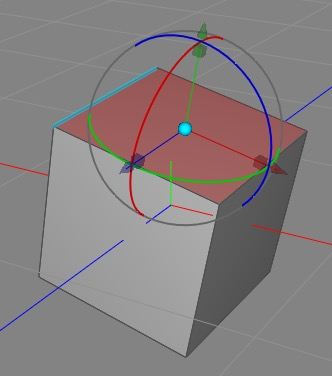
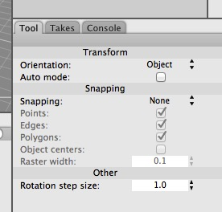

## Selecting and Moving Objects

In general, a huge amount of the work in creating 3D scenes involves using the **Transform** tool to move bits and pieces around and using other tools now and then to add more geometry.

There are four variants of the transform tool (although by default only the most useful one, “Transform” is visible in the toolbar).

These let you transform a selection by translation (moving), rotation, scaling, or (in the case of the Transform tool itself) any of the above.

I’ll only discuss the transform tool itself, since the others are just restricted variations of the transform tool and most people don’t really use them. (The main advantage of them is to prevent accidents, e.g. you might want to move a bunch of things around without accidentally rotating or scaling anything.)

### Selection

First of all, the Transform tool lets you select things. You can select things by clicking on them, select multiple objects by “painting” (dragging across) multiple things (but don’t do this if you already have something selected, or you’ll transform it instead), and finally add to and subtract from selections by shift- or command- clicking respectively.

Note that Cheetah 3D also has a **selection tool** which is useful for selecting things when you don’t want to accidentally nudge them. (It’s kind of like a transform tool that doesn’t do transforms.) It behaves just like the transform tool for selection purposes.

### Moving, Rotating, and Scaling

The transform tool has three kinds of widgets associated with it. For each axis there’s a **cone** (to **move** the selection along that axis), a **cube** (to **scale** the selection along that axis), and a **ring** (to **rotate** the selection around that axis).

The sphere in the center is referred to in the documentation as the “gadget”, and it’s quite weird and wonderful.

_The last tool used was a ring (see how the rings are hilighted) which means the gadget tool is in free rotate mode._

First of all, based on which other gadget was last used (cone, cube, or ring) it will act as a free “move parallel to view plane”, proportional scale, or free rotate tool. (Of these, proportional scale is by far the most useful.)

### Gadget Mode

_We’re in gadget mode (you can tell because the gadget is colored cyan). The mouse pointer (not captured in the screenshot) is hovering over an edge which is highlighted, ready to snap to it if clicked._

You can double-click the gadget tool to enter (and leave) “gadget mode”. In gadget mode, you can move the “frame of reference” for the transform tool around. (You use the cones and rings to move and rotate the gadget, but scale has no effect.) But most usefully you can snap the gadget to components of meshes (e.g. vertices, and the middles of faces and edges). When you leave gadget mode (by double-clicking on the gadget again), the transform tool will act as if the object is centered on and oriented around the transformed gadget.

Gadget mode lets you easily rotate selections around a specific edge, or scale a face out from a corner, and so forth. But **note that the gadget’s position and orientation will be lost when the selection changes** (and will not be restored by undo).

### Editable Meshes and the Transform Tool

The Transform tool has some very helpful capabilities for editing meshes. To begin with, you can move, rotate, and scale any selected collection of vertices, edges, or polygons when in the appropriate mode.

**Orientation** has three possible settings: Object (the default) where the transform tool is aligned to the object’s internal coordinate system, Global where it’s aligned to the world, and Normal which aligns the tool to the normal of the selection (which may or may not make much sense based on what you have selected, but works properly when the selection has a normal that makes sense).

**Auto Mode** allows the transform tool to change mode based on where on a mesh you click. If you click on a polygon you switch to polygon mode, if you click on an edge you switch to edge mode, and so forth. This is great when you’re fine tuning a mesh and don’t want to have to constantly change mode, but it can also lead to accidents, so be careful.

**Snapping** supports three kinds of snapping (snapping means that when you move things around it will “stick” in various places). Component allows you to snap to different parts of existing meshes (not just the mesh you’re editing, but other meshes in the scene). Surface snaps to surfaces (it’s a lot like picking Component and only checking Polygon). **Raster** snaps to a 3D grid in world space (where the grid spacing is equal to the Raster Width value.

If you’re transforming an object using a specific tool, e.g. moving an object along its x axis, snapping will not override the limitations of the tool. This means, for example, that you can use Raster snapping to snap vertices in just one dimension at a time, which is very useful for fixing up small errors in symmetric meshes or lathe profiles where you need a vertex to have an x value of exactly zero, but you don’t want to change its y and z values.

