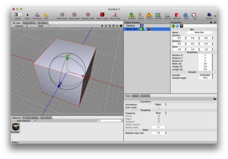

## Meshes

Cheetah 3D is all about meshes. If you can see it in a render then, aside from the background color, it’s a mesh.

Note: there are a couple of special case exceptions in the form of the Sky Light object and the HDRI tag which affect the background, but this is pretty close to an absolute truth. The other quasi exception is particles, which are “instances” of meshes rather than meshes, but we can ignore that distinction for now — the only way it impacts anything is that instances take less memory and when you export a scene to another file format, you lose the instances.

The Box primitive is a (non-editable) mesh. Here’s a Box primitive (renamed “Metal Box”) which has a brushed metal material tag assigned to it.

At bottom, a mesh is:

* a collection of vertices (points in a 3D coordinate system),

* a collection of polygons joining those vertices (each polygon with more than three sides is automatically reduced to triangles in order to render it),

* one set of uv coordinates (which control the way materials “wrap” onto the mesh) and possibly two,

* and the mesh may have one or more materials assigned to it.

There are many kinds of things in Cheetah 3D that produce meshes, but the most interesting (and probably the most common) kind of mesh is the **editable mesh**. For every other mesh, all the things above are created by Cheetah 3D based on a bunch of math and possibly some source objects (splines, other meshes, and so on), but you have no _direct_ control over the positions of vertices, which polygons go where, and so forth. Indeed, you can assign multiple materials to a mesh, but only an editable mesh can use more than one material effectively.

### Editable Meshes

If you’ve been reading all this in order, you know that three of Cheetah 3D’s selection modes — points, edges, and polygons — have special effects when you’re working on an editable mesh. In particular, they allow you to select and deselect parts of a mesh, and perform operations on those parts, including moving them around with the translate tool.

I won’t explain all the different ways you can edit a mesh here, but I’ll cover the most important ones below.

