## Editing Meshes: Core Polygon Tools

### Duck… I mean Extrude and Cover

**Upshot**: you _generally_ want to use cover, not extrude.

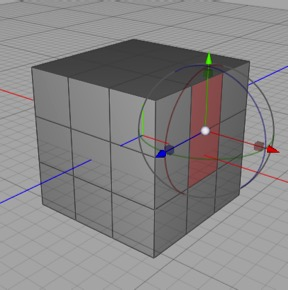

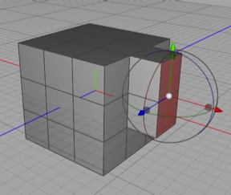

_Using **cover**. I have the transform tool selected and select two faces, then select cover (Tools \> Polygon \> Cover), then simply move the selected faces — new geometry has been created “covering” the boundary of my selection. Note that you’ll find cover the single most useful tool for polygon modeling — I map it to the C key, so in fact I simply selected some polygons, pressed C, and dragged out the new geometry._

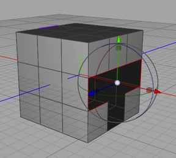

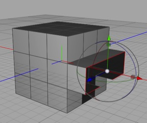

_Unlike extrude, cover works just fine for **edges**. When in edge mode you’re defining the boundary that get’s “covered”._

Extrude and cover both kind of do the same thing — if you select one or more polygons extrude and cover will both let you pull more geometry out of those polygons (i.e. extrude those faces). In general, most experienced Cheetah 3D users will simply use Cover all the time and forget about Extrude for two reasons:

* Cover instantly creates the new geometry without switching tools. This usually means you can just “live” in the Transform tool. 

* Cover lets you do something with the new geometry other than push it out along the face normals.

Picking Extrude, in contrast, activates the Extrude Tool which is a bit weird — while the extrude tool is active you can’t click without creating more geometry, and clicking and dragging pushes the new faces in a direction normal to faces being extruded. I also find that it’s easier to accidentally create geometry I didn’t intend to with stray clicks when the Extrude tool is active, and discover this much later when my mesh does something weird.

* Cover works on edges. You can cover a series of edges to extend a surface. Extrude simply isn’t available in edge mode.

**Inner Extrude** is a really interesting tool. The obvious use for it is creating inset faces.

_In this example I’ve selected three contiguous quads (that go around corners) and used inner-extrude to create an inset collection of faces. This can be really useful (e.g. if modeling windows), and you can’t do this kind of thing (easily) with any other tool._

Inner extrude also works on edges, essentially building out geometry from the selected edges. It’s easier to show than explain, and once again it can be very useful.

_Here I’ve selected a series of edges and then used inner extrude to create a “ring” of geometry around them. This technique can be used (much like beveling) to control the curvature of subdivision surfaces, and also to create new “edge loops” when modeling characters._

Finally, **inner extrude works on vertices**. This is particularly useful for punching holes in things.

_Here I’ve picked a vertex on a corner (because I can!) and used inner extrude to create a loop of geometry around it, which I could easily turn into a hole by deleting the original vertex._

### Create Polygon

Create polygon simply lets you add a new polygon to a mesh by clicking on (or creating) a series of vertices. You click on the vertices (in anti-clockwise order viewed from the side you want to be seen) ending where you started. You need to click four times to create a triangle (unfortunately).

It’s easy to sometimes click on the wrong vertex if your mesh has overlapping vertices (usually rotating your view slightly will solve the problem).

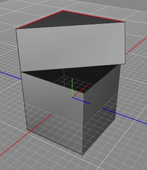

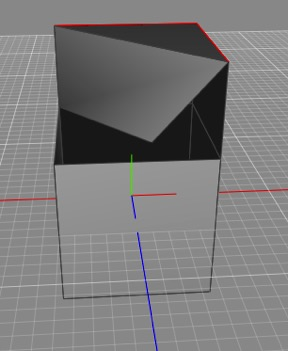

It’s also easy to miss a vertex and create a new vertex somewhere off in space. After creating a polygon or two, it’s wise to take a look at your model to make sure you haven’t created something unintended. In this exaggerated example, I missed the bottom-right vertex of my quad, but quickly spinning my view around I can easily see how I messed up.

### Bridge

The bridge tool joins two parts of a mesh. It works best when joining two polygons with the same number of sides, but it does a pretty good job even if the polygons differ in number of sides.

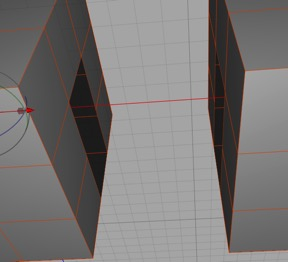

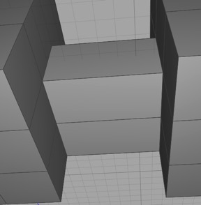

Bridge before (in object mode so you can see edges more clearly) and after. To use the tool you select Tools \> Polygon \> Bridge and then click a point on the first “hole” and then click the point you want to bridge to on the second “hole”.

The bridge tool requires you to click a vertex on the starting polygon and another on the ending polygon. Note that the vertices must lie on a well-defined “ring” of edges, and it’s important for the normals to match.

There are lots of ways bridges can go horribly wrong, and I try to explain them in depth in the detailed section on Troubleshooting the Bridge Tool.

### Fill Hole

Fill hole is simple and useful. If you have a hole in a mesh surface you can use fill hole to make it into a new polygon. Generally this works best if the new “polygon” is reasonably flat (i.e. the edges and vertices used to form it are roughly coplanar).

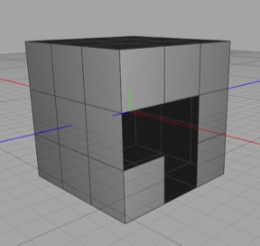

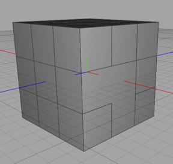

_Fill Hole before and after. I selected Tools \> Polygon \> Fill Hole and then clicked a point on the edge of the hole. Note that the hole gets filled by a single polygon (and that polygon is neither convex nor a quad in this case, which can definitely spell trouble if not corrected)._

If it doesn’t work, chances are there’s a flaw in your mesh you didn’t see, or the edges form too weird a surface.

### Scalpel

The scalpel tool lets you cut up edges and polygons in a very precise way. The scalpel has some important restrictions:

* Start on an existing edge or vertex

* Each subsequent click should create an edge within one polygon, so to cross to a new polygon you must first click on an edge between the polygon you’re in and the polygon you’re going to.

* You need to end on an existing edge or vertex.

The most common applications of the scalpel are:

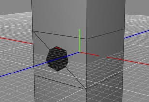

Look ma, I made a hole!

* Cutting a hole in a polygon. If you want to cut a hole in a polygon, first use the scalpel to cut the polygon into two (or more) pieces. Then using the edges now running through your polygon, build out the edges of the hole.



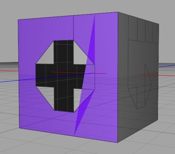

This is an artificial example, but on the top the selected polygon (which is vaguely C-shaped) is being triangulated very badly. On the bottom, breaking up the problem polygon into convex quads with a few cuts using the scalpel tool completely eliminates the problem. (It could definitely be done more tidily, this is simply demonstrating a point.)

* Fixing problem polygons. Sometimes a polygon doesn’t get rendered correctly, especially if it isn’t convex. You can use the scalpel tool to chop complex polygons into simpler polygons that won’t confuse the triangulation algorithm.



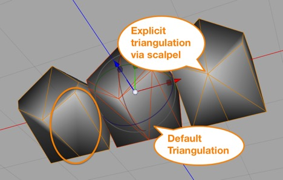

Compare the bottom-right quad across these three (symmetric) meshes. The middle mesh is a result of triangulating the mesh, and shows the triangulation that is being used by Cheetah 3D to render the initial mesh. On the right I’ve used the scalpel tool to force a different triangulation for that polygon.

* Forcing a specific triangulation. Sometimes a quad will simply get triangulated in just the wrong way. You can split the quad into two triangles using the scalpel to override this behavior.



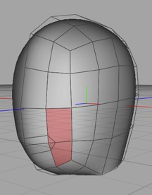

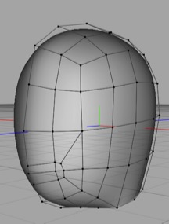

_Here I’m building out the base topology for a head, and I’ve created an edge-loop around what will be the character’s mouth. On the left, the non-quads I’ve created have been selected and are highlighted. On the right, using the scalpel tool I cut two new edges and then used point-slide to make the quads less distorted, resulting in all of the resulting faces becoming quads. This is a very common operation in character animation — creating edge loops and cleaning up the resulting non-quads using the scalpel._

* Refining Topology. Probably the most common scalpel operation is cleaning up mesh topology, which usually means eliminating non-quads. At other times you simply need to add more detail in a particular spot, and here the scalpel is your friend, allowing you to add vertices and edges exactly where you need them.

### Ring Cut

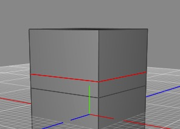

The ring cut tool splits a ring of edges and selects the newly created geometry. You select the tool and then move the mouse pointer over an edge of the mesh and click to create a cut your mesh.

The next paragraph is probably not going to make sense to you right away, but I’ll say it now anyway because at some point you’ll have an “aha!” moment and it will all make sense.

When using box modeling techniques, it’s a good idea to create as simple a mesh as possible, only adding more detail to your mesh when you absolutely have to. Usually this means keeping your mesh very simple until you’ve blocked out the form you want, making the topology as clean as possible, and then using ring cut as sparingly as possible to add detail to the mesh where it’s needed.

The ring cut tool is invaluable for adding more detail to a subdivision “cage” mesh (i.e. a mesh you’re applying subdivision to). This allows you to refine the behavior of subdivision exactly where you need it.

### Jigsaw

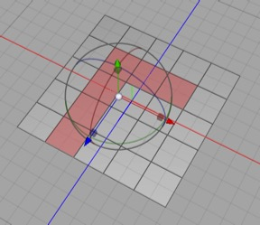

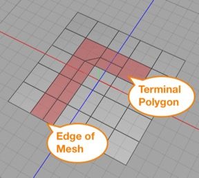

Jigsaw is essentially a controlled ring cut. First, you select a series of quads (note how it can “turn a corner” and then you click on one of the edges that will be cut. The cut is terminated at the mesh edge or a terminal polygon.