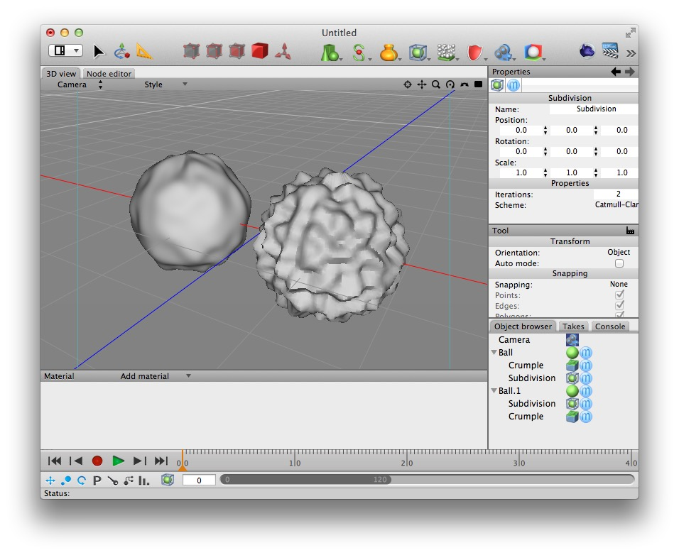
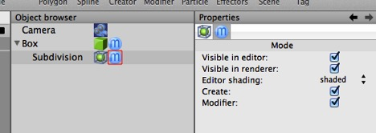

## Mesh Smoothing

## Modifiers

In Photoshop you can non-destructively apply various filters to a one or more image layers at a time. These layers use some kind of mathematical algorithm to produce a visible effect on the images affected, and they do it “non-destructively” — the original image is still there and can be recovered or modified.

(Photoshop also has destructive filters which change the image they’re applied to permanently, and Cheetah 3D has these kinds of tools as well.)

In Cheetah 3D, a modifier is an object (i.e. it has an icon that appears in the Object Browser) that modifies the geometry of a mesh object it is parented to (i.e. that it is the child of).

### Stacking Modifiers

A mesh object with more than one modifier will have those modifiers applied from top to bottom, and this is almost always significant (in mathematical terms, very seldom are modifiers commutative).

On the left is a ball which has crumple followed by subdivision modifiers. The ball on the right has the same modifiers applied in the opposite order — producing very different results.

### Toggling Modifiers

You can turn modifiers on and off individually via their Mode tag, and you can also switch all of a given mesh object’s modifiers on and off via its Mode tag. (If a given modifier’s Mode tag or its parent object’s Mode tag has Modifiers toggled off, then the Modifier is off.)

### Splines

Splines are three dimensional bezier curves (bezier curves are completely agnostic about the dimensionality of the space they occupy). Cheetah 3D’s bezier creation and editing tools are a bit awkward, so the best way to get a precise curve into Cheetah 3D is usually to draw it in a dedicated drawing program, such as Illustrator or Inkscape.

If you must create a bezier curve in Cheetah 3D, you should avail yourself of the **snapping** functionality of the Transform tool.