## User Interface Overview

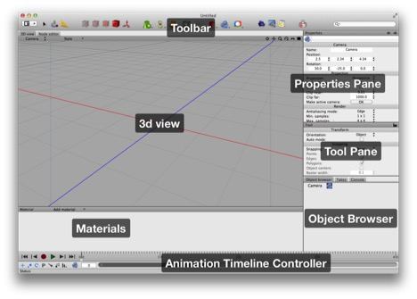

Here’s the default Cheetah 3D layout (with Modeling selected from the Layout menu and the toolbar set to display small icons only).  Note that your initial layout may not exactly match the screenshot (e.g. the animation controls on the bottom are not visible by default, and Cheetah 3d lets use multiple customizable layouts).

### The Cheetah 3D Toolbar

**Toolbar** is where Cheetah 3D’s tools are located. Not shown above is the search field (by default on the right) which filters the content of the _Object Browser_. Not everything in the toolbar is what Cheetah 3D considers a “tool”, as per the above diagram.

* **Layout** is menu that lets you pick one of several customizable layouts for the window.

* **Tools** are in fact tools (select, transform, and the ruler respectively).

* **Modes** determine what can be selected and worked on (points, edges, polygons, objects, and pivots respectively). What’s a “pivot”? It’s the center of a given object’s coordinate system (think of it as living in a universe of its own, the pivot is the center of the universe and its orientation represents its axes.)

* **Things** are objects you can add to the scene or to objects in the scene. (Objects in a loose sense — some are actual geometric objects, while others are things that affect objects in some way.)

The toolbar is a standard Mac OS X toolbar, so you can customize it the usual way…

**3D View** is where Cheetah 3D shows visual representation of your scene  (although if objects are hidden, you won’t see them here).

The 3D View can be in one of several modes: by default it will be in Camera mode which means that what you see is what the _active_ camera is looking at, and adjusting the view will actually change the camera’s settings and/or position. Other modes include “perspective” mode (which is like camera mode but doesn’t affect any cameras).

The easiest way to understand views is to play with them — see _Navigating the 3D View,_ below.

(And yes, since you can have more than one camera in a scene, the active camera is the indicated in the object browser and controls and is controlled by 3D views in camera mode. Did I say views? You can customize layouts to have more than one view, and you can also switch a view into a 4-pane view which can have more than one pane in camera mode.)

**Properties Pane** is where you can see and adjust the properties of selected objects. (Note that the behavior of this pane when multiple objects are selected is quirky.) The properties pane will have multiple tabs (or “tags”) which contain different stuff depending on the selection.

Note that the rotation angles are not rotations around the X, Y, and Z axes but the Y, X, and Z axes (or Heading/Yaw, Pitch, and Roll/Bank in aeronautical terms).

**Tool Pane** is where the settings for your currently selected tool are displayed and can be adjusted. _Note that you always have a currently selected tool_. _Initially, the transform tool is selected._

_Not all of the things in the toolbar are tools_.

**Object Browser** shows a hierarchical representation of your scene (which you can filter by name using the _search field_ in the toolbar). This display is extremely useful, especially in complex scenes where selecting the exact thing you want by clicking in the 3d view gets tough…

The Object Browser is also highly customizable…

**Materials** is where any materials in the scene will be found. You can select materials (and thus see their properties) here, and you can apply materials to things in the scene by:

Dragging a material onto something (in the 3d view or object browser)

Selecting polygons in polygon mode and 

**Animation Timeline** is where you control time within a scene. Think of your scene as a kind of videotape where you can decide where in time you want to be and see (and change) how the scene looked at that time. By default, nothing will happen because objects’ properties remain constant for all time by default.

Animation simply means changing the properties of things over time — to animate things you simply go to different points in time and _keyframe_ their properties. (Keyframe? A keyframe is a state at a particular time; usually when you mess with an object’s properties you are changing them for all time. An animated object can have keyframed properties.) 

_You can keyframe one or more properties_ by selecting the thing whose property you want to keyframe, adjusting the property, and then clicking “record” (the red circle). By default posite, scale, and rotation are recorded. To record other properties, right-click the record button and choose the value you want to record. To record everything, toggle on the P setting. If you toggle the key icon you’ll keyframe everything you change automatically. The little graph lets you restrict keyframing to parameters that change.

### Other Views

**UV editor** is where you can adjust the way textures are mapped onto your meshes.

**Node editor** is where you can see and adjust the characteristics of materials.

**Key Editor** is where you can see and manipulate individual keyframed properties.

**F-Curves** is where you can see and adjust keyframe transitions (i.e. what happens to values between keyframes). 

### Other stuff that isn’t obvious

And finally, **the most important things to know that aren’t immediately obvious** is that:

* When you select something in the 3D view, it also gets selected in the Object Browser (and vice versa)

* The last thing you selected has its properties shown in the Properties Pane.

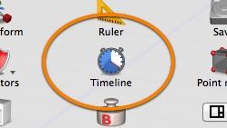

* The Animation Timeline Controller isn’t part of the view layout (and whether or not it’s visible is also not part of the view layout) — it’s toggled on and off using a toolbar icon (that you need to add to your toolbar).

* The 3D view can be toggled between single pane and 4-pane “split view” using the tiny widget at the top-right. Cheetah 3D gives you several window layouts to use for different purposes, each of which is completely customizable. 

**You can customize views** by right-clicking on the title/tab bar at the top of them (which lets you add tabs, change the view’s role, split views, and so on). 

You can save a view layout using Window \> Layout \> Save Layout (or the Save Layout option from the View Layout menu in the toolbar). 

**Caution**: saving your layout will overwrite your current layout. There’s no way to save your layout over a different layout option except hacking your preference file.

### A new Cheetah 3D document is empty except for a camera

When you create a new document in Cheetah 3D you are faced with an “empty scene” (not quite empty: it contains a camera, and you’re looking at an otherwise empty scene through that camera). The blue line you see is the “z axis” and the red line is the “x axis” (the “y axis” is invisible, but would run straight up through the intersection, which is the “origin” — 0,0,0).

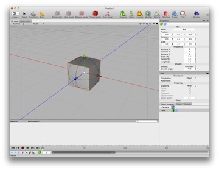

If you create a new object (e.g. by selecting a Box from the Polygon toolbar item) it will appear at the origin (the center of the scene) with zero rotation and scale of 1.0 in all dimensions.

At this point you have created a virtual cube in a virtual space, and you are looking at it through a virtual camera.

You can change your point of view by option dragging in the view (to “orbit” the current center of your view, which is the origin by default), zoom in and out using the scroll button or gesture on your pointing device, and pan the view by option-control dragging.

Note how I said you were looking at a virtual cube through a virtual camera.

Changing your view (by orbiting, zooming, and so forth) moves the camera (i.e. you are changing the view by changing the camera’s position). (If you use the view menu to change to perspective view, you can change your view without moving the camera.)

You can select your cube (it’s probably selected already) by clicking on it. You can then transform it by using the Transform tool — which is selected by default. A “transformation” is a movement, rotation, and/or rescaling in 3D space.

### Navigating the 3D view

There’s a small row of icons at the top-right of the 3D view. These allow you to navigate the 3D view _without remembering the keyboard shortcuts_.

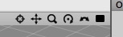

From left to right, the icons are: focus camera, pan, “zoom”, orbit, pivot, toggle 4-way view, and finally the gear (new in Cheetah 3D 7) controls other settings. Note that focus camera also sets the point around which you will orbit.

There are also shortcuts for view navigation: holding down the option (alt) key allows you to “orbit” by dragging the mouse/trackpad; scrolling (gesture, mousewheel, etc.) or option-command dragging allows you to “zoom”; and control-option allows you to pan by dragging.

**Note**: in 3D parlance “orbit” means “move the viewpoint around a fixed point while keeping the distance to that point constant”.

Once you get used to these conventions — which are similar to those in many other 3D programs — they become second nature. (Indeed, speaking from experience, it’s difficult to stop oneself from using them constantly when trying to make video tutorials.)

Also note that the “zoom” operation in fact moves the camera in and out ("dollies" the camera forward or backward) rather than changing the camera’s field of view (i.e. its “focal length”). Thus the magnifying glass is intuitive, but slightly misleading.

And, finally, note that 3D animators often use the same terminology as real-world film makers when describing camera moves. “Dolly” means moving the camera around on a wheeled platform. When you use the scroll gesture you are in fact "dollying" the camera and not “zooming” which would involve changing the camera’s field of view (or “focal length”) while staying fixed in position (and it would change the scene’s perspective dramatically). You may have heard of a trick attributed to Hitchcock (used in Vertigo) called the “reverse zoom” where you dolly in, or out, and zoom in the opposite direction to keep the subject fixed in size while the world around them changes. It’s a neat trick and totally doable in a 3D package like Cheetah 3D.

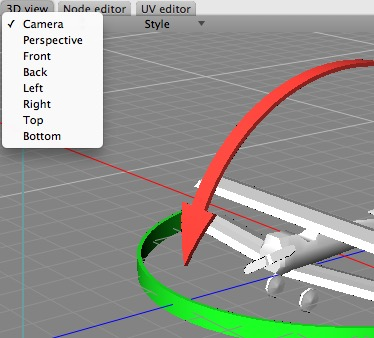

_The menu at the top-left of the 3D view allows you to select views. The camera and perspective views are (usually) freely navigable. The front, back, left, right, top, and bottom views are orthographic (no perspective) views that cannot be rotated, so orbit and pivot don’t work in those views._

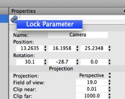

_It’s important to remember that when you’re in a camera view, changing the view moves the camera around (and undo won’t move it back). This is a bit annoying, and you may want to try to remember to work in perspective views unless you want to move the camera. You can also lock the camera by right-clicking its icon in the Properties Panel and selecting “Lock Parameter” to avoid accidentally messing up a camera._

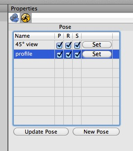

_Another trick suggested on the forums is to add a Pose tag to a camera and save a pose whenever you want to be able to restore a specific camera view. Once you get into this habit you have the best of both worlds — you can quickly move the camera around and make test renders, but you don’t lose views you want to keep._

### Modes

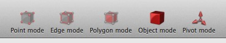

Cheetah 3D’s default toolbar provides five items for selecting modes and displaying the mode you’re in. You start in Object mode by default.

Cheetah 3D is always in one of five modes. The first two modes apply to any kind of object, while the other three apply only to editable meshes (and, in the case of Point mode, splines).

**Object mode** (this is where you start by default). You are living in a world of objects (as in “things in the Object Browser”) and can select one or more at a time and do stuff to objects.

**Pivot mode** allows you to manipulate an object’s coordinate system for purposes of transforming it. Most objects, by default, will have their pivot point in the middle of the object (sometimes the “middle of the base of the object”). But you might want to rotate the object around a different point (e.g. if you wanted to open a door it would rotate around the door’s hinges, which are near its edge). 

Note that the pivot of an object affects how it is transformed, but doesn’t change the object’s position or orientation in space (in other words, the pivot isn’t affecting the object’s internal coordinate system.

### Mesh/Spline Editing Modes

Three of the modes only work for editable meshes (Point mode also works on splines). Any other object will behave as though you are in Object mode. 

Note that if you are in one of these modes and you have an editable mesh selected, you cannot select a different object in the 3D view without switching back to object mode. (You can select a different object in the Object Browser and remain in one of these modes.)

* **Point mode** allows you to operate on the vertices (or points) of an editable mesh directly. You can select one or more vertices and perform various operations on vertices.

* **Edge mode** allows you to operate on edges (sides of polygons, sub-paths of spline) of an editable mesh. When you manipulate an edge you’re really just manipulating the vertices that the edge joins and the polygons that contain that edge.

* **Polygon mode** allows you to operate on the polygons of an editable mesh.

When you are in one of the mesh editing modes you will also have a powerful context menu available via the right mouse button (or equivalent gesture). This provides convenient access to Cheetah 3D’s selection and polygon tools.

### Select vs. Transform

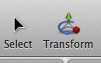

Cheetah 3D offers a select tool which allows you to select objects (and edges, points, and polygons, depending on mode) without the risk of accidentally moving something, and a transform tool which lets you select and manipulate objects. Because Cheetah 3D has excellent undo support, it’s easy enough to “live in the Transform tool” all the time, and undo any accidental nudges, but sometimes you need to be sure, and that’s what the Select tool is for.

### The Transform tool

The most commonly used tool in Cheetah 3D is the transform tool. This tool allows you to select things, and move, rotate, and scale whatever you have selected.

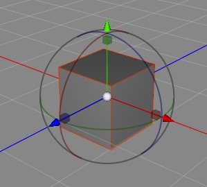

_The transform tool allows you to move, rotate, and scale your selection. Clicking and dragging on the arrows allows you to move (or “translate”) the selection in the x, y, or z direction; the boxes allow scaling along an axis; and the colored circles rotate around the corresponding axis._

The transform tool itself has **four different incarnations** and **two modes**. Its four incarnations are universal (the only incarnation I use), translate, rotate, and scale. The two modes are its usual mode (where it transforms things) and **gadget mode**, which allows you to **set its pivot point** temporarily.

### Center Manipulator Modes

The transform tool also has a central manipulator which is modal. In essence, when you click an arrow, the central manipulator goes into translate mode and you can click and drag on it to translate the selection parallel to the view. 

Similarly, if you click a scale box it enters scale mode, and now clicking and dragging on it will scale the object uniformly. Finally, if you click a rotation manipulator the center manipulator goes into rotation mode and allows you to “freely” rotate. Of these three modes, scale mode is by far the most useful.

You can double-click the central manipulator to switch to gadget mode. Gadget mode is a bit like pivot mode (and indeed existed before pivot mode). I suggest you use pivot mode and ignore gadget mode altogether.

### Two Axis Scaling

The transform tool’s scale functions also have a clever shortcut. If you hold down the shift key and drag on a box, it will uniformly scale the object on the other two axes, (so if you shift-drag on the red box, it will scale the object uniformly in y and z — very useful indeed.

### Working with Selections

Anyone who knows Photoshop well will tell you that much of Photoshop’s power (and complexity) comes from its ability to make and modify selections. Before Photoshop, making and refining selections was treated almost as an afterthought by most graphics programs; Photoshop introduced the idea of the selection as a “first class citizen” of the user interface. You could perform operations on selections, save them in different ways, undo changes to them, and so on.

Cheetah 3D, like Photoshop, treats selections very seriously. 

You can **add to selections** by shift-clicking a suitable item (e.g. if you’re in polygon mode, you can add a polygon to the current selection by shift-clicking it). You can also use Area Select and add to a selection by shift-dragging.

You can **subtract from selections** by command-clicking a selected item. As with selection, you can use Area Select and command-drag to remove a bunch of stuff from a selection.

You can **undo and redo changes to selections**. When you make a selection or change a selection, Cheetah 3D treats this as an operation that you can undo and redo.

Selections are treated as part of an object’s state. Cheetah 3D also considers selections to be an important part of the state of an object: e.g. when you select some vertices in Point mode and then switch to a different mode and/or select some other object and do stuff, when you return to Point mode, your selection of vertices will be there. In fact, your selections will be saved as part of the file! The same holds true for Edge and Polygon mode.

You can **invert, expand, or contract selections**. Expand selection adds polygons adjacent to selected polygons to a selection while Reduce selection removes border polygons from selected polygons.

**Loop** and **Ring** allow you to select polygons (and corresponding edges and vertices depending on mode) that form a continuous loop or ring.

**Area Select** allows you to drag a rectangle around a bunch of things (depending on mode) to select them.

There are other tools for selecting all triangles or all polygons with more than four sides. These tools are designed to help clean up meshes. For many purposes, especially character animation, a good mesh should try to use quads — four-sided polygons — as much as possible, both to improve the way subdivision works, and to reduce the distortion of materials by UV mapping. These tools let you quickly identify any non-quads in a mesh and deal with them if necessary.

And in Polygon mode there are tools for hiding selections (and revealing everything you’ve hidden) to get stuff “out of the way” when editing a mesh.

### The Object Browser

While being able to navigate a 3D view is very useful, sometimes you want a more schematic view of what’s going on in your scene. The object browser allows you to see (and select) everything in your scene, including invisible objects.

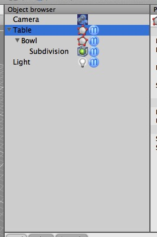

The object browser lets you see and select everything in your scene, including abstract things like modifiers, and things that aren’t visible (or aren’t in view).

It also shows the scene hierarchy, i.e. which objects “are parented to” or “belong” to other objects. The concept of hierarchies is very powerful in 3D graphics. They’re a bit like “grouping” in an vector drawing program but far more useful and flexible.

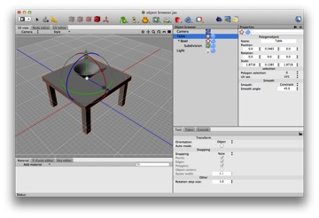

_Consider a table with a bowl on top of it. If you want to move the table, you probably want the bowl to come along with it. But if you want to rotate the bowl you probably don’t want to rotate the table. If you make the bowl a child of the table, this is exactly how things work._

Typically if B is connected to or resting on A then it’s usually a good idea to arrange them in a hierarchy with the basic idea that if “moving thing A would generally result in thing B moving in the same way, then A should contain B” (or A should be B’s parent, or B should be A’s child — all of these concepts are equivalent).

If you find something in the object browser and want to see it in the 3D view (or “viewport”), you can use the Focus Camera icon. Focus camera is so useful, I recommend giving it an easily remembered keyboard shortcut (I use “F”).

Adding items from the object browser to the Properties Panel

Sometimes Cheetah 3D expects you to drag one or more items from the Object Browser to a list or “socket” in the Properties Panel. E.g. if you create a Particle Mesh object you need to tell it which mesh to use as its basis.

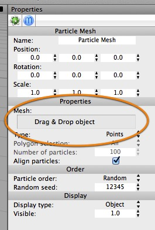

The Particle Mesh object’s Properties panel includes a “socket” which you need to drag a mesh object into.

This is a bit of a paradox, because if you click on an object in the Object Browser then the Properties panel you need to drag to disappears!

The trick is to click and then drag the object to the “socket” or list box in one operation (i.e. _don’t release the mouse button until you’ve completed the operation_). This sometimes requires some finesse (e.g. you might need to scroll the Object Browser view to get the desired object in view before you start).

Perhaps the most common example of this is the Skeleton tag which needs to have all associated bones dragged into its list box. Fortunately you can drag a root object and all its descendants will go into the list box (and you can delete any objects you didn’t really want from the list box afterwards).

