## Making a Mug

**Note**: supporting files for this book, including the tutorials, can be found at [loewald.com/c3dbook](http://loewald.com/c3dbook) (under **tutorials**).

The first thing you probably want to do is make something and render it. In almost any 3D package the steps you go through are something like this:

1. Decide what you want to make

2. Create a model

3. Texture it

4. Create a scene for it (if necessary; this may entail making more models)

5. Pose or animate it (if necessary)

6. Set up your desired camera view

7. Light it

8. Render it

Often a 3D artist will create a lot of test renders as he/she works. Fortunately, Cheetah 3D’s renderer runs quite fast, even on modest hardware, so producing early test renders is quick and pretty satisfying.

We’ve come a long way from when I first got into 3D graphics in the late 1980s — there used to be a joke among 3D graphics people: *The Law of Constant Rendering Time* — no matter how good your hardware gets, it takes *seven hours* to render an image. But in the last ten years or so, the hardware and software have started to overtake artists’ desire for more realism.

And it’s quite possible to skip the first step (i.e. just start doing something to see what happens — 3D doodling!) or change your mind as you go.

So let’s get started.

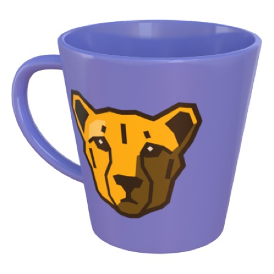

In this tutorial you’re going to:

1. make a mug, 

2. create a material for it, 

3. modify the mug’s UV map to make proper use of the material, 

4. and then render the mug. 

In the course of this tutorial you will learn to:

- manipulate the 3D view and switch between 3D views, 

- basic box modeling techniques, 

- working with modifiers, 

- creating a simple image-based material, 

- the basics of UV mapping, 

- and finally how to quickly light and render a scene.

That’s a lot of ground to cover — but once you’ve finished the tutorial you should know your way around a lot of Cheetah 3D.

If you’ve used Luxology’s *Modo* you may notice some similarities between this tutorial and the introductory tutorial for Modo. This is quite intentional — I think the Modo tutorial is very good and shows off some of Modo’s strengths. I think this tutorial covers a greater range of Cheetah 3D’s functionality, and shows how its modifier and creator stacks give it some advantages over the far more expensive *Modo*.

**Later tutorials assume you have completed this tutorial** and won’t give such blow-by-blow instructions for every little thing.

### Creating the Cup

We’re going to start by creating the main body of the mug using a cylinder primitive and a modifier. We’ll show how we can modify the properties of primitives and modifiers to get what we want before “collapsing” the hierarchy to create an editable mesh.

1. Launch Cheetah 3D (if it’s not already running) and create a new, empty document (if you don’t already have one.

> 

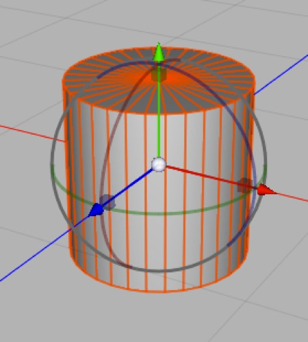

> 

> *By default, a cylinder has 32 longitudinal sections (i.e. it’s a cylinder of a 32-sided approximation of a circle).*

2. Select **Cylinder** from the **Polygon** toolbar item.

3. Let’s get comfortable with **controlling the 3D view**. 

4. Try holding down the **option** (alt) key and then **clicking and dragging** in the 3D view. This is called “orbiting” the view (your point of view stays the same distance from your “focal point” in space). Some views (e.g. “Front”) have a fixed view angle and will not respond to “orbiting”.

5. Now try using the **scroll wheel** (or the equivalent gesture on the trackpad — which is to move two fingers side-by-side up or down) This “zooms” the view (in fact, it moves your point of view towards and away from the focal point).

6. Finally, try holding down the **control** and **option** (alt) keys and then **clicking and dragging** in the 3D view. This “pans” your view around.

If you can’t remember these keyboard shortcuts (chances are the scroll-to-zoom and option-drag to orbit will quickly become second nature) you can also click and drag on the widgets at the top right of the 3D view.

Now, let’s look at the **Object Browser**. The Object Browser is a schematic representation of your current scene. Right now it should consist of two things: a Camera (the thing you’ve been looking at the scene through, and which is moved around when you alter your view when in the Camera view) and a Cylinder (which you just created).

7. Click on the Cylinder to select it (if it’s not already selected) and look at its Properties. The **Properties** panel will display the properties of the thing you’ve most recently selected (either in the 3D view or the Object Browser). Almost all objects will have one or more tags, and these act like extra tabs full of properties for the object they’re attached to. 

E.g. the Cylinder has a blue **Mode** tag which lets you control things like whether a given object will appear in the 3D view or rendered images, how it will be displayed in the 3D view, whether its modifiers will be active, and whether it will create anything if it’s a creator.

1. With the Cylinder’s properties visible (click on the Cylinder icon/tab in the Properties panel if necessary, change its Sections longitudinal to 24, and its Sections height to 8. You’ll see that the wireframe displayed in the 3D view will change to match these new settings.

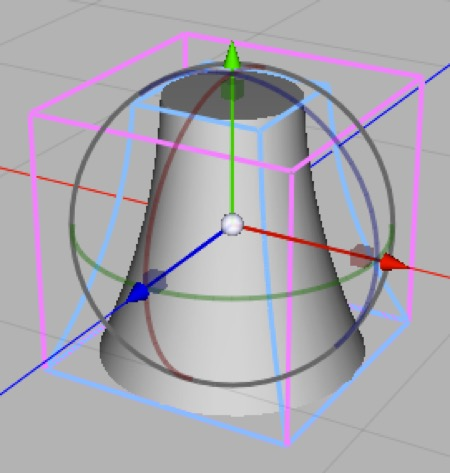

*The cylinder with 8 height sections and a taper modifier applied to it. (If the cylinder only had one section, the curve of the taper would not show on the cylinder.)*

1. Now, we’re going to use a modifier to deform the cylinder to match our mug — we want it to taper towards the bottom. With the Cylinder selected, select **Taper** from the **Modifier** toolbar item. You should see a new icon appear inside (i.e. “as a child of”) the cylinder in the Object Browser, and the cylinder should become tapered, with an inward curve.

2. The **Taper** modifier should now be selected. (If not, select it in the Object Browser.) Since our mug doesn’t have inwardly curved sides we want to change the Taper’s curvature to 0.0. (If we were designing a dainty teacup we might keep it. If we wanted a bulbous mug, we might change it to a positive value. Feel free — as always — to experiment.)

3. The Taper is also the wrong way around. Let’s rotate it 180° around its Z axis. Cheetah 3D refers to rotations either as HPB (heading, pitch, bank) which correspond to rotation around the Y, X, and Z axis, respectively. So change the Taper modifier’s third rotation value to 180. (From now on, I will use the shorthand “set its Rotation to 0,0,180.)

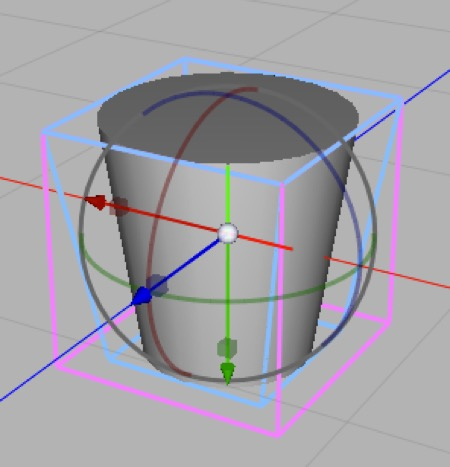

1. The Taper is also a bit too extreme. We don’t want the base of the mug to be quite so narrow, so let’s set the Taper modifier’s Strength to 0.7. (Yes, it’s a bit odd that the higher the “Strength” the smaller the effect.)

2. Right now, the Cylinder is a **primitive** with parameters we can change at will; similarly we can go back and change our Taper modifier any time we like. This is nice and gives us a lot of flexibility, but we need to be able to directly edit its polygons, so we’re going to “collapse” our cylinder and its modifier to make an **Editable Mesh**. You can do this by selecting the Cylinder and then either double-clicking on its icon in the Object Browser or selecting **Objects \> Make Editable** from the menu. 

**Note** that making a mesh editable and “collapsing its modifier chain” is what I refer to as a **point of no return** in the modeling process — you can still undo, of course, but you can’t come back a week later and get back to before you made your fateful choice. If I were being careful I might save before this step, or duplicate the uncollapsed object and leave an invisible copy off to the side. (You make something **invisible** by selecting its Mode tag and checking off **Visible in editor** and **Visible in renderer**.)

1. If you orbit to look at the top or bottom of our cylinder, you’ll see a whole bunch of triangles. This is horrible to work with so we’re going to delete the top and bottom of our cylinder. From the top-left of the 3D view, switch to the Front view by selecting Front from the popup menu.

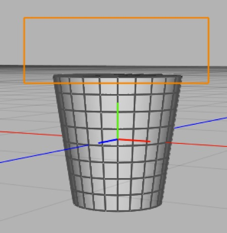

*If you orbit to a nearly edge-on view you can use Area Select to quickly select the cap of the cylinder.*

1. Now, we want to marque select the top of the mesh. First we need to be in Polygon mode. Click the Polygon mode item in the toolbar. Pick **Selection \> Area Select**, and then drag out a rectangle around the top of your mesh (you want to enclose the top edge of the mesh, and nothing else. You can switch back to the Camera view and orbit to verify you got the right polygons. If you have, press the delete key. (If somehow you delete the entire mug, undo, click on the mesh in the Object Browser, and then repeat this step.)

2. Repeat step 13 for the bottom of the mesh.

**Note** that you could do steps 12 and 13 entirely in the camera view if you orbit until the top or bottom is edge on or close to it. An experienced modeler can pretty much “live” in Camera or Perspective views, quickly orbiting to double-check operations.

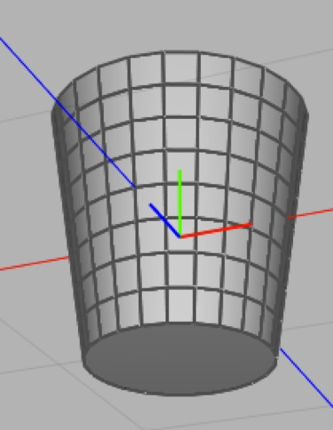

*Viewed from below, the bottom cap has been replaced with a single polygon using the Fill Hole tool.*

1. Now we want to replace the bottom of the mesh with a nice polygon. Orbit so you can see the bottom reasonably well, pick **Tools \> Polygon \> Fill Hole** and click on one of the points around the bottom edge. Done!

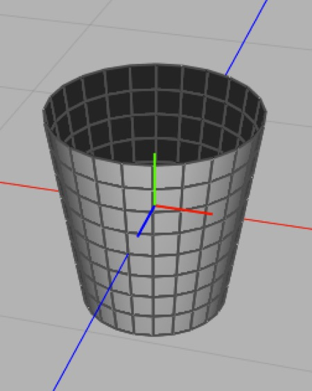

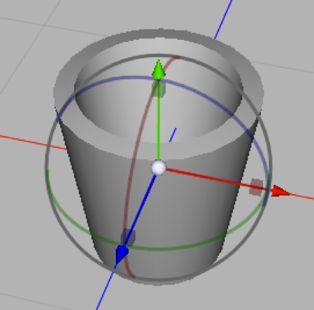

*Before and after applying a Shell modifier to the mesh. This shows the Shell modifier’s default settings, which are thicker than we want.*

1. Our mug is *infinitely thin* right now — and in a game it would look really weird (try selecting Backface Culling from the Style menu at the top-left of the 3D view and orbiting it). With the mesh selected, pick **Shell** from the Modifier toolbar item then set the Shell modifier’s **Offset** to 0.05 (the default of 0.1 is a bit too thick). **Make the mesh editable** by double-clicking on its icon in the Object Browser. You might want to double-click on the mesh’s name and change it to “mug” at this point.

**Note** if you’re not using Cheetah 3D 6 then you need to use the Shell tool at this point. Select the mesh if necessary and make sure you’re in Polygon mode, then Select All (**Selection \> Select All** or Command-A). Pick **Tools \> Polygon \> Shell** and then click-and-drag in the 3D view to give your mesh the right amount of thickness (you be the judge). If you make a mistake — undo and do it over. (Do not do it twice — you might want to double-check by undoing and redoing.)

### Building the Handle

We’re going to use a Sweep creator and two splines to create the precise handle shape we want. We’ll be able to adjust the splines until we’re completely happy with the shape of the resulting handle.

1. Switch the 3D view to **Front**.

2. Click on the **Mode** tag of the mug mesh and set its **Editor shading** to **Wireframe**.

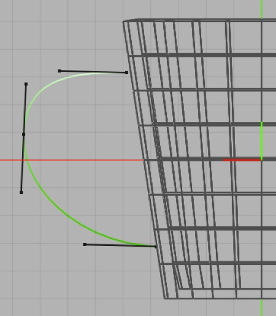

*Here’s the finished spline which will control the shape of the handle. Note how the position of the end points relative to the rows of polygons in the cup.*

1. Click in the background or pick Selection \> Select None (command-D by default) to deselect the mug mesh. Select **Tools \> Spline \> Create Spline**. Now click once roughly where we want the handle to start, again at the extreme edge of the handle’s curve, and once more where we want the handle to end. You should now have a really crappy spline. Note that we’re starting in the middle of the second row of polygons in the mug mesh from the top, and ending in the middle of second row from the bottom.

2. Go into **Point** mode. Select the **Transform** tool. Select All. Pick **Tools \> Spline \> Soft Interpolation**. Your spline now looks slightly less horrible. Move the points and control handles around. **Note**: each control point acts like a 3D point and needs to clicked once to select it and then moved using the transform tool — you can’t just click and drag as in dedicated 2D drawing programs. Move the control points until you’re happy with the curve of your handle.

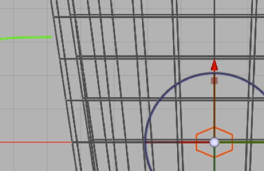

*Here’s the squashed hexagon that will be the cross-section of the handle.*

1. Now pick **n-Edge** from the Spline toolbar item. By default this will create a hexagon, which is exactly what we want. Set its radius to 0.1. Double-click it to make it editable. Then set its **Type** to **Linear**.

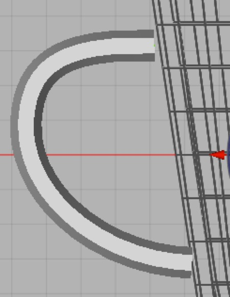

*The sweep tool creates a 3D mesh by moving the profile (the Sweep creator’s first child) along the control spline (the second child).*

1. Select **Sweep** from the Creator toolbar item. Drag the hexagon into it, then drag the spline you created into it, so that the n-Edge (hexagon) is the first child and the Spline is the second child. You should see some geometry appear.

2. Now select the hexagon (named n-Edge) and set its Z rotation to 90°. 

3. Click and drag on the red box (scale) widget and scale down the height of the hexagon until the handle is slightly thinner than the polygon row in the mug mesh.

### Joining the Handle to the Mug

We’re going to use Merge (which replaces Import Children in earlier versions of C3D) to bring the handle into the mug mesh, then we’re going to use the Bridge tool to join the handle to the mug.

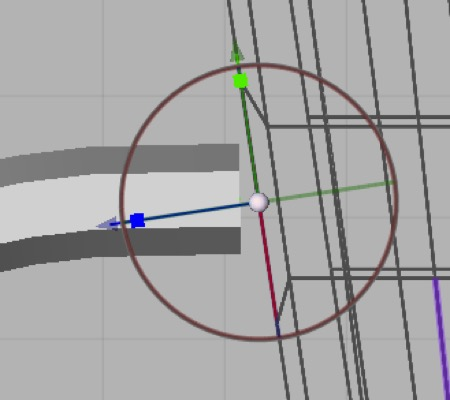

*One of the two edges we need to stretch. The Transform tool is lined up with the edge because its orientation is set to Normal, which allows us to scale the line using the green (y-axis) scaling widget.*

1. **Select the mug mesh** and switch to **Edge** mode. Select the edge that the top of the handle is pointing at, and then select the Transform tool. Change the Transform tool’s orientation to normal (so its y-axis lines up perfectly with the edge you’ve selected). Drag the green box to scale the edge so it’s about one and a half times as big. Repeat this for the edge that the bottom of the handle is pointing to and stretch it as well.

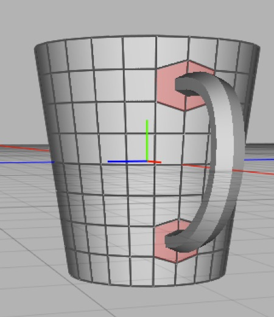

*These are the hexagons we created by stretching the two edges, and which we’re going to delete to make holes so we can join the handle to the cup.*

2. By stretching the two edges **you’ve created hexagons** on the side of the mug mesh which the handle will join to. We’re going to delete these hexagons to leave two hexagonal holes. Switch to **Polygon mode**, and select the four polygons (quads) that make up these two hexagons — click one then shift-click the others — and press delete.

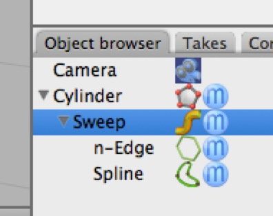

3. Select the mug mesh and then handle (click one, command-click the other) and then select **Tools \> Merge**. (If you’re still using an older version of C3D: now drag the handle (the Sweep creator) into the mug mesh (so that it’s a child of the mug mesh) and then click on the mug mesh and pick **Tools \> Import Children**. This will copy the handle mesh into the mug but leave the original child untouched. )

4. Select the Sweep creator’s Mode tag and toggle off both of its visible properties. This leaves it around in case we want to rebuild the handle. You could just delete the Sweep creator, but this is an example of how you can avoid having to rebuild stuff from scratch later if you make a mistake.

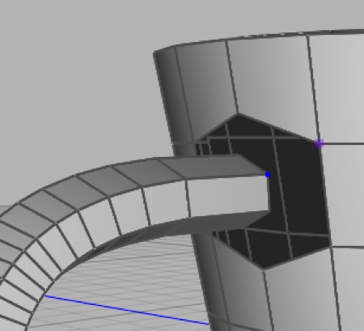

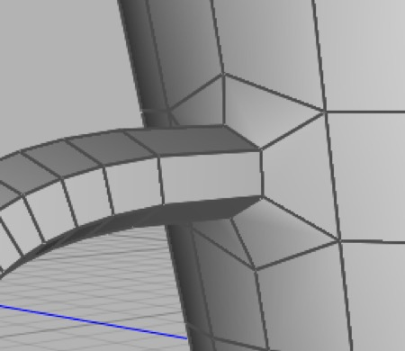

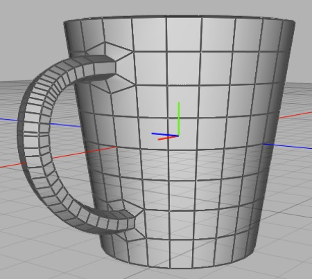

*Before and after we join the two surfaces using the bridge tool — clicking on corresponding points on the edges closed edges we’re going to join.*

5. Now select the mug mesh again and go into **Point mode**. Now pick **Tools \> Polygon \> Bridge**. Click on one of the points around the upper hole in the side of the mug, then click on the corresponding point on the handle — it should bridge the gap perfectly. (If not, undo and try again.) Repeat for the lower hole and the bottom of the handle.

The basic mesh is complete. You should orbit it and admire your handiwork.

### Refining the Mesh

We’re going to use the bevel tool to adjust the curvature of our mesh when subdivided.

1. Switch to **Object mode**. Let’s make the mesh look smoother by adding a Subdivision modifier. **Select the mug mesh** and then pick **Subdivision** from the **Modifier menu**. It looks pretty great, but the bottom is so rounded that the mug wouldn’t stand up on a table, and the bottom of the inside probably looks wrong too. The rim of the mug is a bit too rounded as well. 

2. Select the mesh’s **Mode tag** and **toggle off Modifier** — this will disable all modifiers (i.e. the subdivision modifier) making it easier to work on the base mesh.

3. Now go back to **Polygon mode**. Orbit the mesh and select (click on) the bottom polygon. Then orbit mesh so you can see the polygon at the bottom of the inner surface of the mug and shift-click to add that to the selection. But we actually want the edges of these polygons, so pick Selection \> Convert Selection To \> Edges to select the edges of the polygons and automatically switch to Edge mode.

4. We also want the edges of the rim, so pick Selection \> Loop Select and then shift-click on one edge on the outside of the rim, and one edge on the inside of the rim. You should now have four edge loops selected.

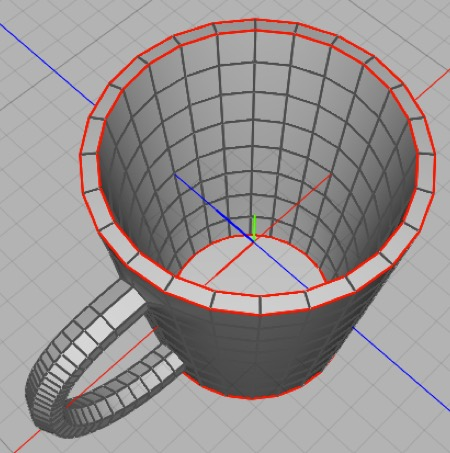

*These are the edges we want to bevel. We selected the edges of the circular base and bottom of the interior by selecting the polygons then converting the selection to edges, then using the loop selector to select the two edges of the rim.*

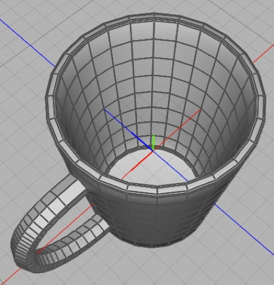

*After the bevel.*

5. **We want to bevel these edges** so that they’ll look good in the base mesh, and also provide finer control when the mesh is used as a subdivision control cage. So pick **Tools \> Polygon \> Bevel**. If you’re using Cheetah 3D 6, in the Bevel tool’s settings change the type to Convex and leave the Level at 2 (if it isn’t 2, change it to 2). Now click and drag in the 3d view (make sure not to mis-click — undo if you do) and carefully drag until the degree of beveling looks right, then click on the Transform tool in the toolbar to get out of the Bevel tool and avoid any accidents.

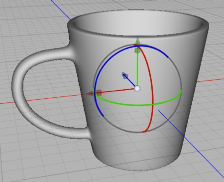

*Subdivision toggled back on.*

6. Now in the mesh’s **Mode tag** properties, **toggle Modifier back on** and admire your handiwork.

### Creating and Applying a Material to the Mug

We’re going to create a simple image-based material and use some brute-force techniques to UV-map it.

1. Select **Material** from the **Add Material** popup menu towards the bottom-left of your window. A sphere that looks like it’s made of grey plastic should appear with the name “Material”. Double-click the name and change it to “Logo Mug”.

2. With the material selected, you should be able to edit the new material’s properties. Next to the diffuse property is a color swatch and a kind of beveled square. The beveled square lets you add an input node to a property — click on it and select **Textures \> Image** from the menu that appears. You should now be looking at the properties of the resulting Image node. Click Load and select mug-diffuse.png. Return to the shader’s properties by clicking the left-pointing arrow at the top of the Properties panel. (This is how you navigate the nodes of a material without looking at the Node view. If you like you can click the Node tab and see the nodes of the simple material you’ve just created.)

3. If you switched to the Node view, go back to the **3D view**. Make sure you’re in **Object mode** and **drag the new material onto your mug**. (The reason we do this in Object mode is that if we’re in Polygon mode we’ll only apply the material to any polygons that happen to be selected, and we want to apply the material to the entire mesh.)

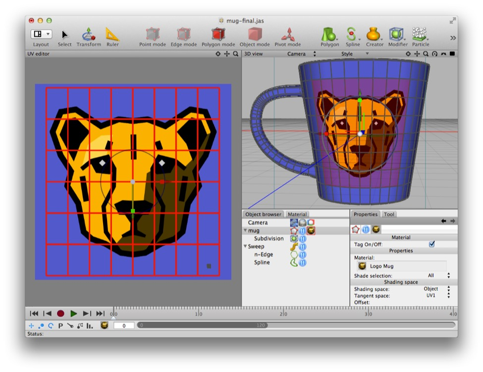

*Using the UV Mapper to place a grid of polygons over the logo. (The little grey square in the bottom-right corner is all the other polygons — so the rest of the mug is the background color.)*

4. Your mug should look pretty terrible. We need to fix the UV mapping. Switch to polygon mode, select the Select tool. In front view, select the the central 4x2 quads you’re looking at by clicking and dragging across them with the mouse (this is called “painting a selection”). Now pick **Selection \> Expand Selection** twice (command-shift-X by default). You should now have a “square” of polygons selected.

**Note**: what happens if your mug is somehow the wrong way around and you don't get a nice "square" of polygons this way? You can select the polygons manually using shift-click to add polygons to your selection and then when you have the polygons you want selected, right-click in the UV editor view and select one of the unwrapping options — it should form the polygons into a nice square for you.

5. From the **Layout menu** in the toolbar select **UV Editing**. In the Object browser, **click on the Material tag** that attached to the mug. This should show the material tag’s properties in the Properties panel. **Double-click on the material**, which should select the material and put its properties in the Properties panel. Now click on the black-and-white checkerboard to the right of the diffuse property to get at the Image node’s properties. Now click Edit so that the image appears in the UV Editor. (Whew!)

6. Now, select the Transform tool and move and scale the polygons you should still have selected so that they neatly cover the stylized Cheetah logo. Then pick **Selection \> Invert Selection** (Command-option-I by default) and **move and scale all the other polygons so they fit in a corner**. Your mug should now display the logo correctly, and the rest of the mug should be blue.

### Lighting and Rendering the Mug

We’re going to render the mug, adjust the lighting using two different approaches, and tweak the properties of our camera and the Logo Mug material to produce a better-looking render.

1. Switch back to the **Modeling** layout. Make sure the 3D view is in **Camera** mode and **pick a nice view of your mug** by using the orbit, zoom, and pan controls. Click the **Render** toolbar item: you’ll get a pretty flat looking render. It’s a result of the “Camera light”. We want better lighting in the scene.

2. Pick **Sky Light** from the **Scene Object** menu.  Now try rendering again — big improvement! You might like to experiment with the Sky Light’s properties and render a few more times.

3. The Sky Light is OK but we can do better. **Select and delete the Sky Light**.

4. Most mugs are porcelain, which is reflective. Let’s click on the Logo Mug material and set its Specular color to black. Now set its Reflective color to medium-dark grey. (The preview sphere will tend to overstate reflectivity.) If you render now you’ll get a flat result and no reflections — we need something to reflect!

5. Select the camera and add an HDRI tag and a Radiosity tag from the Tag toolbar item. **Click on the HDRI tag** and load **faux hdri setup.hdr** into it and set its Intensity to 3.0. (Or you can use one of the HDRs included with Cheetah 3D, in which case leave the intensity at 1.0.) Toggle off the Background property. Now **select the Radiosity tag** and set its Type to **Radiosity** (by default, the Radiosity tag is actually an Ambient Occlusion tag — go figure). Now try rendering.

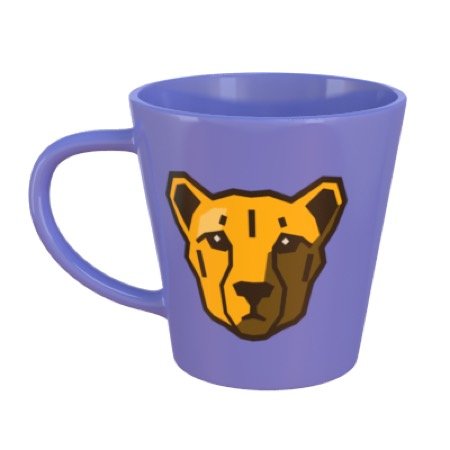

6. In the Object browser (or perhaps the Property panel) **click on the Camera icon** and set its Background Color property to **completely transparent**. Finally, set the Logo Mug material’s Reflection blur to 0.05 so its reflections are mirror sharp. Render. We’re done!

