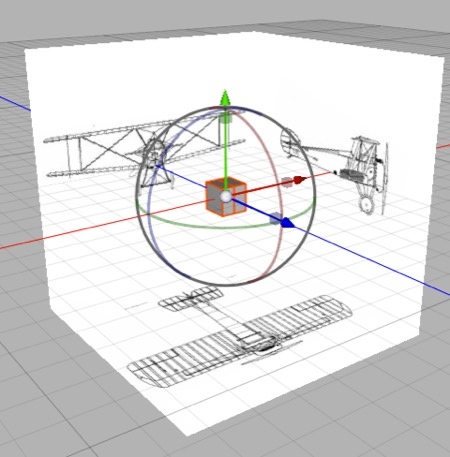
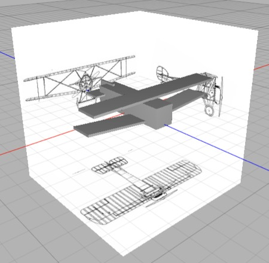
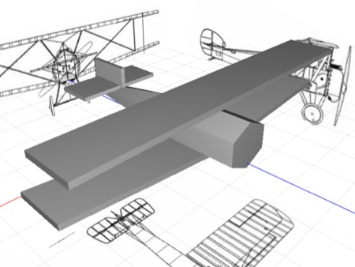
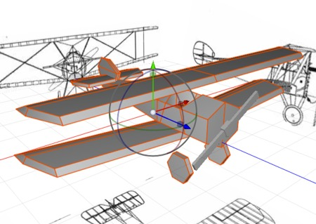
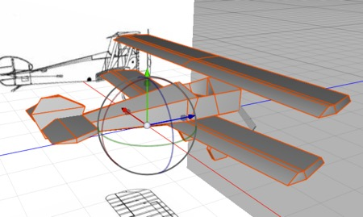
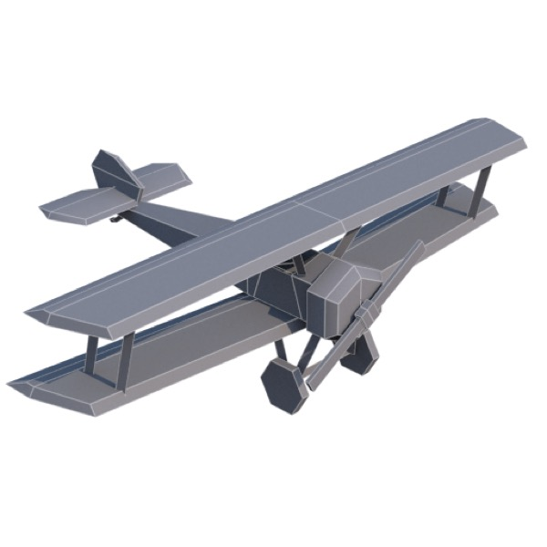

## Modeling a Biplane

**Note**: if you find this tutorial confusing, it may be helpful to go through *A Quick Tour of Cheetah 3D* (starting with *Just Enough to be Dangerous*), and possibly review the *Modeling* section. You definitely want to have gone through the *Making a Mug* tutorial.

We’re going to create a biplane with a very low polygon count, suitable for a mobile game. We’re only doing the mesh, not the texture map (which will take longer — indeed, the lower the polygon count, the greater the relative effort you need to put into the texture map).

**Note**: “Texture mapping” is a shorthand way of referring to UV-unwrapping and creating an image-based material for a mesh.

Launch Cheetah 3D (if necessary). Create a new document (if necessary).

### Setting up a symmetric mesh

1. Create a box (pick Box from the Polygon toolbar item). In its properties pane, set the number of X sections to 2. In the Object Browser, double-click the box to turn it into an editable mesh.

2. Switch to Polygon Mode (click the Polygon Mode toolbar item) and then pick Area Select from the Selection menu.

3. Drag a rectangle so that it contains the faces on the right side of the y-axis, then press the delete key to remove them.

4. Now go into Point (vertex) mode and notice that vertices have been left behind. You can use Area Select to drag a rectangle around them and press delete, or you can use the Optimize tool (**Tools \> Polygon \> Optimize** — feel free to figure that one out for yourself if you like — we’ll deal with Optimize later).

5. Go back to Polygon mode. (Note: your box — which is actually an **editable mesh** now — should still be selected in the Object Browser.)

6. (With the box still selected…) pick Symmetry from the Modifier menu. The faces you deleted should suddenly come back! (But now they’re actually mirrored copies of the faces on the left, which is the whole point of symmetry — this lets us work on symmetric objects twice as fast.)

**Note**: this is how a lot of box modeling projects start, so to save yourself time in future you might like to save a copy of your document now as “symmetric model stationery.jas” or something so you can reuse it later and skip these steps.

### Setting up a blueprint

*Blueprint set up and a symmetric half cube in the middle. We’re ready to start modeling.*

1. From the Scene toolbar item, pick Blueprint.

2. In the blueprint’s Properties panel, load biplane-front.psd into the **back** image and biplane-right.psd into the **left** image. (Yes, front goes in back and right goes in left!) We’ll discuss how to prepare images to be used this way later.

3. Also in the blueprint’s properties, set the scale values (all three of them) to 10.

Note that I’ve set up these images so this “just works”. Exactly how to set up images for use in a Blueprint is discussed in detail elsewhere.

### Roughing it Out

Note that if you have a nice big display you can do this in four-panel mode, allowing you to select faces from the easiest angle, and perform transforms in one panel while visually checking the results in another.

1. From the Style popup at the top-left of the 3D view, toggle on Wireframe so you can see the blueprint images through the mesh. 

2. Our model currently consists of a cube. From the right side, select all polygons and transform them to match the height of the fuselage at the front and match the length of the fuselage.

3. Select all, copy, paste, and then transform the new half-box to match the top wing; duplicate the top wing and drag it to the position of the base of the bottom wing (note that from the front the bottom wing is tilted upwards towards the edge), and then repeat again for the horizontal and vertical stabilizers.

*A motley collection of cubes of roughly the right size.*

4. From the Front view, use area select to select the side of each of the boxes (or jump to Right side, Camera, or Perspective view to select a side polygon then switch back to Front view to adjust its position) and move it (using the red arrow) to adjust the widths of each former half-cube to match that blueprint view. Finally, move the edge of the lower wing up to match the blueprint.

5. Select the side of the fuselage box, and scale it down so that the front of the fuselage becomes a regular hexagon roughly matching the front view of the fuselage.

*It’s starting to look like a biplane.*

6. Probably the biggest discrepancy in the rough mesh you’ve built is the tapering of the fuselage. Use the Ring Cut tool to add a loop where the fuselage starts to taper. Then scale down the rear polygon and move it to match the fuselage taper, then go into edge mode, select the back-right edge and, from the top, move it into position along the x-axis (using the red arrow widget).

If you switch to Perspective or Camera views, toggle off Wireframe, and take a look at your mesh it should be a nice, but rough, model of the biplane. 

### Refining the Mesh

The process of refining the mesh generally consists of getting the mesh you’ve got as close as possible to the reference *without adding geometry*, and then judiciously adding more geometry as needed to add more detail. In a sense you simply ask yourself, “What’s the most glaring thing that’s wrong with this model?” And then fix it. Keep repeating the process until you’re satisfied or you reach your polygon budget.

Right now, I’d say that the most glaring issues are that the wings and especially tail look too boxy, and there’s no cockpit, propellor, or landing gear. We’ll address each of these issues and then call it quits.

*This is what we’re aiming for with this round of improvements.*

#### Vertical Stabilizer

1. Let’s start with the vertical stabilizer. Back to wireframe mode. We’ll create a new loop by using the **Polygon \> Ring Cut** tool and clicking on one of the vertical edges of the tail. Now we can select the top-front edge and move it along the z-axis to better match the shape of the blueprint. Similarly, select and move the other corners.

2. Switch to top view and select the **Polygon \> Weld** tool. Set it to weld to First Point, then weld the trailing edges of the vertical stabilizer so the trailing edge is sharp (click on an inside point then weld it to the corresponding outer point).

#### Horizontal Stabilizer

1. Still in top view, use **Ring Cut** to add a loop where the rear elevator divides the horizontal stabilizer. Drag the corner edges to correspond better to the shape of the stabilizer.

2. Again use the weld tool to weld the trailing edge of the horizontal stabilizer. 

3. Note there’s a **missing triangle** on the back inner side of the elevator now. Use **Polygon \> Add Polygon** to add a triangle there — switch to Point mode to make the existing points easier to see, then click the vertices of the new triangle in anti-clockwise order.

#### Wings

1. In top view make, use Ring Cut to add a loop level with the edge of the elevator. Now drag to outside front edge to match the shape of the wing. 

2. Select the top leading edge and then in the Right side view drag it back slightly to match the leading edge in the blueprint profile. Likewise, select the top trailing edge and drag it almost up to the new loop to match the profile. In a perspective view, drag the outer top edge towards the center slightly. You might want to turn off wireframe and view the wing and make adjustments at this point.

3. Rather than try to match that on the bottom wing, select the existing lower wing (click on one of its polygons, then **Selection \> Extend Selection** until it’s all selected) then delete it. Now select the fancy new top wing using the same method, duplicate it, and move the duplicate into place level with the bottom of the lower wing.

4. Now select the fuselage (using the same trick) and **Selection \> Hide Selection**.

5. If you’re not using it, switch into four pane view (by clicking the widget at the top right of the 3D view). Select the lower wing again and in a perspective view **Edge Rotate** on its upper inside edge to rotate it to match the front view.

6. **Selection \> Show All** to bring back the fuselage check your progress.

#### Cockpit

1. In the Right side view, use Ring cut to add two new loops to the fuselage at the front and rear of the cockpit.

2. Select the edge corresponding to the near lower edge of the cockpit and scale and move it to match the cockpit.

3. Select the polygon where the cockpit ought to be, use **Tool \> Polygon \> Cover** and then drag the polygon down into the fuselage, then use the green box widget to scale it down to a flat polygon. 

4. You’ll probably see some weird edge chasing taking place on the side of the cockpit. This is because the inner side of the polygon overlaps with the outside edge of the fuselage. This won’t matter in a realtime application (the polygons face in opposite directions) but it’s still bad practice and will mess up renders. So in edge mode select the lower edge of that face and then in perspective view use the red arrow widget to move it slightly towards the centerline.

#### Propellor

1. Create a new box, scale it down to match the center of the propellor. Set it to have two X sections, make it editable, (when you make a primitive editable Cheetah 3d will automatically switch to Polygon mode) delete the left half, and add a Symmetry modifier. Select the outer face, Cover it, then scale it down a bit. 

2. Cover again and pull the face out to the approximate length of the propellor blade. Scale it up slightly.

3. Switch to object mode, rotate the propellor around its Z-axis to match the propellor in the front view. Set the Transform tool to Normal orientation  and move the outer polygon of the propellor to exactly match the length of the propellor blade in the front view. 

#### Landing Gear

1. Create a cylinder. Set it to 6 longitudinal sections. Set its rotation to 0,0,90. Position and scale it to match the right front landing gear wheel. 

2. Make the cylinder editable. Delete the caps and replace them using fill hole.

3. Select the biplane mesh and the cylinder mesh (click one, command-click the other) and use Tools \> Merge. (before C3D7: If it isn’t already, make the cylinder a child of the biplane mesh and then select the biplane mesh and use Tools \> Import Children. Delete the old cylinder mesh.

There’s a lot more to do, of course, but this should give you a good idea of how to get it done. And between the first tutorial and this one you’ve now used most of the key polygon editing tools.

If you wanted to create a more detailed model for rendering, there’s a huge amount of work left to do. If this were going to be model for a mobile device, you might stop adding much more geometry here (although right now your biplane should be well under 300 polygons), use transparent materials for the struts and landing gear detail, and rely on textures to bring the model to life.

*Here’s a version of the model with some extra details added. It’s up to 399 polygons. Adding a few more polygons for the machineguns and possibly a pilot would still leave it well under 500 polygons.*

