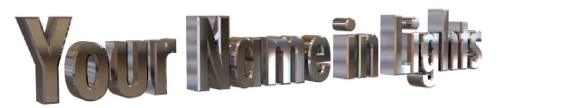

## Mini-Tutorial: 3D Text

Here we’re going to build 3D text suitable for use as a big heading on a poster, or a page layout.

In this tutorial we’ll create 3D text using C3D’s excellent Text Spline object, and then turn that spline into 3D text using the Extrude Creator. Finally we’ll use some tricks to make it look spiffy.

I should note that you can use this exact process to create a 3D logo from a vector outline. You can import vector art directly into Cheetah 3D from an SVG or PDF file. Simply replace steps 1–3 with “import a logo”.

Launch Cheetah 3D and create a new document (if necessary).

### Extruding a Spline

1. From the Spline toolbar item, pick Text. 

2. In the Properties panel note the Text property has a triangle next to it (a “disclosure triangle”). Click on it! Change the text to whatever you want — all caps will probably look best. Click the Font button and pick a nice bold sans-serif font

3. You should see a wire view of the text you’ve typed (cool huh?) — if it’s not all visible try using the pan and scale tools to get it all in view with a bit of space to spare (you can also use the orbit tool to adjust the angle, but keep it at an angle!

4. Deselect everything (Selection \> Select Nothing, or click in the 3D view background). Add an Extrude creator to the scene and drag the text spline object you created onto the Extrude icon. Voila 3D text!

### Making it Metallic

1. Select Metal \> Steel from the Add Material popup. Drag the Steel material (a metal ball icon) onto your text in the 3D view (or onto the Extrude creator in the Object Browser — either will work).

2. Click the Render toolbar icon… Um, black? The problem is metals get their appearance from what they reflect, and there’s nothing in your scene to reflect, so let’s fix that.

3. Add HDRI and Radiosity tags to the Camera. Load an HDR of your choice (there are two included with Cheetah 3D) into the HDRI tag (I recommend entrance\_hall\_pano.hdr). Set the Radiosity tag’s type to Radiosity.

4. Click the Render toolbar icon again. Better — except for the fuzzy background. This is because we’re using an HDRI “environment map” both as a faux scene for the metal to reflect and as a background (the tag’s default setting is to behave this way). Let’s fix that.

5. Select the HDRI tag on the camera and uncheck background. While we’re at it, select the Camera’s background color to transparent.

6. Adjust the camera view to taste and hit Render again. Now you have created a properly “alpha channeled” 3D text image suitable for compositing onto your movie or page layout.

