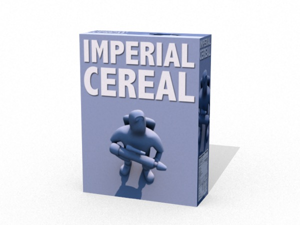

## Package Mockup

Let’s suppose you’re designing the packaging for a new breakfast cereal and you want to mock up some 3D packages based on your designs.

In this tutorial we’ll build a package using a box primitive, convert it to an editable mesh so we can apply different materials to each face of the box, and then create materials for the different faces. We’ll also create a very simple scene and lighting setup to give our render some context (vs. a box floating in space).

Launch Cheetah 3D (if necessary). Create a new document (if necessary)

1. Add a Box to the scene. Set the Box’s width, height, and depth to 0.6, 0.8, and 0.2 respectively. Now set its y coordinate (the middle value under Position) to 0.4.

2. Add a Plane to the scene and set its scale values to 100 (i.e. 100, 100, 100). It should now fill the view, but the box you created should be on top of it.

3. Add a Sky Light to the scene. (For variety! If you like, make an HDRI setup instead per the previous tutorial.) Set the Skylight’s Date to 13:00 (instead of 12:00, which is the default). This will affect the angle of lighting and shadows.

4. Click Render! It’s a box on a plane. Not very exciting.

5. Now, in the Object Browser, double-click on the Box icon to make it into an editable mesh.

6. In the Materials panel, create four new materials by clicking Add Material and selecting Material. Rename the materials: “front”, “side”, “top”. For each material, click on the bevel button to the right of its diffuse property, and select Texture \> Image to add an Image node, and load the appropriate image (Imperial Cereal.PSD for the front, and so on.)

7. Now, select the box mesh, go into Polygon mode, select the front face and then drag the appropriate material onto it. Repeat for the side and top polygons (we won’t worry about the three faces we can’t see — I’m sure you get the idea).

8. From the Add Material popup, select **Special \> Shadowmat**. Drag this material onto the plane. Set the Camera’s background color to transparent.

9. Frame your box and hit Render. You’ve now got a nice render of your produce complete with a translucent shadow.

