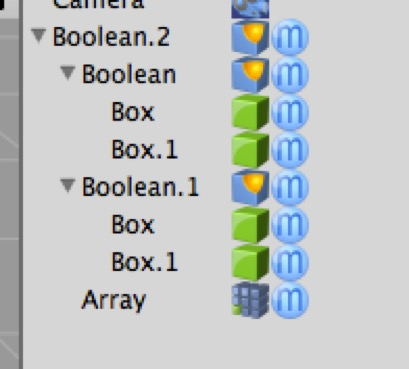

## Understanding How Creators, Tags, and Modifiers Interact

Creators, modifiers, and tags are the three non-destructive mechanisms Cheetah 3D provides for applying changes to an object without destroying it. In other words, they allow you to change the way the renderer (or output file) “perceives” the underlying object while allowing you to go back and make changes to it (or recover it unchanged).

Creators and modifiers are almost, but not quite, the same thing done in two different ways. 

**A creator acts on one *or more* of its _children_** while **a modifier acts on its _parent_** (and if a single object has multiple modifiers, they’re applied in order, top-to-bottom). The fact that a creator can act on more than one of its children is why creators need to exist (e.g. a “sweep” creator generates a mesh by “sweeping” one curve along another).

The best way to “read” creators when trying to understand your scene hierarchy is simply to ignore the children they act on and think of them as being the object created.

**But there’s more**: *creators hide any extra child meshes they may have from the renderer*. If a mesh operates on its first two children and its third child is a mesh, then that extra child *simply will not be rendered* but will be visible in the editor interface.

**Tags are attached to objects and act on that object alone**. (Why have tags and modifiers? Modifiers act on an object’s geometry, whereas tags can act on arbitrary qualities of an object, e.g. directly modifying the way the object is rendered or interacts with the animation system.)

How all these things interact can be quite hard to understand. The general rule is that **the properties of a child override the properties of a parent**. E.g. if an object has a render tag that turns its shadows off, a child of that object with a render tag that turns its shadows on will still cast shadows.

Again, the big exception to this is creators, which work inside-out. In essence, you need to think of the children used by a creator as not being part of the “downward” hierarchy. E.g. in the above example the top boolean (Boolean.2) is acting on its first two children (Boolean and Boolean.1). The array modifier is acting on Boolean.2 and ignores Boolean.2’s first two children.

