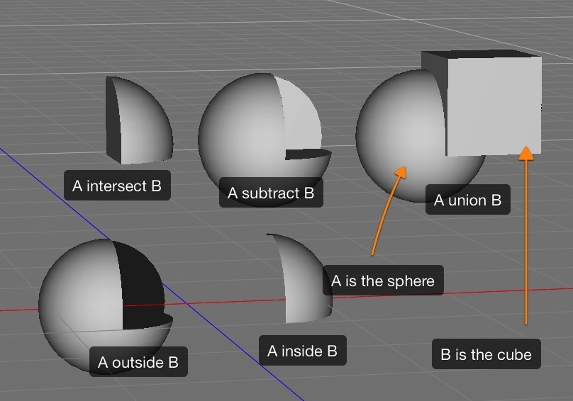
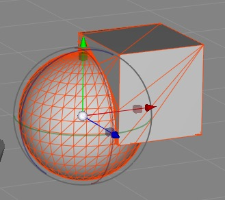
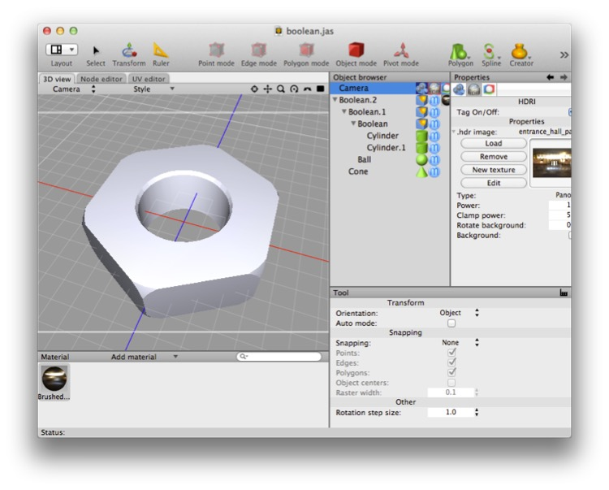
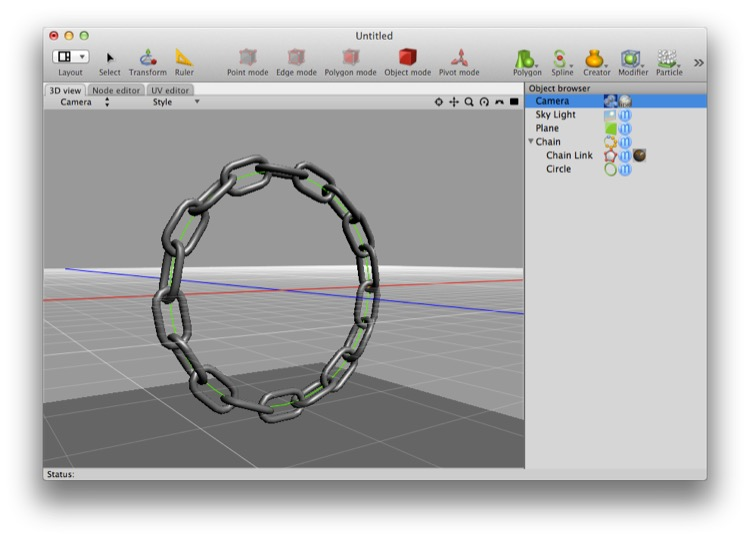
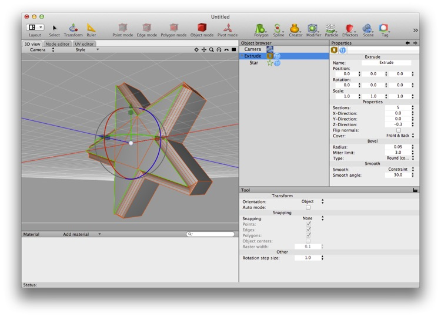
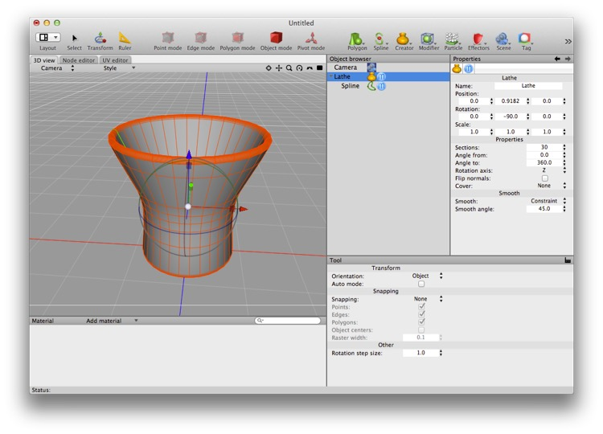
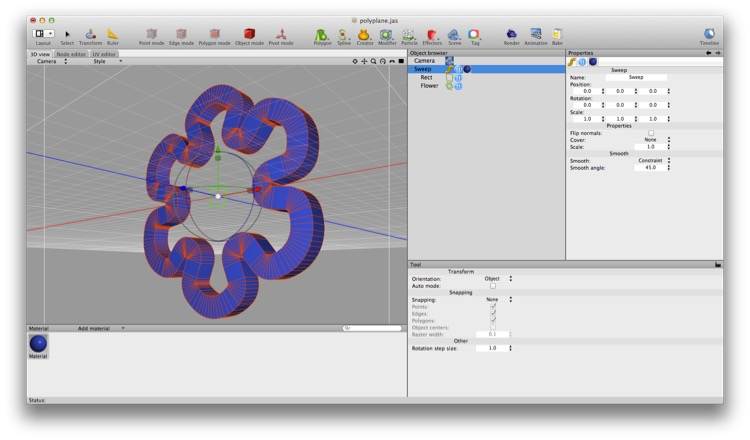
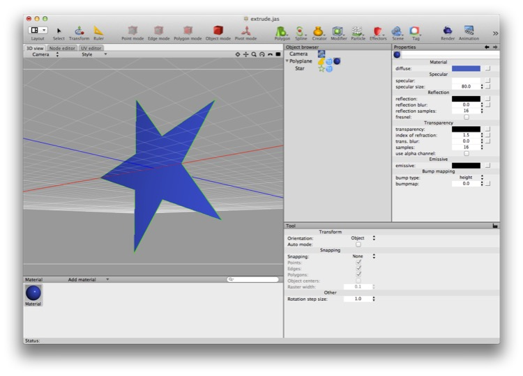
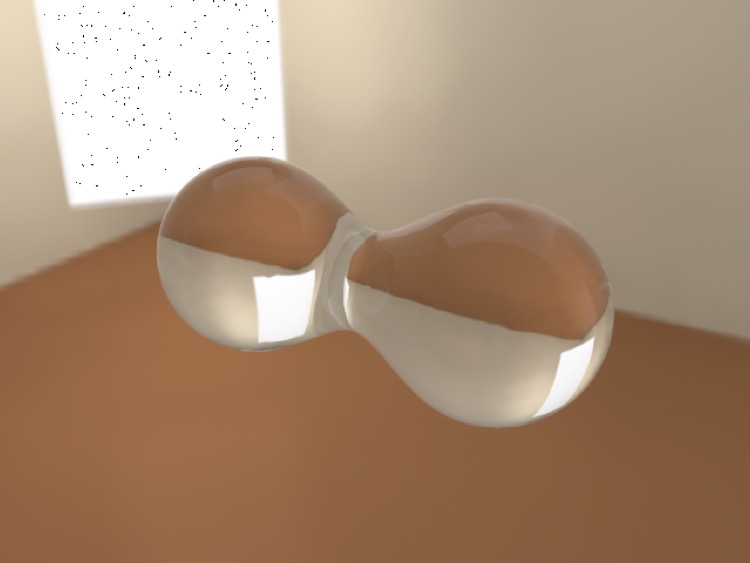

## Creators

A creator is an object that — given the correct number and type of children — will generate a mesh derived from those children. The easiest way to explain creators is to show what they do. Note that while I explain creators in alphabetical order, the Boolean creator is a terrible one to start with — skip it and come back afterwards!

### Boolean

*This shows the different boolean operations. The first three options perform a boolean operation on two “solid” meshes — union (add), difference (subtract), and intersection. The last two “inside” and “outside” options act on any surface in relation to a solid (e.g. if you want to cut a plane with a solid object.*

The boolean is a very useful, very powerful, and potentially dangerous creator. You should use it sparingly and only when no reasonable alternative exists because it produces meshes that are difficult to work with.

The union mesh from the previous example is a complete mess (i.e. it has "awful topology") and is completely triangulated. Doing polygon work on such a mesh is pretty much impossible, so if you must boolean meshes together, try to do it as late in your workflow as possible, and only commit (make the boolean editable) if you absolutely have to.

*This complex form was created using a series of booleans. First, a round cylinder was “subtracted” from a six-sided cylinder, then the corners were created by intersecting the result with a ball, and finally the beveling around the hole was achieved by subtracting a downward pointing cone. Note that the bottom of the hole has not been bevelled.*

*In practice, this is a bad way to get this result (and, as already stated, the bottom of the hole still isn’t bevelled and we haven’t even tried to model the screw-thread). Even if we were to use booleans, we’d be better off trying to reduce the number of booleans being used because each successive boolean creates a more degraded (“uglier”) mesh.*

**When *not* to use booleans**: booleans should be used sparingly because they produce ugly meshes (i.e. triangulated meshes with no real topology). In general, if you can think of a way to do something without booleans, do so.

**When to use booleans**: use booleans if you simply can’t think of another option, such as when one or both of the objects concerned is complex and the difference or intersection cannot easily be modeled any other way. (The only reason to ever use a union is if you need a single, solid mesh. It never helps with rendering.)

**Working around bugs in booleans**: the boolean algorithm used in Cheetah 3D is far from perfect and is particularly likely to produce bad output if one of the two meshes has vertices that are coplanar with the other mesh’s faces. If the input meshes are “heavy” (i.e. have lots of vertices) it follows that bad output is virtually assured.

### Chain

The boolean chain creator produces multiple copies of an object along a spline. (That’s why it’s called “chain” — the obvious thing to do with it is make chains without modeling each link individually.)

### Extrude

The extrude creator creates a 3D object from a spline by extending it along an axis. The extrude tool also allows you to bevel the resulting object with straight, curved, or stepped bevels.

Note that the extrude tool will not allow you to extrude a 2D mesh object. There’s a polygon tool for doing that.

### Lathe

The lathe creator creates a 3D object from a spline by rotating it around an axis. It’s called “lathe” because by default it creates objects similar to those you would produce by turning a piece of wood or metal on a lathe.

### Sweep

*Here we’ve swept a small square (“Rect”) along a Flower spline. The Rect is the first argument and the Flower is the second.*

The sweep creator creates a 3D object from two splines by “sweeping” the first along the path described by the second. E.g. if you sweep a circle along a curve you get a “pipe” running along the curve.

### Polyplane

*Here we’ve turned a star spline into a star-shaped polygon (that the renderer can see).*

The polyplane creator creates a 2D mesh surface from a spline. (Splines aren’t rendered, so this essentially makes splines “visible” to the rendering engine.)

### Isosurfaces (Metaballs)

Isosurfaces are a new feature in Cheetah 3D v6.

Isosurfaces produce behavior that resembles surface tension in liquids, and are thus able to produce the kinds of shapes characteristic of liquids. In combination with particles, isosurfaces can be used for fluid simulations.

### Symmetry

The symmetry _creator_ mirrors an object relative to a specified plane (corresponding to the plane formed by any two of the x, y, and z axes). It’s more usual to use the symmetry _modifier_ over the creator. (The symmetry creator could be useful if it allowed you to mirror more than one child object, but it doesn’t, and like all creators it hides extra child meshes from the renderer.)

