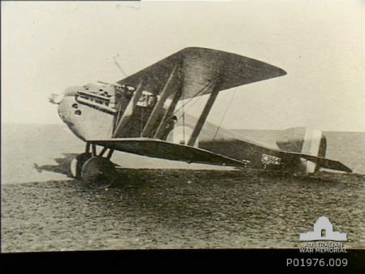

## Model Sheets & Blueprints

### Creating a Model Sheet & Preparing It For Use

*This model sheet, by David Leroy, was created for the book Character Development in Blender 2.5 (which I recommend). It’s licensed under Creative Commons. Note how the artist has broken out extra drawings of details — such as the inner side of the boots — that are not apparent from side and elevation views.*

Model sheets are the way 2D concept artists communicate their character designs to 3D models. (Typically in professional productions the person who designs a model is a 2D “concept” artist and a different person creates the 3D model.) Model sheets are useful even if you’re a one-man-band because it’s easy to lose details and proportions if you just “model by eye”.

There are any number of books on the subject of how to draw (although I’m not sure any of them are much good — I don’t know anyone who learned to draw from a book). This is not one of them.

**Aside**: insofar as I have had any success teaching people to draw, I suggest you start by drawing lots of dots on sheets of paper and then deliberately setting out to join specific pairs of dots with a straight line. I find that people who “can’t draw” can’t do this! It’s the basic skill that you need before you can apply any other drawing lessons (such as the classic approach of blocking out forms with simple shapes — it doesn’t work if you can’t put the shapes where you want them). Once you can do lines, try making smooth curves out of three points.

Another amazingly powerful trick is to try to draw something from life upside down. Again, most people who "can’t draw" can do this better than they can draw something right side up.

### Blueprints vs. Model Sheets

*Sopwith Dolphin “blueprints” from the-blueprints.com (a fabulous resource).*

Blueprints are, in essence, a specialized example of modeling sheets. If anything the main problem with using blueprints is that they tend not to include a perspective view that shows you what a given part of the object is _supposed_ to look like.

*Viewed from in front or from a side, a cylinder can only be distinguished from a cube by its shading. But blueprints don’t have any shading. When working with blueprints, other visual references (e.g. photographs) are invaluable.*

In the case of the Sopwith Dolphin I doubt you’d guess what the wheels on the landing gear looked like without visual references.

*I was able to find many useful visual references for the Sopwith Dolphin via Google Image Search but most of them are either copyright or unattributed. These images (from the Australian War Memorial) are specifically stated to be in the public domain.*

So the key thing when working with blueprints is to have *other visual references* at hand for a reality check. Again, Google Image Search is your friend.

### Setting up a Blueprint Object

Once you have a model sheet, to use it in C3D’s blueprint object you need to separate the different views (you’ll usually have front and side views) and then place them in a square document and line them up correctly. Also, if you have a top view you’ll want it to face *downwards*.

**Note**: "square" isn’t strictly necessary as long as you reproportion the blueprint object accordingly, but it’s easier to just make all the images square.

*Here we’ve started with a “model sheet” (an image from the-blueprints.com) which has all the pieces we need, but they’re not lined up or separated.*

*Each piece needs to be placed in its own layer in a square document. The top view needs to point down for purposes of alignment (and then rotated to face left for purposes of importing into Cheetah 3D (yes, this is annoying).*

*All of the images must be at the same scale (but this is usually not a problem). The top view needs to be lined up perfectly with the front view.*

**Aside**: there's a common problem with some WWI and WWII aircraft “blueprints” where the side view is of the plane resting on the ground (i.e. with its tail wheel grounded). In such cases you may need to rotate the side view so that the fuselage is parallel to the "ground". This isn’t the case here.

*And the side view needs to be lined up with the front view.*

*Having saved out the top, side, and front views as separate files, I’ve loaded them into the bottom, back, and left “sockets” of a **Blueprint** object in Cheetah 3D. (“Bottom” refers to which part of the blueprint “cube” you’re placing the image on rather than the view in which it’s useful, which is confusing).*

### Blueprint Summary

- Separate the images from your model sheet and put them in different layers of a square document (in Photoshop, Acorn, Pixelmator, Photoline, or whatever other image editor you use).

- Top view faces down for alignment.

- Line up the top and front views.

- Line up the side and front views.

- Once you’ve lined up the views, rotate the top view to face left.

- Save out the views as three different images.

- Load the top, side, and front views into the bottom, left-or-right, and bottom views respectively.

