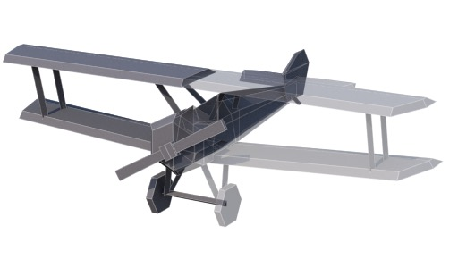
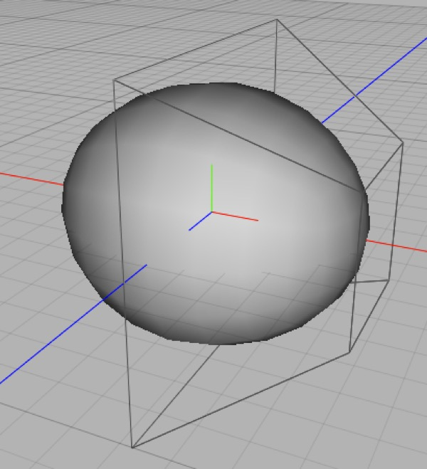
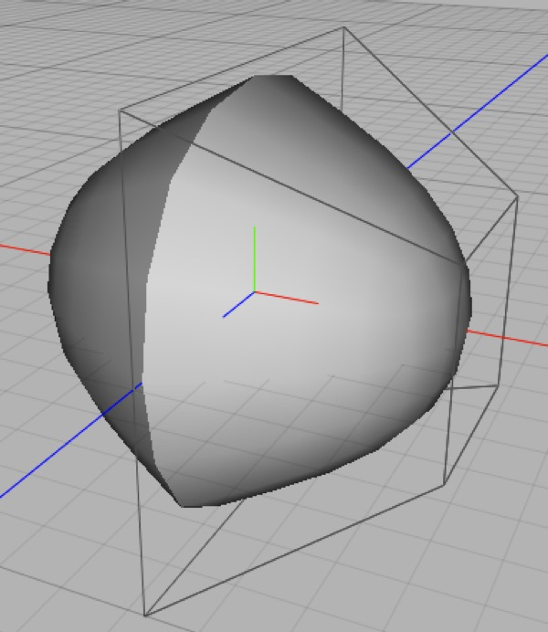
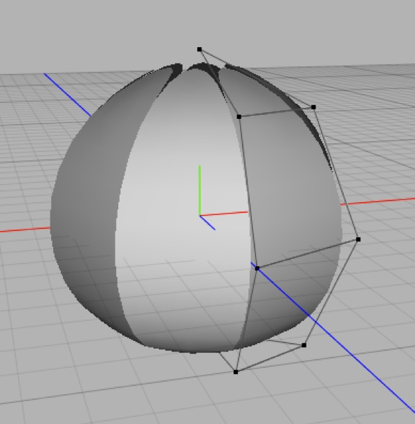
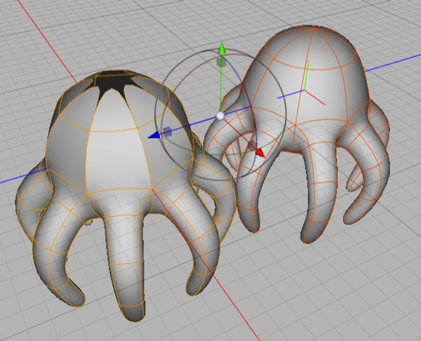

## Symmetry

_Many objects, including most animals and vehicles, are (at least roughly) symmetric. The symmetric creator and modifier allow you to infer half of your model from the other half, making creating (and tweaking) your model much easier._

_Rotationally symmetric objects can be modeled using the ring modifier, although in order to subdivide the mesh you'll need to manually flatten and optimize the mesh (because the ring modifier doesn't "weld" points the way the symmetry modifier does)._

Most living creatures (at least visible ones) are symmetric in some way, as are many other real-world objects. (Sometimes objects are largely symmetric but have asymmetric detail, e.g. cars are mostly symmetric but have a steering wheel and instruments on one side; aircraft often have pitot tubes and antennae arranged asymmetrically.

Cheetah 3D has two powerful modifiers for efficiently modeling symmetric objects — **Symmetry** and **Ring**. (Ring?! Yes, Ring allows you to efficiently model rotationally symmetric objects, like Octopuses and many plant parts. Unfortunately, the Ring modifier wasn’t designed for this kind of use, so it’s more fiddly to use for modeling than the Symmetry tool.)

In any event, bilateral symmetry, which is what the Symmetry modifier (and its unloved cousin the Symmetry creator) is designed for, is much more commonly required.

### Symmetry Modeling Tips

#### Snapping to the Symmetry Plane(s)

When modeling symmetric meshes you often want points to lie exactly on the symmetry plane. The simplest way to snap a point to the symmetry plane is to set the Transform tool to snap to raster, then if you move a point along the axis perpendicular to the symmetry plane (x for a default symmetry) it will be easy to snap it to the symmetry plane. (To make it even easier, set Raster width: to a large value, like 1.0.)

If you want to snap a lot of points near the symmetry plane to the symmetry plane, area select them (switch to the four-quadrant view or the view straight down the symmetry plane (Front or Back view for a default symmetry) and then scale the selected points down on the axis perpendicular to the symmetry plane (the x-axis for a default symmetry) and then snap the entire selection using the previous trick.

#### Not Quite Symmetric

Often you’ll find that your mesh is not-quite-symmetric. E.g. a human character might be almost entirely symmetric but have an asymmetric face and hairstyle. (Perfectly symmetric faces never look right!) Similarly, an Octopus’s lower body might be rotationally symmetric, but its upper body is only bilaterally symmetric.

There’s no single solution to these issues.

E.g. if I were modeling an Octopus I might rough it out using an 8-iteration ring to get the lower body pretty close up to the point where it would meet the upper body, then duplicate the mesh and collapse it, throw away the bottom and one side of the collapsed mesh, and then apply a Symmetry modifier to the new mesh and model “up” from the join. Now the Octopus is comprised of two meshes, a lower Ringed mesh and an upper Symmetry mesh. When I’m done I’ll have to collapse and merge both and clean up the join. 

The Symmetry and Ring modifiers are powerful tools, but they won’t solve all your problems for you. As in all workflow issues, the goal is to (a) do as little work as possible and (b) do irreversible operations as late in the day as possible (and make backups before you do them).

### Symmetry and Workflow

Perhaps more than any other modifier, Symmetry has profound implications for workflow. This is because (a) Symmetry is extremely useful and (b) it causes significant issues for UV-mapping and rigging.

#### Symmetry and Modifier Chains

*The same mesh with Symmetry and Subdivision modifiers applied, on the left **Weld Points** is toggled on (the default) while on the right it is toggled off.*

The Symmetry modifier has a very useful feature — weld points. This causes points in the mesh that are sufficiently close to the symmetry plane to be welded with their mirrored counterpart. Weld Points has a dramatic effect on Subdivision modifiers that are below the Symmetry modifier in the hierarchy, and it also reduces the complexity of the final mesh.

*Because the Ring modifier wasn’t intended for symmetry modeling, it lacks the Weld Points feature. This means it doesn’t play very nicely with Symmetry, and you’ll need to simply have faith as you model your “cage” mesh.*

*The mesh on the right was created by duplicating the “working mesh”, deleting the Subdivision modifier out of its hierarchy, collapsing the Ring modifier, using **Tools \> Polygon \> Optimize** to clean up the mesh, and then putting in a new Subdivision modifier.*

### UV Mapping Symmetric Objects

One potential issue with symmetric objects is UV-mapping them. Sometimes an object will have symmetric textures, in which case you’ll want to UV-map before collapsing its modifier chain (if you need to collapse its modifier chain).

Sometimes an object has asymmetric textures while having a symmetric form. The only way to do this is to collapse the symmetry modifier and then do the UV-mapping afterwards (or use a procedural material). In this case you may want to keep a copy of the uncollapsed mesh lying around (but it’s usually pretty easy to recover the “half mesh” if you don’t).

A rather common case is objects that are mostly symmetric in terms of material appearance, but have asymmetric parts (e.g. consider a person who might have symmetric-looking clothes and appendages, but has an asymmetric face and hairstyle). You’ll need to use your judgement in dealing with these kinds of workflows. One option is to separate the symmetric and asymmetric parts of the mesh for UV-mapping, then merge the meshes again later in the workflow.

#### Rigging Symmetric Objects

You can’t rig an object with Ring or Symmetry modifiers applied to it, because the Skeleton modifier will only bind the base mesh’s vertices to the bones. (You *can* rig a mesh with modifiers intact if you want its poses to be symmetric! E.g. you might be able to rig a blooming flower this way.)

Moving from modeling to rigging involves collapsing the symmetry part of your modifier chain and is, therefore, an irreversible step. (You do *not* need to collapse other modifiers, such as subdivision.)

