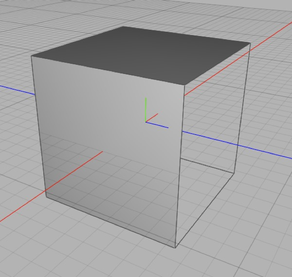

## Modeling Tricks & Techniques

### Gadget Mode

Cheetah 3D has an amazingly powerful feature called "gadget mode". It you've ever wished you had something like Blender's "cursor" only a lot less annoying, you will probably love gadget mode.

In simple terms, gadget mode lets you _temporarily_ move the _pivot_ of the selection for _all_ purposes. To do this, switch to the transform tool, make your selection (if necessary) and double-click the sphere. It will turn blue, and now you can move it around or snap it to components. When it's where you want it, you simply double-click it again and use the new pivot. 

Once you change your selection, the pivot reverts. (If you want to permanently change an object's pivot, see the next section.)

#### Why would you use this?

- Scaling relative to a specific center

- Rotating around an edge

- Snapping components together

### Pivots, Coordinate Systems, Skew, & Other Stories

An object's pivot (which appears when you select it) is a representation of the object's coordinate system — it is placed where the object's "origin" is, and (by default) the orientation of the pivot shows the orientation of the coordinate system.

### Merging, Joining, and Bridging Meshes

To **merge** multiple meshes into one mesh, simply select the meshes you want to combine and then select **Tools \> Merge**.

In earlier version of C3D, merging is more difficult: pick one to be the parent, make the other meshes children, then select the parent and choose **Tools \> Import Children**. The child meshes will be copied into the parent (you can delete the children or collapse the parent mesh at this point).

To **join** separate pieces of a mesh you can build polygons to join them one-by-one using the **Create Polygon** tool, you can **bridge** closed loops, or you can weld vertices together using the **Weld** tool.

### Splitting Meshes

To split meshes apart you need to be in polygon mode. Simply select the polygons you want to split off from the mesh and select **Tools \> Polygon \> Split**. The selected polygons will now be a separate mesh with the name of the original mesh with “.split” appended.

*This mesh was created by creating a default box, making it editable, selecting its top polygon, using Tools \> Polygon \> Disconnect (and clicking OK in the Disconnect tool’s panel) then using edge rotate to rotate the “lid” around its back edge.*

To allow a selected set of polygons to be moved without affecting adjacent polygons you can detach them from their neighbors using **Tools \> Polygon \> Disconnect**.

**Working with Primitives**

Primitives are very useful by themselves. They have the advantage of being controlled by parameters you can change at any time and some are surprisingly flexible.

In general, the most important properties of primitives are those which control the level of detail.

*Five cylinder primitives with a 45° Bend modifier, with 20, 10, 5, 3, and 1 vertical sections respectively.*

*Some of the primitives are surprisingly versatile. These are all **torus** primitives.*

### Modeling a Hole (without Booleans)

A common problem in box modeling is trying to carve a precisely shaped opening or recess in an arbitrary face. In many cases the best approach is to build a flat surface with the shape of the hole, snap it to the surface in question, merge the meshes, and then bridge the two geometries.

*We’re carving a star-shaped hole in a square polygon. **Top**: we start by creating the star shaped mesh (star spline in a polyplane creator, collapsed) then merge it into our initial mesh and use snapping to snap it to our face; **Upper-middle**: we then delete the face we’re cutting a hole into and **lower-middle**: bridge the edge of the resulting hole to our star; **Bottom**: little cleanup to fix the non-convex polygons and we can make our precisely star-shaped recess.*

### Solid Modeling

Here’s the summary. If you want to use your meshes as solids then make sure there are no holes or doubled (superimposed) polygons, and verify that all the normals are correct and consistent. You should also look for and try to eliminate non-convex polygons.

Cheetah 3D isn’t designed for solid modeling, but it does have some useful features for doing these things.

- If you pick **Backface Culling** from the 3D view’s Style menu polygons will disappear when viewed from “behind”. This makes it much easier to see flipped polygons (i.e. those with normals facing the wrong way) and correct them.

*The right face of this box looks weirdly dark. Switching on Backface Culling reveals a hole in my box. Oops!*

- Incorrectly flipped polygons will often look oddly shaded. If you see polygons in your mesh that just look wrong, try turning on backface culling to double-check.

*“z-chasing” occurs when coplanar polygons overlap, and is never a good thing (but especially bad if you’re trying to do solid modeling). It’s referred to as z-chasing because realtime 3D rendering uses a “z-buffer” to figure out when something is in front of something else — if two things have identical or near identical z-buffer values they will produce visual artifacts.*

- You should inspect your mesh carefully (look at it from different angles) and look for telltale “z-chasing” (which indicates coincident or overlapping polygons).

- If you use polygon **Optimize** tool (Tools \> Polygon \> Optimize) you can eliminate some redundant or pathological polygons.

*Here’s a (very) non-convex polygon that looks just fine in Cheetah 3D, but there’s no way to predict how another package might handle it. Triangulating it in Cheetah 3D and verifying it still looks right will prevent disappointment later.*

- The simplest way to eliminate all non-convex polygons from a mesh is to triangulate it. If you’re sending a mesh off to a bureau for 3D printing you might want to triangulate it and inspect it for issues.

### Normals and Solid Modeling

In order to understand how a solid is inferred from a mesh, it’s important to understand normals. Imagine you are building a complicated mould into which you plan to pour concrete. You want to be able to re-use the mold, so you paint slippery goop that concrete won’t adhere to on the “inside” of the mould. But the stuff is disgusting and expensive so you don’t paint it anywhere else. An experienced concrete pourer can look at a correctly assembled and gooped mould and infer what the final object is going to look like, no matter how complicated it is, because the inside surfaces are consistently lined with this slippery goop and outside surfaces aren’t.

But if your mould has gaps (holes) in it, then it won’t work because the concrete will leak out. And if you accidentally paint the goop in the wrong places then the concrete pourer might get confused and think the mould is inside out and there’s no telling what will happen.

So, you need to make sure your mould has no holes in it and that the goop is correctly placed throughout. Replace mould with mesh, holes with “missing polygons”, and goop with “normals” (except the normals should point outwards).

Oh, and there’s one more complication — doubled polygons are just as dangerous as missing polygons (e.g. imagine you have two identical overlapping polygons). There’s no analog of this in our real world example, because polygons are dimensionless, and moulds aren’t.

#### Tip: Seeing Normals

Some 3D programs offer the option of seeing normals but unfortunately Cheetah 3D isn’t one of them. If you want to see the normals on a mesh you can use a Particle Mesh and a Spline. This is so useful it’s worth keeping a Particle Mesh set up for this handy. All you need to do is create a Particle Mesh (rename it “View Normals” or something) and add a Line spline to it. Set its length to 0.2 and its position to 0,0.2,0 and drag it into the Particle Mesh. Now you can assign any mesh to the Particle Mesh’s Mesh property and you’ll be able to view its Point, Edge, and Face normals.

*Displaying the polygon, edge, and point normals of a Polyhedron using a Line Spline and a Particle Mesh.*

#### How solidity is inferred

The process by which a person looks at a cup, say, and figures out which part of it is the “inside” and how to pour tea into it is incredibly complicated. Computers are simple minded and can’t do complicated things like that unless we can break it down into very simple steps. The way solidity is inferred in practice is quite simple, and identical conceptually to the way laser printers figure out which parts of a glyph (e.g. a letter or symbol) need to be colored in.

Imagine you are a laser printer and you’re drawing a single row of pixels. Which part of the line should be black and which white? The simplest answer is to count the number of edges you cross. If you’ve crossed an odd number of edges you’re inside a character (so the pixel should be black) and if it’s an even number of edges you’re outside a character (so the pixel should be white). Easy!

The only problem with this is that it assumes that there are no overlapping, wasted shapes. In practice, many objects are created in a much cruder and more slipshod manner, e.g. I might have built the numeral 1 out of overlapping pieces:

If we simply count the number of edges crossed here, we’ll render the overlaps as holes, which is not what we want. So we need to have a concept of the “inside” of a shape, and this is where “winding order” comes in. We define a shape as a series of control points in a specific order such that they go anticlockwise (to pick a direction) around their interior.

If we switch to the 3D case, “winding order” becomes the surface normal. We establish the convention that the normal points away from the interior of a mesh, so we know that if we’ve crossed more outward facing edges than inward we are still “inside” something, and so we’re still inside.

But if a normal is the wrong way out, or a face is doubled or missing, our count can be off and we might never enter or escape the interior of our mesh. And so we can’t infer the interior, and our mesh won’t work.

