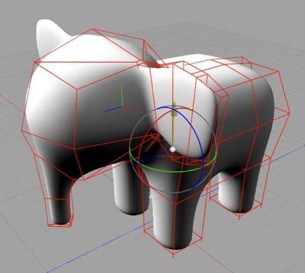
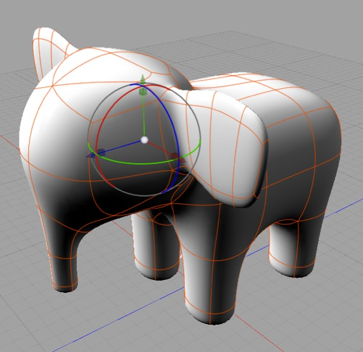
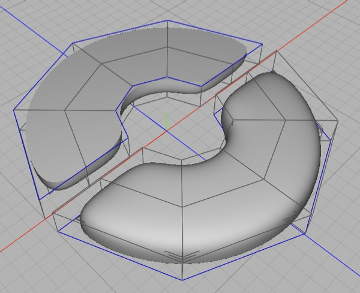
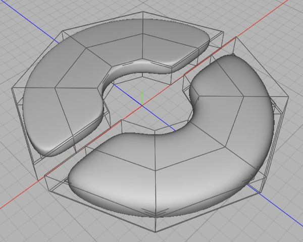
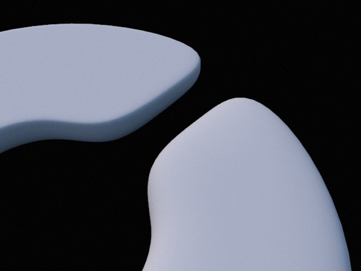

## Subdivision Surfaces

Subdivision surfaces are a powerful tool for creating smooth meshes. They are useful for both hard surface modeling (industrial design and similar kinds of modeling) and character modeling.

The base mesh to which subdivision is applied is often referred to as its “control cage” or “cage mesh”. The cage mesh affect the shape of the subdivision surface in much the same way as the control handles of a bezier control its curvature, and — as with bezier curves — the only way to get a good feel for how they work is to play with them.

### Controlling Curves

The general principle for controlling the curvature of a subdivision surface is that the more detail you need in the curve, the more detail you need in the cage mesh.

### Creasing Edges

*In this mesh you can see the effect of marking edges as creased (the blue edges are creased).*

You can crease/uncrease edges using **Selection \> Toggle Crease**. Creased edges will be sharply defined, but it’s a bit all-or-nothing. For finer control, adding extra detail to the cage mesh allows subtler definition.

*Here, I took the same mesh as before, used Selection \> Select All Creases and toggled the creases off, then beveled the previously creased edges.*

*Here are the two meshes rendered. As you can see, creasing (**top**) produces a sharp corner while beveling (**bottom**) allows a defined but still rounded corner. Each option has its uses.*

