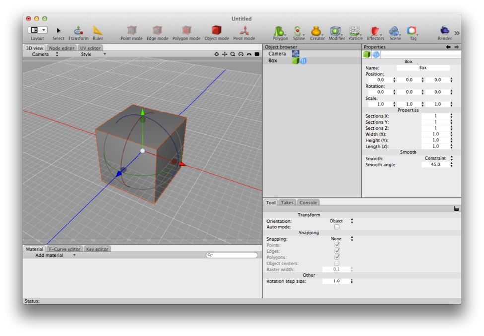
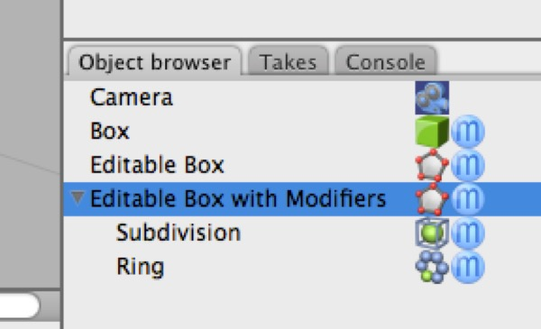
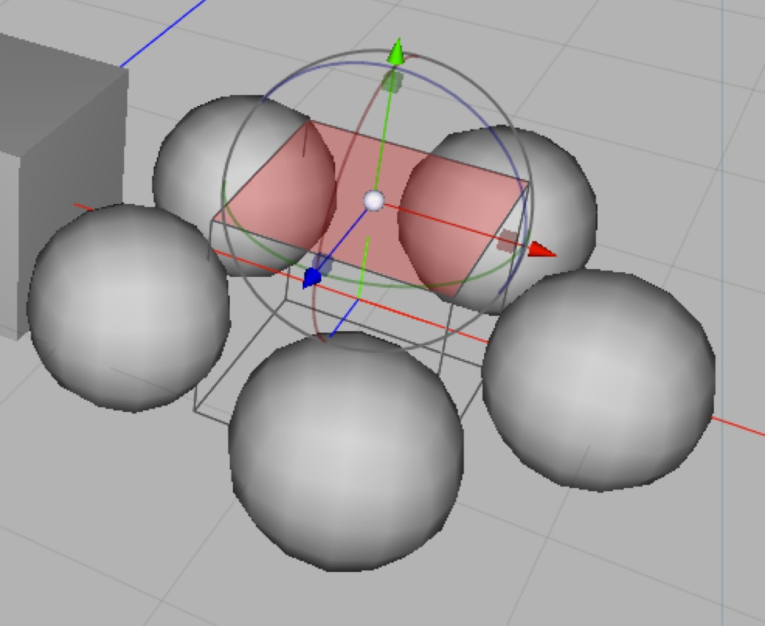

## What is a mesh?

*The box is a mesh, but it’s not an editable mesh. Double-clicking on the box (or on most other objects) will convert the thing you double-click on into an editable version of what you see. (**Careful**: child meshes will be destroyed!)*

You’ll see certain terms such as “mesh” and “editable mesh” bandied about a lot in this book and by Cheetah 3D users in general. A mesh is a 3D object that is represented by a bunch of polygons, each defined as an ordered set of vertex (or “point”) references. Everything that Cheetah 3D can render (aside from backdrops) is a mesh or an instance of a mesh.

Some things aren’t meshes: e.g. lights (aside from area lights with “geometry” switched on which synthesize a plane), splines, folders, empty creators, and so on, but if you can see it and render it, it’s a mesh.

### Editable Meshes

An **editable mesh** (often, confusingly, referred to as a "raw polygon object" in the online help) is a specific kind of mesh that the user can directly manipulate — moving, adding, or deleting points, edges, and faces, and directly edit UV maps.

*In the Object Browser view above, **Box** is a box. It isn’t an editable mesh. **Editable Box** is an editable mesh (you can move its pieces and UVs around, add and delete stuff to it, and so on). **Editable Box with Modifiers** is also editable, but the end result is not (although editing the box causes the end result to change).*

*Here is the **Editable Box with Modifiers** in the 3D view. (You can recreate it very easily by creating a box, making it editable, and adding Subdivision and Ring modifiers.) As you can see the box itself is editable, but the final mesh (a ring of balls) cannot be directly edited (although modifying the box itself will affect the final mesh).*

#### Making a mesh editable

In general you can convert a mesh into an editable mesh by **double-clicking it** in the Object Browser (or choosing **Object \> Make Editable** from the menus).

If you double-click a mesh with modifiers then it will convert the final modified mesh into the editable mesh (and destroy all child meshes).

### What About Other Meshes?

All objects which have visible geometry are meshes of some kind, but only *editable meshes* can be manipulated in this way. You can almost certainly change it — by adjusting the parameters and source objects that are used to produce it, adding or removing modifiers, and so on — but not by *directly* manipulating its vertices, edges, and faces.

E.g. if you create a “box” then it will not be editable, but you can adjust its dimensions and how many faces it’s made of by changing its properties. 

Similarly, an editable mesh with a modifier produces a mesh that isn’t (directly) editable. If you have a subdivision modifier on an editable mesh you can adjust the subdivision settings or edit the underlying mesh, but you cannot directly edit the subdivided mesh.

#### Polygon Objects (Primitives): Ball, Box, Cone, Cylinder, Disk, Plane, Polyhedra, Relief, Stair, Torus, Tube

Each of the polygon object tools produces a primitive of the obvious kind and has properties that allow you to adjust the polygonal detail of the object.

It’s very useful to dial up the detail of objects you wish to apply deformations (modifiers) to. On the other hand, you can use these properties to adjust detail levels downward to save polygons for realtime applications or if you want to keep a scene’s complexity down for some reason.