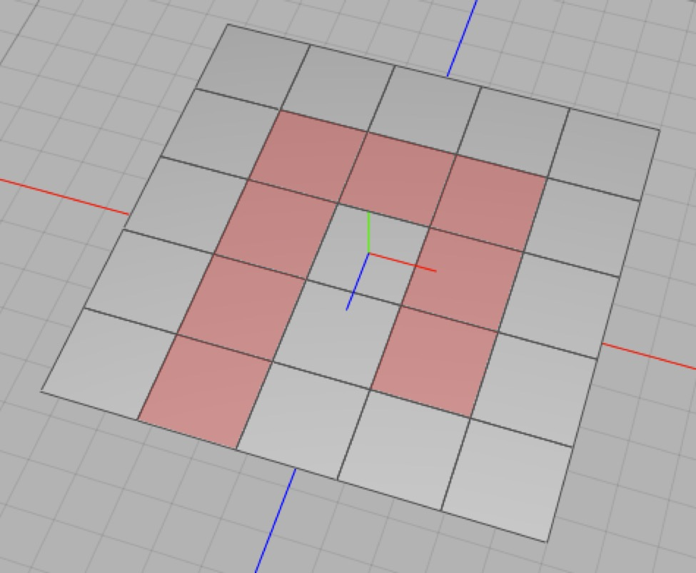
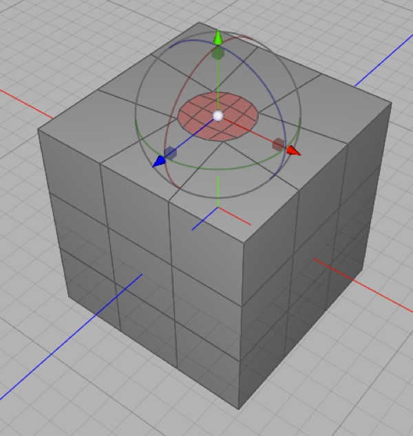

## Polygon/Box Modeling

**The easiest way to understand box modeling is to try it**. Once you’ve done it, then we can discuss exactly what’s going on, what works well and what doesn’t.

So now that you’ve done some box modeling, let’s quickly go over a few fundamentals. A mesh comprises a set of vertices (points in space) and a set of polygons (ordered lists of vertices). The simplest mesh (aside from a “nothing” mesh) is a triangle — three vertices and one polygon containing each of them.

A mesh can contain “bare” vertices — i.e. vertices not referenced by any polygon. These vertices will not be rendered.

A polygon (or “face”) can have 3 or more edges. A face ought to be planar (i.e. all the vertices should be coplanar) but need not be. When representing a face in the editor view or rendering it, Cheetah 3D will convert it to triangles internally, and three points are *always* coplanar.

The basic operations in polygon/box modeling are:

- **Changing Mode** (vertex mode, edge mode, face mode, or object mode). When you’re not in “object mode” you are working on a specific object, and it becomes your “universe”. E.g. in vertex mode, “select all” selects all the vertices of the current object.

- **Selecting** things (based on mode) and changing selections (e.g. adding to, inverting, or subtracting from a selection)

- **Deleting** whatever you have selected. Deleting edges between adjacent faces will merge those faces (usually!).

- **Creating** new faces by selecting or creating a series of vertices. (Select the vertices in counter-clockwise order viewing from the front.)

- **Moving, rotating, and/or scaling** the current selection.

- And applying various **tools** to the current selection or the mesh.

### Polygon Tools

Cheetah 3D has an excellent set of polygon tools. The only weird thing is that the organization of the Polygon Tools menu *doesn’t make any sense at all*. The only way to deal with it is keep reading through it until you memorize it.

Most Polygon tools are modal — i.e. by selecting the tool you enter a special mode. Some have an instantaneous effect which doesn’t change the current mode (which, since it’s probably Transform or Select mode is a very good thing).

#### Create Polygon

Create Polygon lets you add polygons to the current mesh by picking or creating a series of points. (If you click on or near an existing point in the mesh, that existing point is used, otherwise a new point is created in the camera plane or the main plane depending on the tool’s settings — this is almost never where you actually want the point.)

To finish a polygon you simply pick the point you started with (after picking at least three points in total).

It’s important to know that you should pick the points in **anticlockwise** order (as seen from the front/visible surface of the polygon).

_**Helpful hint**: switch to point mode before creating a polygon so you’ll be able to see existing points more easily._

#### Fill Hole

If you want to create a polygon to fill an “obvious” hole in your mesh you can use the Fill Hole tool and simply click on one point on the edge of the hole.

Fill Hole will produce no result (it will beep) or a very bad result if there are problems with your mesh (e.g. gaps, flipped polygons, or the “hole” would produce a very odd polygon).

#### Magnet

*The Magnet tool lets you manipulate a mesh with “falloff”. It’s a bit like “soft selections” in other modeling programs but a lot less useful (unfortunately).*

The magnet tool allows you to manipulate a mesh as though it were made of some kind of viscous goo, but it is really hard to work with because it only works in screen space or normal to the selection (and every time you do something the normal changes) which means you tend to have to get it right the first time (also it provides no useful visual feedback). If you really need this kind of functionality for anything more than a trivial tweak, I’d suggest using another program.

#### Cover, Extrude

Cover and Extrude allow you to “pull” more geometry out of a selection.

Cover is instant. Extrude is modal. This makes Cover much more pleasant to use than Extrude. Also, Cover works on edges and Extrude doesn’t.

**One important use for Extrude**

*Here I want to pull more geometry out of a polygon in a symmetric model (a mesh with a Symmetry modifier) and the polygon is on the edge of the mesh. In the **middle** image you see the result of Cover followed by scaling down the polygon. At the **bottom** I first Extrude the polygon exactly zero distance (once I had the Extrude tool selected, I set it to Quantize 0.1 and then dragged the extrude out and back to exactly zero), and then I scaled the new polygon.*

Extrude always leaves the edges of the extruded polygons intact, cover does not leave the edges of polygons at the boundary of a mesh intact. This makes extrude useful for working on polygons touching the symmetry plane when doing symmetric modeling.

#### Shell

The Shell tool allows you to turn single-sided surfaces into two-sided solids (as per the before and after meshes shown above). Note that Cheetah 3D v6 introduces a Shell modifier which is both non-destructive and allows you to finely control the thickness of the output mesh. In most cases you’ll want to use the modifier rather than the tool.

#### Ring Cut, Jigsaw, Scalpel

Ring Cut, Jigsaw, and Scalpel are all tools for adding new edges to a mesh.

*A plane with one of its quads split into two triangles showing the **edge loops** as dashed lines.*

*The same plane showing one of its rings and the two loops that it is derived from.*

In terms of mesh topology, an **edge loop** is a series of edges passing through four-way intersections of edges (it may or may not form an actual loop).

A ring is a series of edges that join adjacent loops.

When you select the ring cut tool **clicking on an edge**:

1. creates a new edge loop through the ring 

2. containing the edge you clicked on, 

3. and passing through the point you clicked.

*The jigsaw tool cut the path shown through the selected polygons.*

The Jigsaw is a like the ring cut tool, but follows a selected path of polygons rather than a ring, so you can “steer” it. The jigsaw will stop cutting at the edge of a mesh or before the last polygon on a path.

The Scalpel tool lets you cut a series edges manually. You must start the series of edges on an existing edge or point, and then click out new edges one point at a time. A new edge cannot cross another edge, so to cut an edge from one polygon to another you must go through an existing edge or point.

#### Normal Scale, Rotate, Move

The tools do the same thing as the Transform tool with Orientation set to Normal. I suggest using the Transform tool instead as these tools are no longer needed.

#### Edge Rotate

*The selected faces are rotated around the edge (highlighted in purple in the **bottom** image).*

The edge rotate tool allows you to rotate the current selection around any edge in the mesh.

#### Point Slide

Point slide is a useful tool for tweaking a point by moving it along one of the edges connected to it.

#### Collapse, Weld

Collapse and weld are used for simplifying a mesh’s geometry. Weld lets you merge two points (and makes all the necessary changes to edges and polygons that use those points) while Collapse turns a specified polygon into a single point.

Weld has a very important setting — “to” which determines whether the final point is the first of the two points you weld together, or the middle (average) of them.

Collapse, similarly, has a “to” setting which determines where the vertex that replaces the thing you click on is the point you clicked or the middle of the thing you clicked.

#### Collapsing Edges

There is no convenient tool for “collapsing” edges, but welding the points at either end of an edge has the equivalent effect.

#### Optimize

Optimize is a very useful tool for cleaning up meshes. Usually the only thing you might want to change from the default setting is to change the weld radius.

**Remove unused vertices** deletes any vertices (points) from the mesh that aren’t part of any polygon.

**Weld close vertices** merges vertices within a threshold distance — the Weld Radius — of one another (this is very helpful for optimizing meshes).

I’m not sure what **Optimize polygons** does (and the online help is no use here) but I suspect it removes zero-length edges from polygons

#### Array, Clone

*I’ve created an array of 1 x 10 x 1 copies of the selected face with a total offset of x = 0, y = 1, z = 0.*

Array creates an array of duplicates of your current selection based on the tool settings. (It’s a lot like the Array modifier except that it produces an immediate result and operates on a selection rather than the whole mesh.)

Clone is like Array but only produces a “single row” of copies.

#### Disconnect

*Here I select the top of a sphere (converted into an editable mesh first, of course) then — **middle** — I move the selection which stretches polygons bordering the selection. Oops! Finally — **bottom** — I use the Disconnect tool first then move the selection.*

Disconnect separates the current selection from the rest of your mesh without splitting it off into a new object (e.g. imagine you want to move the current selection “away” from the rest of the mesh without distorting polygons that share edges with polygons in your selection — disconnect it first).

Note that Disconnect is a modal tool that needs to be Applied (click OK in the Tool panel) or it won’t do anything.

#### Crumple

*A 10x10 plane converted to an editable mesh and crumpled with the default tool settings.*

Crumple randomly displaces the points in your mesh (based on the tool settings).

#### Flip Normal

*If you take a cube, delete three faces, then flip the remaining polygons, you have a little set to place things on.*

Flip normal reverses the winding order and thus flips the facing of selected polygons. The facing of a polygon has important effects on how a polygon is smoothed and rendered in Cheetah 3D, and in most realtime applications polygons will only be visible from the “front”.

#### Ruler

*When in ruler mode, mousing over a point will show you its exact position (in the selected coordinate system) and clicking on multiple points will show you the precise distances between them.*

The ruler allows you to see the precise position of points in global or local space and measure the precise distance between points.

#### Triangulate

*A dodecahedron before and after triangulation. (Because no polygons were selected the entire mesh was triangulated.)*

The triangulate tool instantly triangulates the current selection (or the entire mesh if all or no polygons are selected). 

Generally you do not want to triangulate meshes, but there may be cases (e.g. Symmetric models) where you want fine control over the way the mesh is triangulated.

#### Catmull-Clarke Subdivide, Linear Subdivide

*Here I have selected one face and applied the Catmull-Clarke Subdivision tool to it twice. This technique is sometimes suggested as a good way to put round holes in square faces, but there are better and more precise methods. I would suggest that unless you know exactly what you’re doing, don’t use these tools.*

These tools allow you to immediately apply one level of subdivision to selected polygons. 

In general if you want to subdivide an entire mesh you should use the Subdivision modifier which offers more options, greater control, and is non-destructive. Occasionally you may want to have complete control over subdivision, in which case these tools can be useful.

#### Split

Split breaks off your current selection into a new (separate) mesh. If your original mesh was called “foo” then the selection will be moved to a new mesh (with the same coordinate system) called “foo.split”.

##### Aside: Merging Meshes 

**To merge two or more meshes in C3D7** simply select them (you can select a range by click and shift-click, or toggle the selection of individual meshes using command-click) and select **Tools \> Merge**.

**To merge two or more missions in earlier versions of C3D**: pick one mesh to be the “parent” and make all the others its children, then select the parent mesh and use **Tools \> Import Children** (you can now delete the children or collapse the parent).

#### Bevel, Inner Extrude

*Starting with the three edges selected on the left, I perform a linear bevel with bevelLevel 0 or a Concave bevel with bevelLevel 10.*

Bevel is used to refine corners where two polygons meet by introducing new geometry. Since almost no real world objects have perfectly sharp corners, beveling is very useful for making models a little bit more realistic. It’s also very useful for refining subdivision cages.

*Here we have a simple box with subdivision applied. By beveling the selected edges the curvature of the subdivided surface can be given more definition in a highly controlled way.*

**Inner Extrude** is an odd tool. It creates more geometry around selected edges. Among other things, inner extrude is useful for refining subdivision cages.

#### Bridge

The Bridge tool joins two parts of a mesh. You pick two vertices on two different polygon edges in the mesh (“holes”) and it joins them together. The Bridge tool works best when you use two polygons with the same number of sides, and go in the same direction (i.e. with the adjacent polygons having their normals set correctly). The two vertices you select will be joined directly, and the rest of the bridge will follow from that.

##### Aside: Troubleshooting the Bridge Tool

Sometimes the bridge tool simply refuses to work. This is usually because either one or more of the faces bordering on one of the polygons is flipped, which means that the polygon isn’t well-formed.

In this example I’ve flipped the normals of the top portion of the mesh, which confuses the bridge tool (because it reverses the order of the polygon its joining up) and completely messes up the resulting bridge.

You should also pick the vertexes you click on with the understanding that the first vertex will be joined to the second, and everything else will follow from that. So if you pick the mismatched vertices, the bridge will be twisted. (This “twisting” effect can actually be used to your advantage in some cases.)

Finally in this example there’s an exaggerated hidden flaw in my geometry which means that one of the polygons isn’t the polygon I thought it was and the resulting bridge is, again, a mess.

