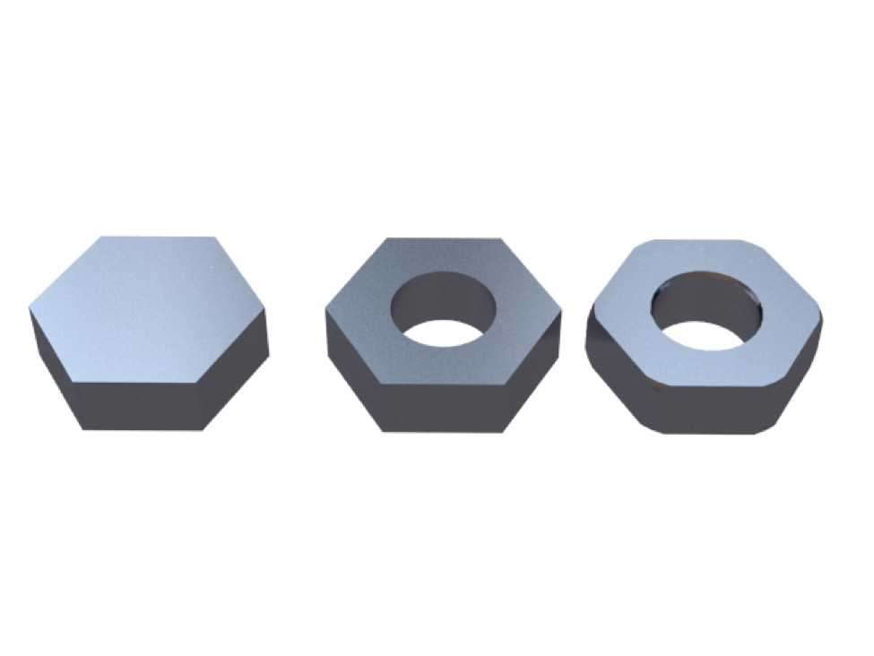
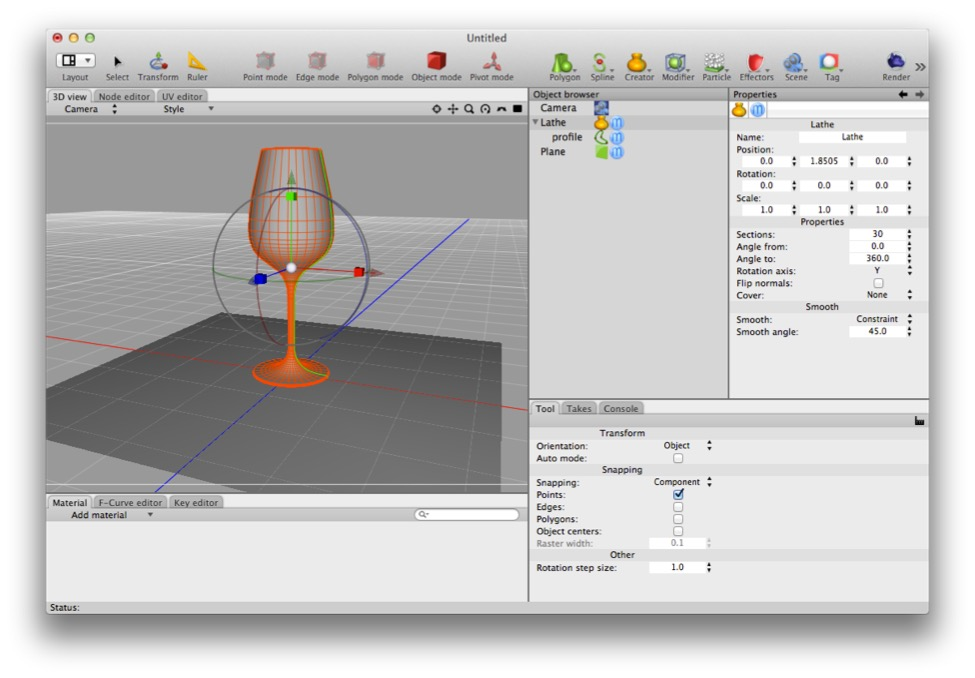

# Modeling

Modeling is the process of seeing or imagining a three-dimensional object and then creating its geometry in virtual space. It’s often compared to sculpting (and some 3D software tries to simulate the process of sculpting clay) or building things out of cardboard or matchsticks or lego.

In general, modeling consists of:

1. Picking the thing you want to model and then finding or drawing reference images or visualizing it in your mind’s eye (perhaps from memory),

2. Deciding the level of detail you want to model it at,

3. Figuring out the simplest way to achieve the desired result,

4. And then doing the work.

The last two steps tend to be iterative: you work on the model (or a small piece of it) then look at your handiwork and assess it. Are the proportions right? Is your approach working? Are you creating problems for yourself down the track?

There is no approach that works for anything. Sometimes you can start by creating a crude model and refining it, other times you will find yourself building small, intricate pieces and assembling a larger whole from the pieces.

### Visual References

It’s impossible to overstate the value of visual references, either of the object yourself or objects whose qualities you wish to incorporate into the model. E.g. you might be modeling an alien starship but want it to have a visual resemblance to a WWII battleship (or, if you’re H.R. Giger, bones and offal). Furthermore, good visual references will often give you insight into how something is actually put together (you’ll be surprised at how often your memory or imagination proves lacking). 

E.g. I once tried to model a forklift from memory (hey, I knew what a forklift looks like!) and quickly realized I had no idea how the wheels worked or how the lift attached to the rest of the vehicle. 

**Google Image Search** is your friend! There’s also a great website called **http://the-blueprints.com** if you want precise technical drawings of a vehicle.

### Level of Detail

*A simple hex nut modeled at three different levels of detail (and note that we could go much further, e.g. there’s no screw thread even on the most detailed version.)*

Picking a level of detail and sticking to it is crucial. It saves you time, high polygon counts, and wasted work. Consider the humble screw. At first approximation it’s a simple object: a short squat cylinder on top of a tall thin cylinder. But the closer you look the more complicated it becomes. If you’re modeling a battleship you don’t need to model the rivets in detail, but if you’re modeling a rivet you do.

When determining level of detail consider how much time you have and how important the object will be to your current (and expected future) projects. If the answers are not much and not very then keep it simple or even avoid it altogether (a lot of detail objects can be omitted or made part of a material).

Rand and Ryan Miller, the brothers who created *Myst* on 25MHz Macintosh computers, had a great one-liner: **under model and over texture**. There are circumstances where this isn’t the right approach, but it’s worth remembering: you can put a lot of polygons into a crate and not produce anything vaguely decent looking, or you can slap a few bitmap materials on a cube and get very good results in five minutes. 

_A cube with a bitmap slapped on it._

Indeed, “under model and over texture” almost defines how modern 3D game art works — in essence, detailed models are created, retopologized as simple meshes, and then the extra detail is “baked” into textures.

### The Simplest Method

Simplicity is difficult. If there’s one thing Apple has taught its competitors it’s that producing something simple (and good) is hard.

When picking a good method to model an object you need to think of simplicity holistically — it may be easier to do something one way, but it may lead to problems later. A classic example is **booleans** — they’re an easy way to slice objects up, but you can’t do much with the results. Often you can improve a model hugely by strategically beveling or curving corners, and this is essentially impossible with booleans.

This topic is like Alice’s rabbit hole and I had best not go too far down it. The key point is that if you’re finding it too hard to model something, try a different approach.

### Judging your own work

In general, to produce good work you must have a balance of **ability** (to do what you need to do) and **critical faculties** (to judge what you have done). A lot of ability with no critical faculties and you will produce a lot of junk. But the overly self-critical will never finish anything because they can’t get the first thing done *just right*.

Of course some of what we lack can be made up for by our friends and colleagues. Asking people you respect for their opinions of your work is a useful way of benefiting from their experience and criticism. But in the end, we can’t ask someone else to judge every little thing we do — we all need to be able to critically assess our own work.

In my experience best way to develop critical faculties is to examine things you like and then understand *why* you like them, and similarly to examine things you dislike and figure out *why* you dislike them.

The best way to hone your abilities is simple: do stuff and pay attention.

### Give a Damn

It’s at this point in a discussion of creativity that one traditionally recommends Robert Pirsig’s *Zen and the Art of Motorcycle Maintenance* — and I do — but I’ll try to summarize it and then paraphrase William Goldman (screenwriter of, among many others, *Butch Cassidy and the Sundance Kid*, and author of *The Princess Bride*). 

In *Zen*, Pirsig’s alter ego essentially argues that **the way to produce something good is to care**. Everything else follows from that. Most stuff is produced by people who don’t care, which is why most stuff sucks.

**Aside**: I looked up *Zen* in Wikipedia to get a feel for what other people think the main point of the book was and it turns out that the Wikipedia consensus position is that it has something to do with the author’s alter ego reconciling his initial reductionist view of the universe (exemplified by his proficiency at motorcycle repair) with his friends’ romantic “don’t bother me with the details” — or “zen” — approach. Who knows? The point I’ve taken away from the book seems more useful (and I don’t see that there must be a tension between the romantic and reductionist views) — I think the conflation of romantic and “zen” assumes a rather simplistic view of zen, and if you take the Buddhist idea of “being present” it resembles “giving a damn”.

William Goldman, in *Adventures in the Screen Trade*, says there are really only two kinds of movies: movies that were intended to be good, and movies that weren’t.

### Approaches to Modeling

Not only is modeling an art in and of itself, but there are different flavors of modeling, which come with their own approaches and philosophies. Different kinds of modeling and different approaches to modeling are supported by Cheetah 3D, but some more than others.

#### Box Modeling, Subdivision Surfaces, Splines, and NURBS

There are many different approaches to creating meshes for 3D graphics. Cheetah 3D is primarily built around box modeling and subdivision which is both the most easily understood approach to modeling and the most modern.

With box modeling you directly manipulate the vertices, edges, and faces of meshes to create an approximation of the form you want. You can either progressively refine your mesh until you’re happy, or use your approximate mesh as a “base mesh” for sculpting, or a “cage” for subdivision. (Often both approaches are used — i.e. the artist creates a reasonable approximation mesh, subdivides it, and then sculpts the subdivided mesh in a dedicated sculpting program such as ZBrush or 3D Coat.)

For real-time applications such as games the artist may use a highly detailed, sculpted mesh to “bake” normal and other maps for texturing a simpler mesh (which will be easier for a game engine to render on-the-fly), which will either be the base mesh, or a “retopologized” and simplified mesh built from the sculpted mesh.

**Note**: "retopologized" is a fancy way of saying “made the mesh less horrible” (for some value of “horrible” such as “complex” or “full of triangles” or “messy”).

In a sense, NURBS and similar constructs (including swept splines, which Cheetah 3D also supports after a fashion) represent “blind alleys” 3D software engineers explored in their attempts to enable organic modeling. NURBS and splines certainly have an important role (e.g. in industrial design), but they are hardly used at all for organic modeling any more (NURBS are very useful for hard edged — i.e. precise — modeling tasks such as industrial design).

If you’re interested in NURBS modeling, the best known NURBS modeler is Rhino 3D. The original developer of Rhino has created a similar but much simpler (and less expensive) program called MoI (“Moment of Inspiration”) which is excellent, but is a bit strange on the Mac (it runs using an integrated Windows emulator based on WINE).

#### A Tale of Two Wineglasses — and a B-29 bomber: The Pros & Cons of Splines** 

*A Reidel wineglass.*

So when should you use splines and when should you box model? The short answer is do whatever gets the job done quickest. The long answer is, of course, more complicated and best illustrated with some simple examples.

##### Tutorial: Making a Wineglass with a Spline and the Lathe Creator** 

The Lathe creator is a very effective tool for creating rotationally symmetric objects (in other words, the kinds of things you make with a lathe). A wineglass is a classic example of a rotationally symmetric object, so it’s a cinch to create a nice profile of the wineglass and then “lathe it” into a solid object.

(Actually, it’s a cinch to create the profile using a good drawing program like Illustrator or Inkscape. It’s possible, but not nearly as easy, to do it in Cheetah 3D.)

##### Tutorial: Making a Wineglass with using Box Modeling and Subdivision** 

Even though using box modeling and subdivision to get the same result might seem like a much more roundabout way of achieving the same result, it’s surprisingly easy to do, doesn’t require using a dedicated vector drawing program (or struggling with Cheetah 3D’s somewhat limited spline drawing tools), and produces a very elegant result that is also more versatile.

There is one significant disadvantage to this approach though — subdivision creates more polygons to produce a smoother result, but the way the polygons are added is indiscriminate — areas that do not need more detail gain polygons just as quickly as those that do. Subdivided meshes can be “heavier’ than lathed meshes.

*The finished (box modeled) wineglass*

(In this particular example, the lathed version has about one third fewer triangles than the subdivided version.)

###### Aside: When making stuff with lathes causes problems…

The real advantage of subdiv modeling over using splines and lathes and whatnot, at least in a polygon-centric 3D program like Cheetah 3D, is that upon examination, **very few objects turn out to be rotationally symmetric**. Wineglasses might be a nice example of a symmetric object, but you don’t need to look hard at most apparently suitable objects to discover serious problems.

*In this diagram (from the Wikipedia entry on columns) you’ll see that none of the columns even have a circular cross-section. Even if you intended to handle that detail using, say, normal or bump maps, the top and bottom of most columns is not at all circular in cross-section.*

Often, what might appear to be a “nice round object” needs to merge seamlessly into other objects, and that’s where the box modeling approach wins over lathing.

**Note**: I'm talking about Cheetah 3D here. This is often not the case in NURBS based modelers (e.g. Rhino or MoI) or CAD packages with strong support for 3D splines.

*The B29 (photo from Wikipedia) is the most lathe-friendly airplane you’ve ever seen, but if you were trying to model one you’d end up having to deal with the wing root, and you’ll notice that the wing doesn’t join the fuselage with a sharp angle, but merges into it seamlessly. If you lathed the fuselage, you might have to deal with some pretty ugly geometry.*

Whether you’re attaching handles to a goblet, a spout to a teapot, or wings to an aircraft, you’re going to come up against many objects that seem like they are round, but on closer inspection turn out to have seamless joins to other objects. (And, many of those objects will turn out not to be quite round after all.) This is when box modeling comes to the fore.

##### Tutorial: Modeling a Wing Root

*Here we’ve modeled a simple wing root where an aircraft’s wing melds seamlessly into a round fuselage.*

In a nutshell, if you’re trying to create a rotationally symmetric object that probably won’t end up being joined to some other thing, like a typical wooden pepper mill or a wine glass, and you want a very precise profile, you should probably use a spline and the Lathe creator. In almost any other case, use box modeling and subdivision.

Also note that none of these tradeoffs exist if you’re working with a dedicated NURBS modeler and don’t care about polygon counts. Creating a mug or teapot entirely out of splines in a specialist NURBS modeler is as easy as pie. We’re talking about Cheetah 3D, not Rhino or MoI.

### Splines

Splines are very useful things in Cheetah 3D. You can animate objects along them, you can use them to create objects via various kinds of sweeps, and you can even emit particles from them. But creating and editing splines in Cheetah 3D is pretty ugly.

If you’re used to editing splines in a dedicated Bezier drawing program like Illustrator, prepare for disappointment. Indeed, the best way to get a good 2D spline into Cheetah 3D is to create it in a dedicated spline drawing program and export it as SVG. (If you don’t own Illustrator or something similar, I heartily recommend highly recommend iDraw, which I prefer to Illustrator. If you want something perfectly good and free,  look no further than [Inkscape](http://inkscape.org/).)

#### Spline Tools

If you need to create a spline in Cheetah 3D (and if you need a 3D spline then it’s probably your best option) you either need to draw it using Cheetah 3D’s spline tools or use a script.

Use **Tools \> Splines \> Create Spline** to create new splines. You probably want to be in one of the orthogonal views (e.g. Top) or it will be even more confusing when you start. The first click creates a new spline object with its first point where you clicked; each subsequent click adds a point to the spline. You can click and drag when creating points to determine the spline tangent, much as in Illustrator, but you have no control over the starting tangent (just accept it — you can go back and fix it later).

Also — constraints (e.g. the shift-key) don’t work. So you’ll need a steady hand.

Once you’ve created a spline, it’s impossible to add new points or subtract them. The only option is to use the **Break Segment** tool (which cuts the spline at a selected point) to excise a problem area, draw a replacement, and then use **Join Segments** to hook it back together.

You do have some tools for changing individual points from hard interpolation (sharp corners) to soft (smooth interpolation) and equalizing tangent directions. But these are pretty basic.

Finally, you can really only use point mode to work on splines. You can’t select edges and work on them.

#### Building Splines with Snapping

Ideally, you should create your splines in another program and import them. If you must create a 3D spline, try making parts of it in another program and doing as little as possible in Cheetah 3D.

*Having created a grid using a plane (which is set to wireframe — or ghosted — display) I rough out my bezier by clicking out the points, then I snap the points and control handles onto the grid (note that even this doesn’t work quite right).*

But if you must, you must. And here, your best option is to use as much snapping as possible. Build a mesh with points where you want your spline points and control handles to be, rough out the spline, then use component snapping to snap the spline points and control handles into position. It’s tedious, but it works.

### Solid Modeling

Some modelers try to avoid the abstraction of vertices and triangles and deal with *volumes*. Every object in such modelers has volume and there’s no ambiguity as to what the interior of a solid is (contrast this with polygon modelers where it’s perfectly feasible to have meshes with holes in them, or doubled faces, or some faces pointing in the wrong direction).

These modelers tend to be oriented towards engineering applications, and are very useful for working with 3D printing (since there’s no need to “infer” where the interior of a given object is). Cheetah 3D isn’t a solid modeler, but it is possible to create solid models if you’re careful, and then export them to STL (a format used for 3D printing among other things).

### Hard Edged vs. Organic

Cheetah 3D is built around box modeling and subdivision. As such, while it is possible to do precise modeling in Cheetah 3D, it will require extra patience and discipline. Of course it’s perfectly feasible to model in another program more suited to a specific modeling task and then simply import the resulting mesh into Cheetah 3D. 

Box modeling and subdivision are ideally suited to organic modeling. (Indeed, that’s why subdivision surfaces were invented.)

