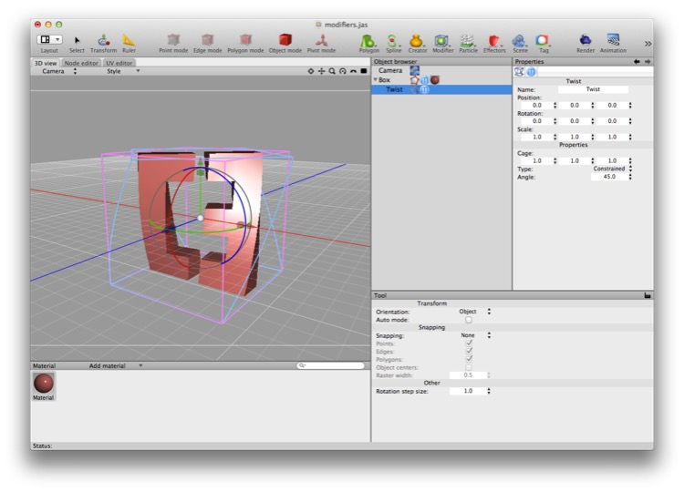

## Modifiers

Cheetah 3D’s non-destructive modifiers are simply wonderful. Many high end 3D packages have similar functionality, but Cheetah 3D’s implementation is both simple and powerful.

The basic idea of a modifier is that you apply it to a mesh object and it becomes a child of the mesh and modifies it. Modifiers are applied top-to-bottom.

Modifiers fall into three broad categories: ** subdivision** (a modifier that increases the detail in the parent mesh), **replicators** (modifiers that produce one or more transformed copies the parent mesh’s geometry), **deformations** (modifiers that deform the parent mesh by warping or otherwise modifying their spatial coordinates).

The easiest way to explain modifiers is simply to show what they do.

### Subdivision

*Subdivision, by default, turns pretty much anything into a rounded blob.*

Subdivision is probably the single most important modifier in Cheetah 3D. First of all, it’s very useful. And secondly, it would be exceedingly difficult to replicate its functionality if it didn’t exist. In its default incarnation (“Catmull-Clarke”) it increases a mesh’s resolution and smoothly interpolates its surfaces, turning hard edges into smooth curves.

**Catmull-Clarke** — the default setting — produces smoothly interpolated meshes, particularly well-suited to modeling organic objects, such as characters. Catmull-Clarke is named after Edwin Catmull and Jim Clarke, the computer scientists who first described subdivision surfaces. (Ed Catmull is one of the founders of Pixar.)

*Catmull-Clarke can be controlled by selecting edges and marking them as **creased** (so they won’t be smoothed away). (Creased edges are displayed in blue by default — but only when not selected.)*

*Catmull-Clarke subdivision can be controlled more subtly by adding fine-tuning the “cage mesh”. In this case three edges have been bevelled to better define those edges (rather than simply make them hard).*

*On the left is an icosahedron with one level of Catmull-Clarke subdivision; on the right is an identical icosahedron with one level of Stam-Loop subdivision. As you can see what started as a regular triangulated mesh becomes more irregular under Catmull-Clarke subdivision than Stam-Loop.*

(There are some refinements of Catmull-Clarke subdivision which Cheetah 3D does not, as I write this, support. These in essence allow finer control of the interpolated curves and allow you to produce better results with fewer subdivision iterations.)

**Stam-Loop** (named after Jos Stam and Charles Loop) is an alternative subdivision surface algorithm that produces different results, especially with respect to triangles (Catmull-Clarke is designed to handle quads and tends to produce nasty results around triangles; Stam Loop is intended to work well for triangles, especially entirely triangulated meshes, and produces nearly identical results to Catmull-Clarke on pure quad meshes).

**Linear** subdivision subdivides the mesh without softening the geometry (in essence, using a linear rather than a quadratic interpolation to produce intermediate points). Linear subdivision is useful for creating smoothly deformable meshes (e.g. if you want to curve some extruded text around a sphere, you can linear subdivide it first to produce a cleaner result).

### Replicators

Replicators produce multiple copies of the base geometry in a variety of different ways. If you need to produce rows, grids, or rings of identical objects, these tools can be invaluable. (If you want to produce a string or chain of objects along a path, take a look at the **Chain** creator.)

#### Array

The Array modifier turns your mesh into an evenly spaced line of copies of itself.

#### Build

Build isn’t, strictly speaking, a replicator, since it removes geometry rather than duplicating it, but it doesn’t deserve its own category so I’ll shove it in here!

*The Build modifier is showing 50% of the polygons in the original mesh.*

The Build modifier randomly hides a proportion of the faces of a mesh. If its “percent” (which is actually a proportion and not a percentage — so 1.0 means “all”) is animated then the mesh will appear or disappear one polygon by polygon.

#### Ring

The Ring modifier turns your mesh into an evenly spaced ring (or partial ring) of copies of itself.

### Deformations

#### Bend

The bend modifier bends things. Like Bender, but not as funny or evil.

#### Bulge

Bulge produces inward or outward bulges in your mesh. (It’s very similar to, but less flexible than, the taper modifier. It’s essentially taper with the tapering switched off.)

#### Displace

*Here you can see a plane being displaced by a bitmap. The whiter the bitmap, the greater the displacement.*

The Displacement modifier distorts meshes by pushing offsetting vertices based on an input image, referred to as a “displacement map”. In the displacement map white means “move it a long way” and black means “leave it alone”.

Displacement pushes vertices in the direction normal to the surface they belong to (so “away” from the face they’re on). Which pixel(s) of the image are used to displace a given vertex is determined by UV mapping (as though the displacement map were a material).

#### Skew

Shear skews a mesh in its XY plane.  

#### Spherify

*Spherify lets you convert a cube into a sphere. Unlike a regular “polar” sphere the cube is easy to UV map.*

Spherify projects the vertices of a mesh (within its radius of influence) onto the surface of a sphere. It’s very handy for producing spheres from boxes, because boxes are much easier to UV map than traditional “polar” spheres (which always have messed up UVs near the poles).

*Spherify can also be used to produce “shockwave” effects.*

#### Symmetry

*In order to create this result I had to drag and rotate the faces of this mesh away from its local origin (which you can see is still at the global origin).*

Symmetry is a very useful modifier. Symmetry always reflects geometry through the designated plane in the object’s own coordinate system.

The most common use of symmetry is to model objects with bilateral symmetry (such as people, animals, vehicles, and so forth — at least at first approximation). This lets you do half as much work, and also not have to worry about keeping things symmetrical manually.

When it becomes time to rig or animate a mesh, you’ll need to “bake the symmetry in” by collapsing the symmetry modifier (this is because you need to control all the vertices of the mesh, not just half of them).

#### Taper

*Taper produces a kind of organic stretching effect (if you set the curvature to zero it essentially deforms your mesh into a cone.*

#### Transform

It’s hard to display the effects of the transform modifier since it simply applies its own transformation to its parent object (which makes it appear that object is now somewhere else).

Why would you use such a thing? 

Well, it allows you to move reposition (or rotate or scale) an object without actually repositioning (or rotating or scaling) it. You might want to experiment with a scene without potentially messing things up. Or you might use it for special animation effects (e.g. you could render one set of motions with the tag switched on, and another with it switched off, and then composite.

#### Twist

*The Twist modifier does pretty much what you’d expect it to do — twisting the parent mesh around its local y axis.*

#### Warp

*The Warp modifier is perhaps the most temperamental modifier around. The UI gadget kind of shows you what it’s going to do, but it’s often a matter of trial and error to get the desired result out of it.*

