## Tags

Tags don’t do anything by themselves, instead they _attach extra information to an object_ that can be used by Cheetah 3D’s internal functions (or scripts). Most tags are only meaningful in specific contexts and can only be attached to certain objects.

Cheetah 3D groups tags into five categories (six if you include scripted tags). These categories can be thought of as:

- Rendering

- Inverse Kinematics

- Animation

- System Properties (i.e. extra information for particle and metaball systems)

- Dynamics

### Rendering Tags

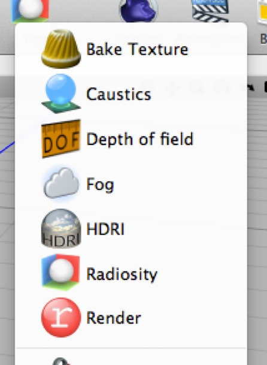

Most of these tags are further discussed in more detail elsewhere.

Note that the **Bake Texture** and **Render tags** go on objects in the scene, whereas the other render tags are all applied to **Cameras** and affect how the tagged camera renders the world.

#### Bake Texture

You assign this tag to a mesh you’re planning to bake, and it controls and facilitates the baking process. (Oddly enough, the Bake toolbar button has two different effects. If your current selection is a mesh and has a Bake tag assigned to it, it bakes the mesh. If your current selection is a mesh without a Bake tag, it adds a Bake tag to it.)

#### Caustics

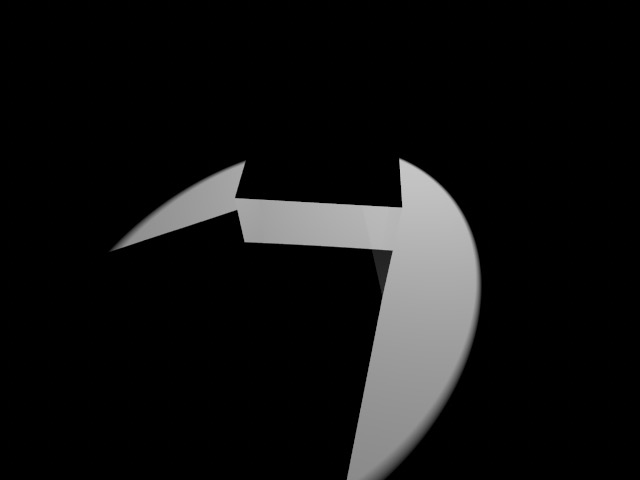

_A glass cube with a spotlight (set to ray-traced shadows)._

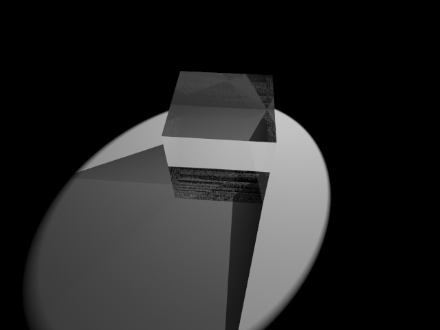

_Ray-tracing with transparency creates very implausible results._

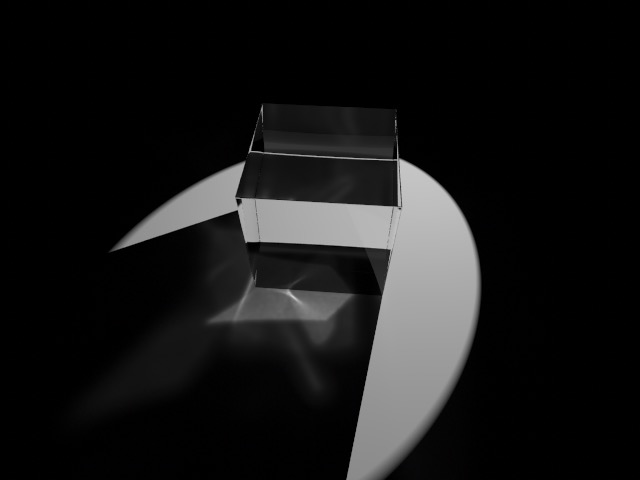

_Adding a caustic tag results in more realistic scattered light appearing in shadows, although tweaking the settings to get good results requires both judgment and effort. (1,000,000 photons, 0.1 strength, 1000 samples.) 

Caustics are visual effects caused by light being refracted or reflected, especially into the shadows of objects (where that are most noticeable). Objects tend to cast shadows, but if they're transparent the light _goes_ somewhere, and that's what caustics simulate.

Caustics are implemented using a good deal of fakery behind the scenes, and in particular spotlights are the best source of caustic "photons" because you can concentrate them on the specific part of the scene you want the caustic to show up in. If you just want caustics to appear correctly and organically everywhere, e.g. in giant architecture renderings) you should probably use an unbiased (or physically-based) renderer such as Luxrender, Octane, or Indigo. (Note that Falcon is an unbiased renderer too, as is Blender’s Cycles, but neither handle caustics at this time.)

#### Depth of Field

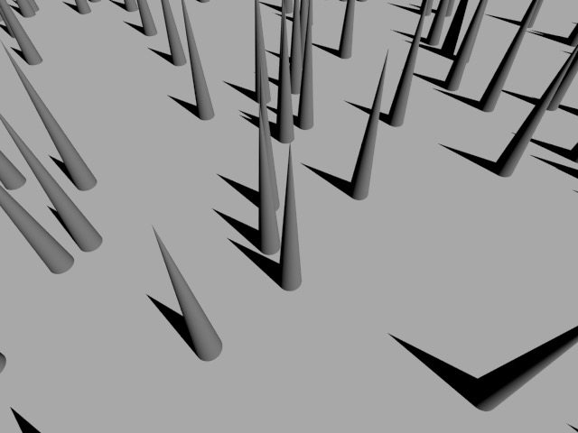

No depth of field tag used.

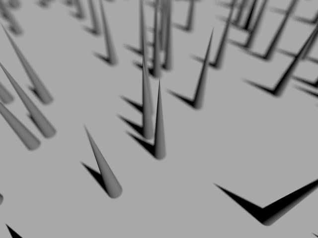

Depth of field tag used (the point of the central cone is in near-perfect focus).

C3D's Depth of Field tag will cause Cheetah 3d's usual "perfect" camera to suffer from depth of field effects somewhat like a real camera. 

Once the depth of field tag is assigned to a camera and the tag is selected, you can see and adjust the focus plane in the viewport (an awesome feature).

**Hint**: you can use a Depth of Field tag (turned off) to determine the distance from the camera to objects in the scene for setting similar properties such as Fog starting distance.

A real camera will only be perfectly focused on a plane (or sometimes a curved surface) in space. Everything that is closer to, or further from the camera than that surface will be out of focus to some extent. The distance away from the surface within which a subject remains acceptably sharp is referred to as the **depth of field**. The "longer" the camera's lens (i.e. the narrower its angle of view) and the "wider" its aperture (i.e. the larger the hole light passes through) the smaller the depth of field will be, and the blurrier objects outside the depth of field will become.

The depth of field effect is achieved _stochastically_ (i.e. by randomly sampling multiple rays) so it's computationally expensive and will tend to increase render times by a factor proportional to the number of samples.

#### Fog

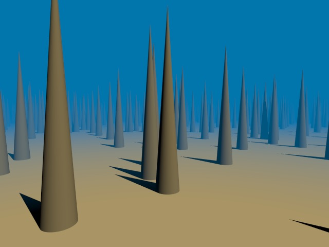

_Cones in the fog_

Adding fog to a camera will cause the scene to "disappear into fog" (of a chosen color) at a specified rate, and beyond a specified distance. It's a very simple effect. In particular, you fog doesn't cause any blurring, so it may be helpful to use a subtle Depth of Field tag in concert with a fog tag if you want mist effects.

_One important side-effect of fog is that it effectively becomes the background color, including in reflections_. This makes subtle use of fog very helpful for quickly putting together simple, good-looking renders (such as product shots). It also prevents you from using fog if you want a transparent background.

#### HDRI

HDRI is used to assign an image, usually an HDR image, to a camera which will then be used for reflections and image-based lighting. If you want to use image-based lighting, you should also add a Radiosity tag to the camera.

#### Radiosity

Adding a Radiosity tag to a camera means that it will render using either the ambient occlusion or radiosity algorithms rather than simple ray-tracing. Both ambient occlusion and radiosity are techniques designed to account for the shortcomings of simple rendering models which don't account for _scattered light_.

**Ambient occlusion** applies a simple heuristic to scenes where surfaces receive more light if they are far from a sharp corner and receive less light if they are close to a sharp corner.

In practice, ambient occlusion produces very bright renders, but darkens nooks and crannies.

**Radiosity** applies a more computationally expensive approach and assumes surfaces will be lit (in part) by light scattered from other surfaces. (If you're into theory — it's the ray-tracing approach to the the problem that unbiased rendering solves in a more realistic way.) 

In practice, radiosity adds a good deal of realism to renders. It causes bright surfaces to diffusely illuminate nearby surfaces, and — similarly — colored surfaces to bleed into nearby objects.

Radiosity also treats an image-based lighting source (HDRI tag) as input data for its algorithm.

**Important Note**: by default, the Radiosity tag is set to Ambient Occlusion (and not Radiosity). In most cases you probably want to choose **Radiosity** and turn on **Detail Detection**.

#### Render

The Render tag is assigned to mesh objects and controls how they are rendered. E.g. if a particular object is creating a problematic shadow, you can make its shadow disappear.

### Inverse Kinematics Tags

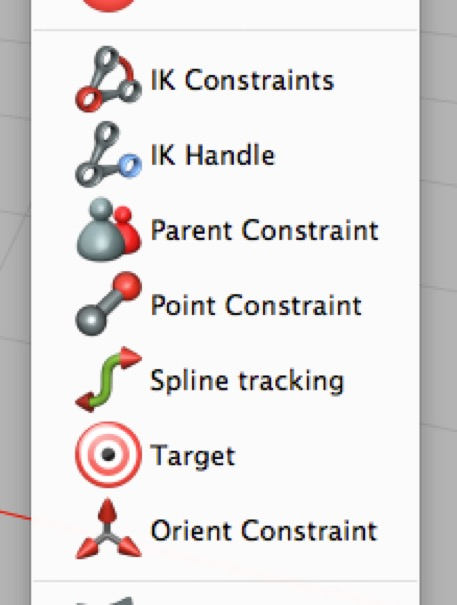

The Inverse Kinematics tags control the behavior of objects in the IK system.

### Animation Tags

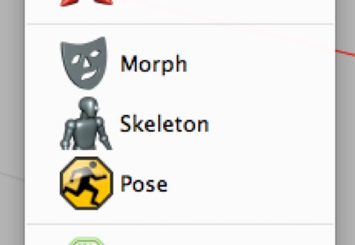

#### Morph

The Morph tag allows you to store and interpolate between morph states of a mesh. The usual application for this is animating facial expressions and mouth shapes for a character.

#### Skeleton

The Skeleton tag allows you to store and edit an animation “rig”. In terms of other 3D packages, it is used to “skin” meshes.

#### Pose

The Pose tag allows you to store and re-apply the keyed settings of the object to which it is attached and that object’s descendants.

### System Properties Tags

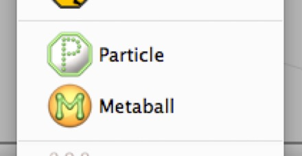

The Particle and Metaball tags affect the behavior of individual meshes within a Particle System or Isosurface Creator.

#### Dynamics Tags

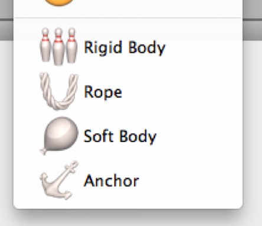

The Dynamics tags assign dynamic behavior to meshes. They are described in greater detail in the chapter on Dynamics.

#### Material Assignment Tags

In addition to the property tag every object automatically receives, when a material is assigned to an object it is represented by a Material Assignment Tag, which is covered in more detail in section on Materials.

